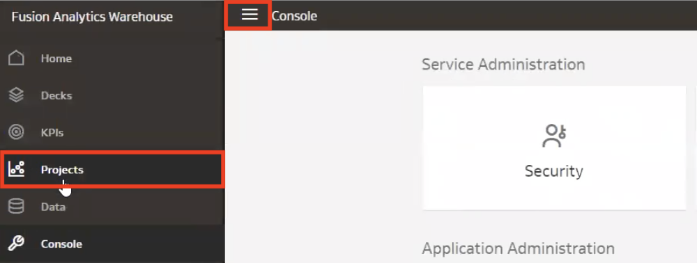
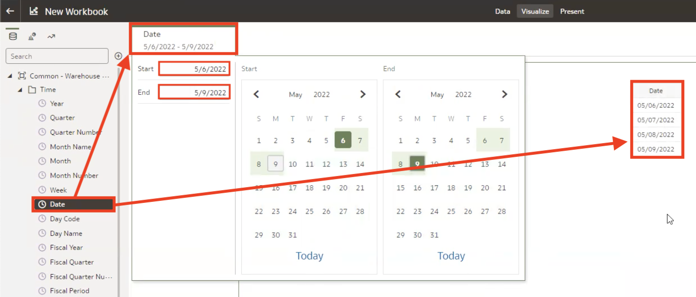

# How can I verify that the incremental update has been completed in Fusion Analytics Warehouse (FAW)?

Duration: 4 minutes

If you have set up an Incremental Execution Time for incremental updates in the Pipeline Parameters of your FAW instance, you may have noticed that incremental updates are not recorded in the Request History.

### What are Pipeline Parameters?
When you extract your data in FAW, you have the option to set certain specifications about the data that you are extracting within your data pipeline and this is referred to as Pipeline Parameters. Options include Analytics Language, Currency, Exchange Rate Type, and Incremental Execution Time among others.

System Administrators will have set an Incremental Execution Time which automatically loads  data at a time specified to ensure that their data is up-to-date.

### Why do I need to verify that incremental updates have run successfully?
* Verify that your critical records have been imported as scheduled
* Sanity check to make sure your system is running as you've specified
* Ensure that your data is current

## Verify incremental updates
The following steps will guide you to verify that the incremental updates have started and been completed in your FAW environment.

  > **Note:** You must have 'Data Warehouse Refresh and Usage Tracking Analysis Duty' application role to successfully complete these steps.

1. Click on the **hamburger menu** and navigate to **Projects**. This will direct you to the console that manages the embedded Oracle Analytics Cloud service that is a part of your FAW environment.

  

2. Within the OAC console, click on **Create Workbook** and you will be prompted to add a dataset.

  

3. Click on **Subject Areas** and select **Common - Warehouse Refresh Statistics** and click **Add to Workbook**.

  

4. Collapse the folder named **Time** and drag the **Date** column into the canvas to create a table. Then drag **Time** again into the filter section above the canvas and choose the date range which you would like to verify the Incremental Execution Time for.

  

5. Under the **Refresh Summary Details** dataset, select and drag **Process Type** and **Process Description** in the **Rows** section and your table will be created.

* *Adhoc Warehouse Refresh* refers to manual refresh that was executed.
* *Scheduled Warehouse Refresh* refers to the Incremental Execution Time refresh that was set in the Pipeline Parameters. This is your incremental update.

  

Congratulations! You have just learned how to verify that your incremental updates have been completed in Fusion Analytics Warehouse and when and why you would need to do this.

## Learn More
* [Administering Oracle Fusion Analytics Warehouse](https://docs.oracle.com/en/cloud/saas/analytics/21r3/fawag/administering-oracle-fusion-analytics-warehouse.pdf)
* [Set Up the Pipeline Parameters](https://docs.oracle.com/en/cloud/saas/analytics/22r1/fawag/set-pipeline-parameters.html)
