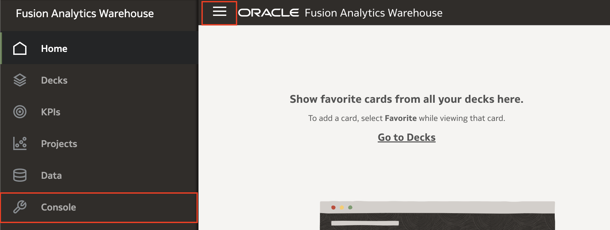
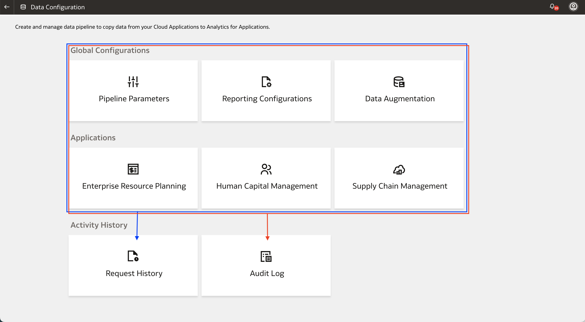
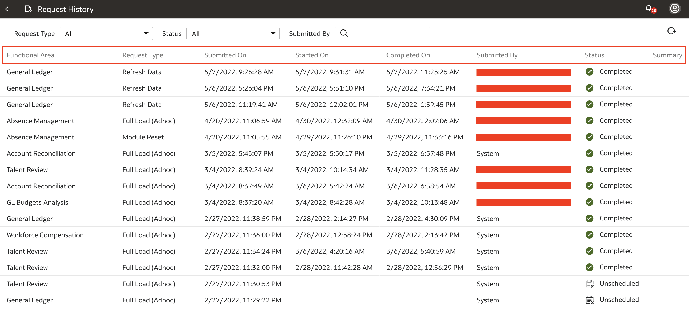
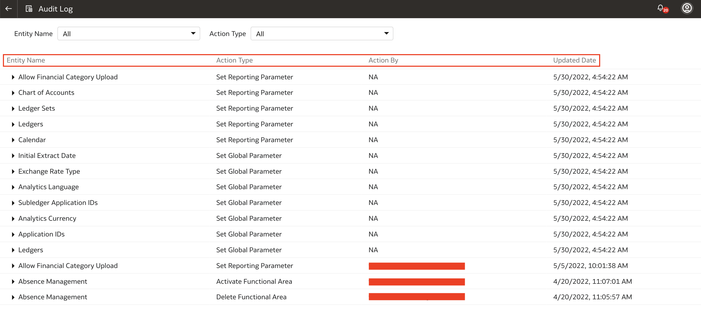

# How do I view the request history and audit logs in Fusion Analytics Warehouse (FAW)?

Duration: 2 minutes

When you run a job in Fusion Analytics Warehouse, it's a best practice to verify that the job has run successfully. This is true whether you run a task in FAW or any other platform. While the status of the tasks for the functional areas in your applications or the data augmentations are listed, you're not able to view the history of the changes you have made. The changes you made to your **Reporting Configurations** are also not listed inside the reporting configurations section. This is where the role of the **Request History** and **Audit Log** come into play and this Sprint will guide you on how to view the Request History and the Audit Logs in FAW.

## View Request History and Audit Logs
>**Note:** You must have the **Service Admin** application role to complete the following steps.

1. In your Fusion Analytics Warehouse homepage, click the **Navigation menu** and click **Console**.

  

2. Under Application Administration, click **Data Configuration**.

  

3. This is where you will find the **Request History** and **Audit Log**. All of the changes that you make in the **Global Configurations** and the **Applications** sections are recorded in the **Audit Log** while the data refreshes and runs associated with those changes are recorded in the **Request History**. Click **Request History**.

    >**Note:** Click [here](https://docs.oracle.com/en/cloud/saas/analytics/22r2/fawag/view-load-request-history.html#GUID-6085251E-FB1C-4AE3-A3E8-517B2B3E5F65) to learn about the different request types and statuses.

  

4. Here, you can see the list of requests such as data refreshes and data loads that were made to your functional areas. To view the list of request types and request statuses, click [here](https://docs.oracle.com/en/cloud/saas/analytics/22r2/fawag/view-load-request-history.html#GUID-6085251E-FB1C-4AE3-A3E8-517B2B3E5F65). Go back to **Data Configuration** and click **Audit Log**.

    >**Note:** Incremental data refreshes are not recorded here. For a comprehensive list of refresh runs with more details, you must view the 'Common - Warehouse Refresh Statistics' subject area. This [LiveLabs Sprint](https://livelabs.oracle.com/pls/apex/r/dbpm/livelabs/run-workshop?p210_wid=3210&session=11021557938086) will guide you on how to explore that subject area to verify your incremental data refreshes.

  

5. In the **Audit Log**, you will see the record of changes you've made in the **Global Configurations** and  **Applications**. Changes such as setting the reporting parameter, setting the global parameter, activating functional areas, deleting functional areas, etc. will all be recorded here.

  

For more information about Request History and Audit Logs, expand the **Learn More** section below.

## Learn More

* [View Load Request History](https://docs.oracle.com/en/cloud/saas/analytics/22r2/fawag/view-load-request-history.html#GUID-F8CB42A3-F316-41AB-B596-7054392A79F1)
* [View Audit Log](https://docs.oracle.com/en/cloud/saas/analytics/22r2/fawag/view-audit-log.html)

## Acknowledgements
* **Author** - Nagwang Gyamtso, Product Manager, Product Strategy
* **Last Updated By/Date** - Nagwang Gyamtso,  July 2022
