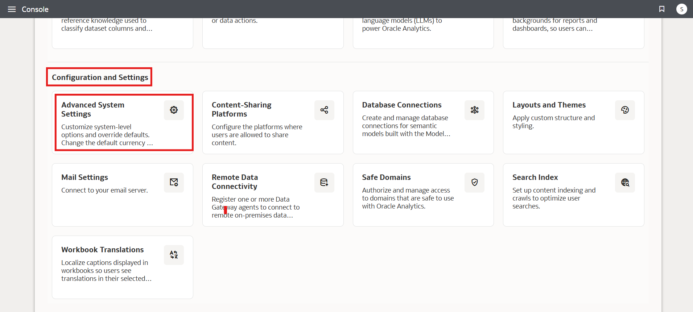
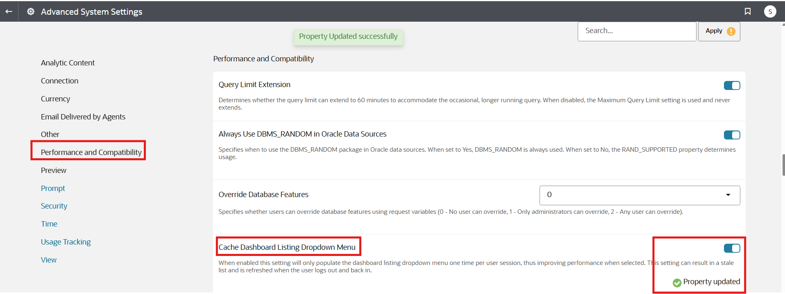
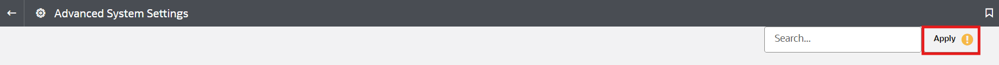
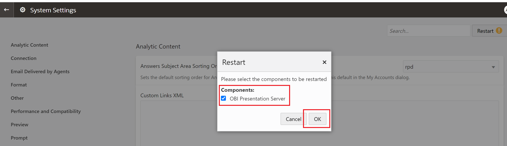

# How do I enable the cache dashboard listing dropdown menu in Oracle Analytics Cloud and Server (OAC & OAS)?

Duration: 1 minute

The Cache Dashboard Listing Dropdown Menu option is a great way to improve performance of dashboard listing. When enabled, this setting will only populate the dashboard listing dropdown menu one time per user session. **Important Note:** This setting can result in a stale list and is refreshed when you user logs out and logs back in.

## Enable cache dashboard listing dropdown menu

>**Note:** You must have the **BI Service Administrator** application role to complete this Sprint.

1. In your Oracle Analytics instance, click the **Navigation menu** and select **Console**.

  

2. Under **Configuration and Administration**, select **System Settings**.

  

3. Within the System Settings, click on **Performance and Compatibility** and search for **Cache Dashboard Listing Dropdown Menu**. Toggle the button to enable this option.

  

4. Once you enable this option, scroll to the top and click **Restart** to apply this change.

  

5. Click **OK** to restart the OBI Presentation Server component. The Cache Dashboard Listing Dropdown Menu should now be enabled.

  

## Acknowledgements
* **Author** - Ahmed Awan, CEAL
* **Last Updated By/Date** - Nagwang Gyamtso, November 2022
