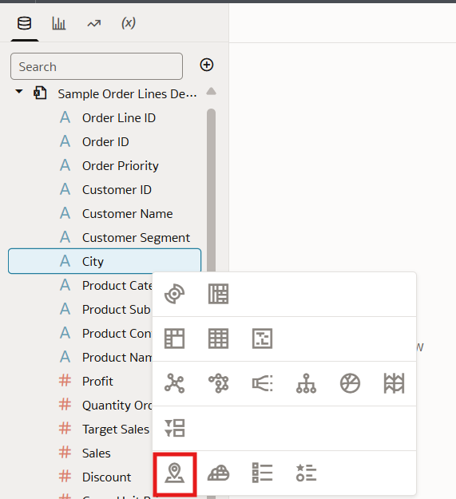

# How do I add a custom map background in Oracle Analytics Cloud (OAC)?
Duration: 3 minutes

Map backgrounds are a great tool to improve the quality of your map visualizations
and customize them to fit the specific theme of your workbooks in OAC. You can style your custom background using Google Maps or Baidu, as well as any maps created with Web Service Map or
Tiled Web Map protocols.

## Adding a custom map background through the OAC Console.
In order to complete this sprint you need to have the appropriate credentials
ready from your mapping service. If you are using Google Maps or Baidu, this is an API key.
If you are using a Web Service Map or Tiled Web Map protocol, this is a URL.

>**Note:** You must have the **BI Service Admin** role in order to complete the following steps.

1. From your OAC homepage, click on the hamburger icon in the top left and select **Console**.

    

2. From the Console page, select **Maps**.

    

3. Click on **Backgrounds** and expand the **Map Backgrounds** field.

    

4. Click **Add Background** and select the supported mapping service that you would like to use. For this tutorial, we choose Google Maps.

    

5. Google Maps requires an API key as credentials to create the map background. We paste our API key into the **Key** field and give the map a description. If you are using a different mapping service, you may need to provide a URL/API instead. We are also given the option to specify account type and default map type. Click **Save** and you should see your background added to the list of available map backgrounds.

    

6. Your map background is now ready to be used in a workbook. You can verify this by returning to the OAC homepage
and creating a new workbook. You must use a dataset that has a location-based column, such as "State" or "Country" so that
you can create a map visualization.

    

7. Within the workbook, right click on your location-based column and select
**Pick Visualization**, Then select the map visualization.
**Note:** By default your map has a white background, but you can change
this by adding your custom map background.

    

    

8. Look to the bottom left of the screen at the properties section for our visualization. Click on the **Map** icon, then
find the **Background Map** option and change it from **default** to your newly created custom map background. Your background is
listed by the name of the mapping service that you created it with, so we choose Google Maps for this example.

    

9. The map visualization is now updated with the custom background you created.

    

Congratulations, you have just learned how to add a custom map background in Oracle Analytics Cloud!

## Learn More

* [Create a Map View of Your Data](https://docs.oracle.com/en/cloud/paas/analytics-cloud/tutorial-create-map-view-of-data/#before_you_begin)
* [Enhance Visualizations with Map Backgrounds](https://docs.oracle.com/en/cloud/paas/analytics-cloud/acubi/enhance-visualizations-map-backgrounds.html)

## Acknowledgements
* **Author** - Miles Novotny, Solution Engineer, North America Specialist Hub
* **Last Updated By/Date** - Miles Novotny, August 2022 Backgrounds](https://docs.oracle.com/en/cloud/paas/analytics-cloud/acubi/enhance-visualizations-map-backgrounds.html)

## Acknowledgements
* **Author** - Miles Novotny, Solution Engineer, North America Specialist Hub
* **Last Updated By/Date** - Miles Novotny, August 2022
