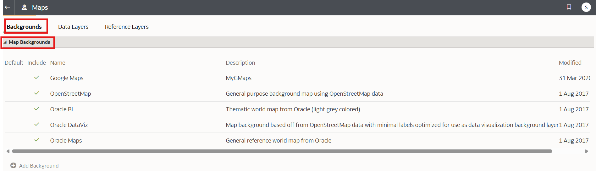
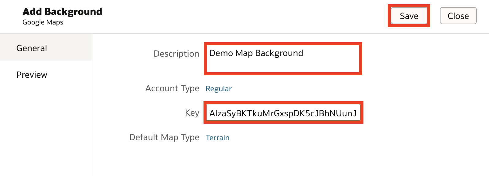
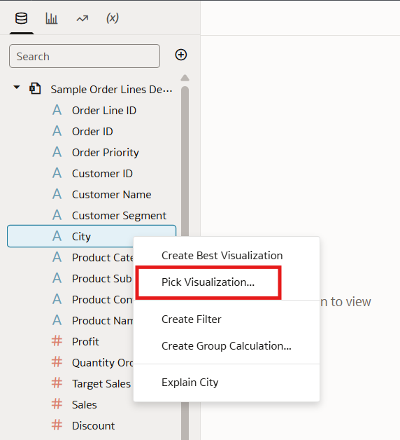

# How do I add a custom map background in Oracle Analytics Cloud and Server (OAC & OAS)?

Duration: 3 minutes

Map backgrounds are a great tool to improve the quality of your map visualizations and customize them to fit the specific theme of your workbooks in OAC and OAS. You can style your custom background using Google Maps or Baidu, as well as any maps created with Web Service Map or Tiled Web Map protocols.

## Adding a custom map background
You need your mapping service's credentials to complete this sprint.
For Google Maps or Baidu, this is an API key, and for Web Service Map or Tiled Web Map protocol, this is a URL.

>**Note:** You must have the **BI Service Admin** role in order to complete the following steps.

1. 1.	On the Home page, click on the hamburger icon in the top left and select **Console**.

    

2. From the Console page, select **Maps**.

    

3. Click on **Backgrounds** and expand the **Map Backgrounds** field.

    

4. Click **Add Background** and select the supported mapping service that you would like to use. For this tutorial, we choose Google Maps.

    

5. Google Maps requires an API key as credentials to create the map background. We paste our API key into the **Key** field and give the map a description. If you are using a different mapping service, you may need to provide a URL/API instead. We are also given the option to specify account type and default map type. Click **Save** and you should see your background added to the list of available map backgrounds.

    

6. 6.	Go to the Home page and click Create and then select Workbook. Add a dataset that contains location-based columns, such as "State" or "Country.

    

7. 7.	In the workbook, right-click the location-based column, select **Pick Visualization**, and select Map as the visualization type.
**Note:** By default your map has a white background, but you can change this by adding your custom map background.

    

    

8. 8.	In the Grammar panel, click **Properties** and click **Map** and select the custom map background you added. Your background is listed by the name of the mapping service you created it with, for example Google Maps.

    

9. The map visualization is now updated with the custom background you created.

    

Congratulations, you have just learned how to add a custom map background in Oracle Analytics Cloud and Server!

## Learn More

* [Create a Map View of Your Data](https://docs.oracle.com/en/cloud/paas/analytics-cloud/tutorial-create-map-view-of-data/#before_you_begin)
* [Enhance Visualizations with Map Backgrounds](https://docs.oracle.com/en/cloud/paas/analytics-cloud/acubi/enhance-visualizations-map-backgrounds.html)

## Acknowledgements
* **Author** - Miles Novotny, Solution Engineer, North America Specialist Hub
* **Last Updated By/Date** - Miles Novotny, August 2022
