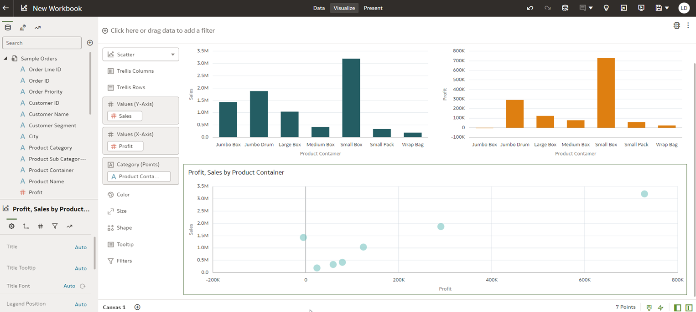
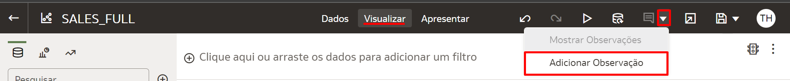
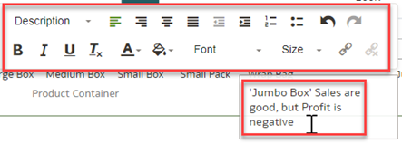
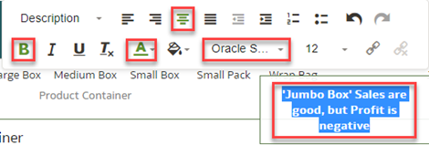
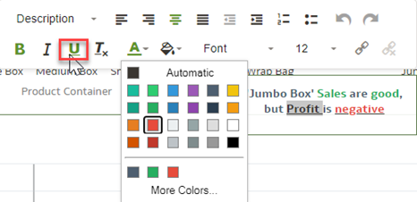
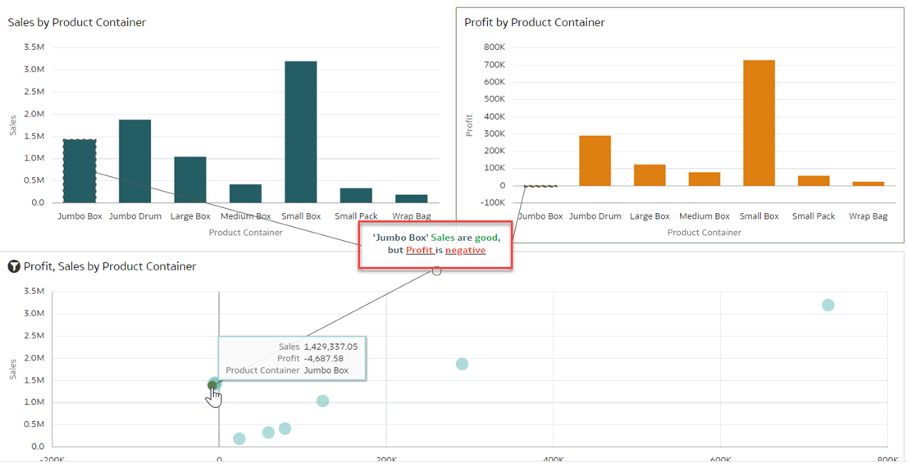
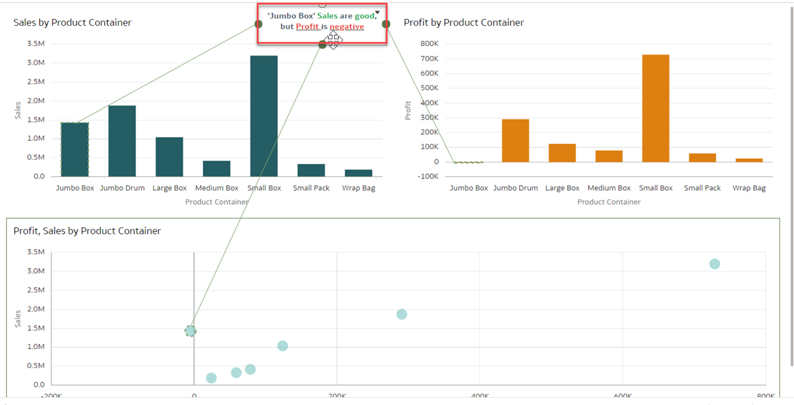

# Como adicionar notas para apoiar a apresentação e a narrativa no Oracle Analytics Cloud (OAC)?

Duração: 3 minutos

Adicionar notas ou observações às visualizações é uma ótima maneira de complementar a apresentação e a narrativa. Você pode adicionar notas para destacar informações importantes nas visualizações de uma pasta de trabalho (Workbook).

Por exemplo, digamos que você acabou de explorar uma análise de vendas e percebe que, embora as vendas estejam indo bem, o lucro é negativo e, portanto, você deseja adicionar seu insight a essa análise.

   

As notas são uma ótima maneira de enfatizar ou explicar informações importantes relacionadas às suas visualizações. Neste exemplo, adicionaremos uma nota com conectores de ponto de dados. Você pode conectar uma nota a até dez pontos de dados em uma visualização ou canva.

## Adicione notas ou observações às suas visualizações

>**Nota:** Você deve ter a permissão de **DV Content Author** para executar os passos a seguir.

1. Na aba Visualizar, clique no ícone de **Notas** como indicado na imagem e selecione **Adicionar Observação**.

   

2. Digite o seu insight dento da caixa de texto.

   

3. Enfatize seu conteúdo usando formatações, como alterar o tamanho da fonte, negrito, cor do texto ou alinhamento.

   

4. A cor é uma das ferramentas mais poderosas que você tem para enfatizar o texto. Para esta visualização, você deseja focar a atenção no lucro negativo de 'Jumbo Box'. Para fazer isso, selecione as palavras que deseja colorir, clique no ícone **Cor do Texto** e escolha vermelho.

   
     > **Nota:** Você também pode utilizar a opção de sublinhado como uma ferramenta para enfatizar o texto para acomodar pessoas com daltonismo.

5.  Para anexar a nota a um ponto de dados, passe o mouse sobre a nota e arraste um círculo para o ponto de dado ao qual deseja conectar a nota. Você pode conectar um círculo a vários pontos de dados.

   

6. Você também pode alterar o posicionamento de sua nota clicando e arrastando a nota pela tela. Isso não moverá os pontos de dados.

   
   > **Dica:** Ao decidir onde posicionar suas observações importantes, coloque-as de acordo com a direção em que um idioma é lido. Por exemplo, este Sprint é escrito em português, que é lido da esquerda para a direita, portanto, queremos posicionar nossa anotação, que é um insight importante queremos que as pessoas leiam, no canto superior esquerdo, onde seus olhos poderão captá-lo desde o início. Para idiomas onde a leitura é feita da direita para a esquerda, como árabe e [outros idiomas](https://www.worldatlas.com/articles/which-languages-are-written-from-right-to-left.html), deixaríamos a nota ou observação no canto superior direito para que ela fosse notada mais facilmente.

Parabéns! Você acabou de aprender como adicionar notas ou observações a visualizações e vinculá-las a pontos de dados específicos. Você também aprendeu que a cor e onde você posiciona seu insight (nota) é relevante para apresentar e contar a história adequadamente.

## Saiba Mais
* [Add Notes to Visualizations](https://docs.oracle.com/en/cloud/paas/analytics-cloud/acubi/add-notes-visualizations.html#GUID-4C3A1144-7C3C-4F61-8111-00FADD62978D)

## Reconhecimentos
* **Autor** - Lucian Dinescu, Product Strategy, Analytics
* **Tradução** - Thais Henrique, Cloud Engineer, Brazil Data & AI Team
* **Última Atualização** - Thais Henrique,  Agosto 2022
