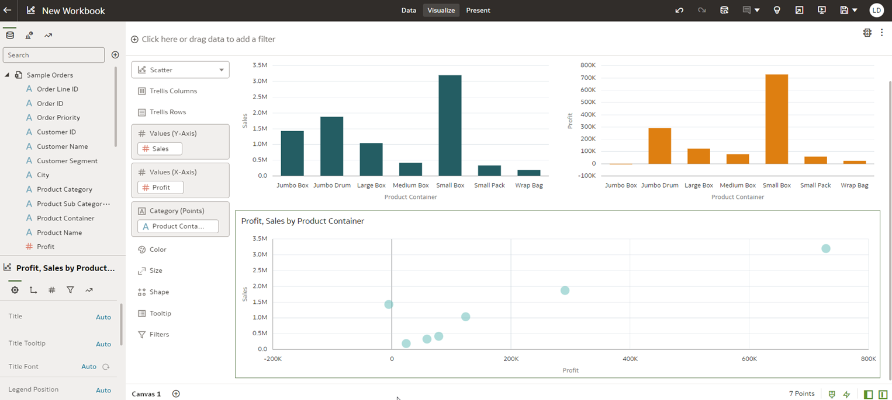
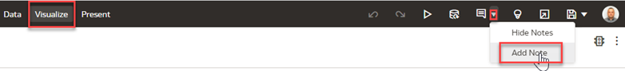
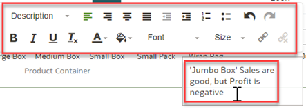
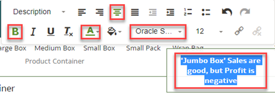
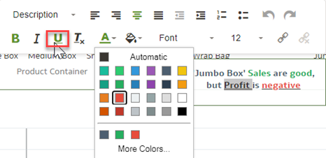
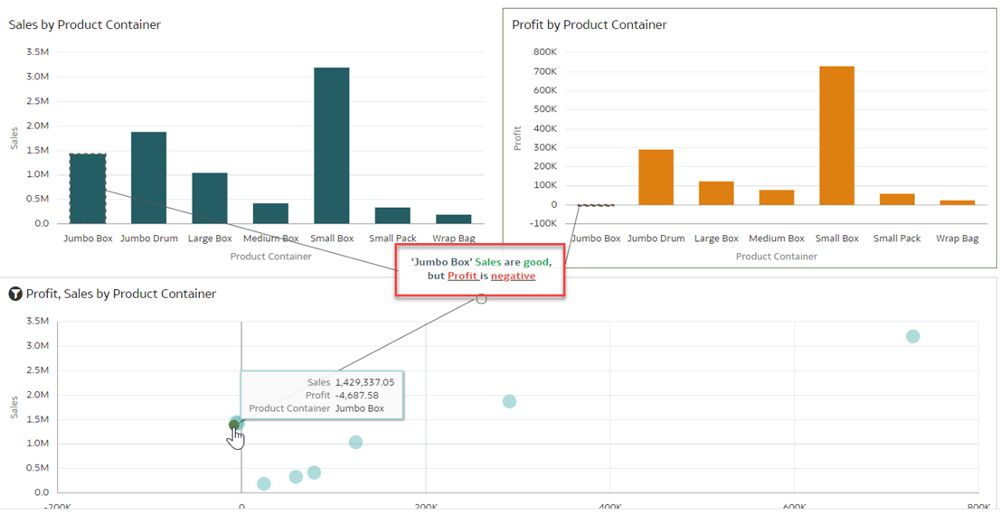
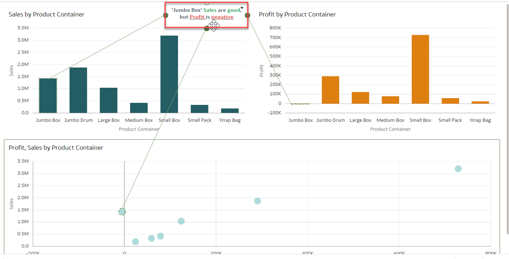

# How do I add notes to support presenting and storytelling in Oracle Analytics Cloud and Server (OAC & OAS)?

Duration: 3 minutes

Adding notes to visualizations is a great way to support presenting and storytelling. You can add notes to call out important information in a workbook's visualizations.

For example, let's say you have just explored a sales analysis and you notice that while sales are doing well, profit is negative and so you want to add your insight to this analysis.

   

Notes are a great way to emphasize or explain important information related to your visualizations. In this Sprint example, we are going to add a note with data point connectors. You can connect a note to up to ten data points on a visualization or canvas.

## Add notes to your visualizations
>**Note:** You must have the **DV Content Author** application role to execute the following steps.

1. On your visualization canvas, click the **Notes** icon represented by the text bubble and select **Add Note**.  

   

2. Type in your insight in the text box.

     

3. Emphasize your content by using formatting such as changing the font size, bold, color, or alignment.

      

4. Color is one of the most powerful tools that you have to emphasize text. For this visualization, you want to focus the attention to the negative profit of 'Jumbo Box'. To do this, select the words you want to color, and click on the **Text Color** icon and choose red.

     
     > **Note:** You can also utilize the underline option as a tool to emphasize text to accomadate for those with color blindness.

5.  To attach the note to a data point, hover over the note and drag a circle to the data point that you want to connect the note to. You can connect a circle to multiple data points.

      

6. You can also change the positioning of your note by clicking and dragging the note around your canvas. This will not move the data points.

     
   > **Tip:** When deciding where to position your important annotations, place them according to the direction a language is read in. For example, this Sprint is written in Enlish which is read from left to right so we want to position our annotation, which is an important insight we want people to read, towards the top left where their eyes will be able to catch it early on. For languages read from right to left like Arabic and [other languages](https://www.worldatlas.com/articles/which-languages-are-written-from-right-to-left.html), we would leave the note on the top right so that it is noticed.

Congratulations! You have just learned how to add notes to visualizations and tied it to specific data points. You have also learned that color and where you position your insight (notes) is relevant to properly presenting and storytelling.

## Learn More
* [Add Notes to Visualizations](https://docs.oracle.com/en/cloud/paas/analytics-cloud/acubi/add-notes-visualizations.html#GUID-4C3A1144-7C3C-4F61-8111-00FADD62978D)

## Acknowledgements
* **Author** - Lucian Dinescu, Product Strategy, Analytics
* **Last Updated By/Date** - Lucian Dinescu,  June 2022
