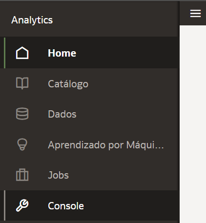

# Como faço para habilitar o Auto Insights no meu conjunto de dados no Oracle Analytics Cloud (OAC)?

Duração: 3 minutos

O Auto Insights é uma ótima maneira de criar uma visualização poderosa usando sugestões geradas automaticamente pelo Oracle Analytics em seu Workbook. Também é um recurso proativo, fornecendo um ponto de partida para entender os principais elementos de dados em um conjunto de dados para que você não fique preso à "síndrome do canvas em branco" (blank canvas syndrome).

As etapas a seguir mostrarão como habilitar o Auto Insights se não estiver aparecendo para o seu conjunto de dados.
   

## Habilite o Auto Insights
  > **Nota:** Você precisa ter a permissão **BI Service Administrator** para conseguir executar os próximos passos.

1. Na página inicial do OAC, clique no **Menu de Navegação** e selecione **Console**.

   

2. Clique em **Configurações avançadas do sistema**.

   

3. Na página de Definições do Sistema, clique em **Performance and Compatibility** e localize o campo **Enable Auto Insights on Datasets**. Clique no botão indicado na imagem para habilitar o Auto Insights.
      > **Nota:** Em versões futuras do OAC você poderá encontrar essa opção habilitada de forma automática por padrão.

      

4. No Menu de Navegação clique em Dados. Em seguida, localize seu conjunto de dados, clique nele com o botão direto do mouse e clique em **Inspecionar**.

      

5. Na aba **Geral**, selecione **Ativar Insights**. Para salvar suas mudanças clique em **Salvar** e **Fechar**.
      > **Nota:** A opção **Ativar Insights** está disponível agora.

      

Parabéns, você aprendeu como habilitar o recurso **Auto Insights**.
Oracle Analytics irá disponibilizar sugestões de visualizações com uma descrição textual dos melhores insights disponíveis para o seu conjunto de dados.

## Saiba Mais
* [Begin every data journey with Auto Insights](https://blogs.oracle.com/analytics/post/begin-every-data-journey-with-auto-insights)

## Reconhecimentos
* **Autor** - Lucian Dinescu, Product Strategy, Analytics
* **Tradução** - Thais Henrique, Cloud Engineer, Brazil Data & AI Team
* **Última Atualização** - Thais Henrique,  Março 2023
