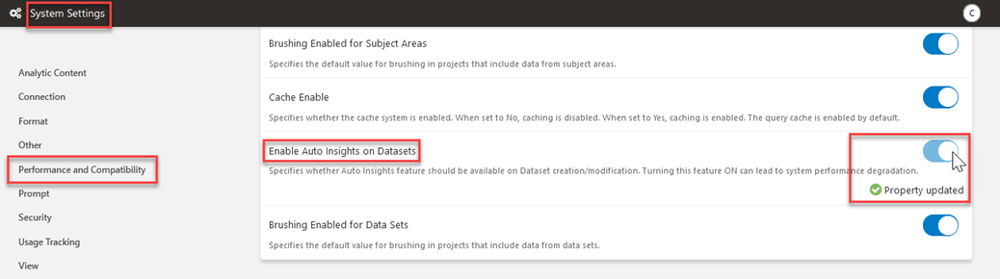

# How do I enable Auto Insights with my dataset in Oracle Analytics Cloud (OAC)?

Last updated June 6, 2022

Duration: 3 minutes

Auto Insights is a great way to create powerful visualization using suggestions automatically generated by Oracle Analytics in your workbook. It is also a proactive feature, providing a starting point for understanding key data elements within a dataset so that you are not stuck with blank canvas syndrome. 

The following steps will show you how to enable Auto Insights if it is missing for your dataset.
   

## Enable Auto Insights
  > **Note:** You must have the **BI Service Administrator** application role to complete the following steps.

1. On the OAC homepage, click the **Navigation menu** and select **Console**.

   

2. Click on **System Settings**.

     

3. Within the System Settings, click on **Performance and Compatibility** and search for **Enable Auto Insights on Datasets**. Toggle the button to enable Auto Insights.
      > **Note:** in future OAC releases you might find this option enabled by default

        
  

4. Go back to your dataset and click the **Actions Menu**. Then select **Inspect** and in the **General** tab, select **Enable Insights**. To save your changes, click **Save** and **Close**. 
      > **Note:** **Enable Insights**  option is  available now

        
    

Congratulations, you have just learned how to enable **Auto Insights**. Oracle Analytics will now display suggested visualizations with a textual description of the best insights for your datasets.

## Learn More
* [Begin every data journey with Auto Insights](https://blogs.oracle.com/analytics/post/begin-every-data-journey-with-auto-insights)
