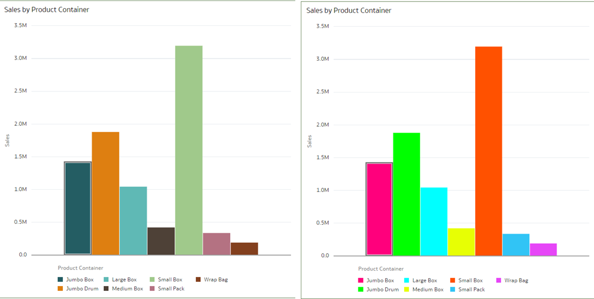
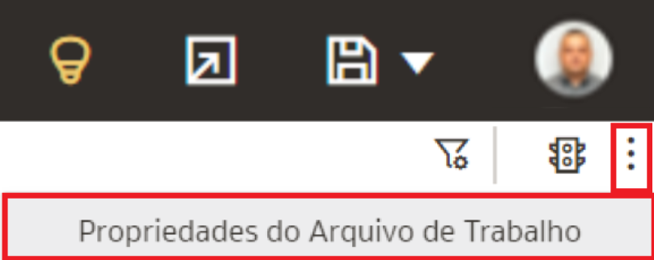
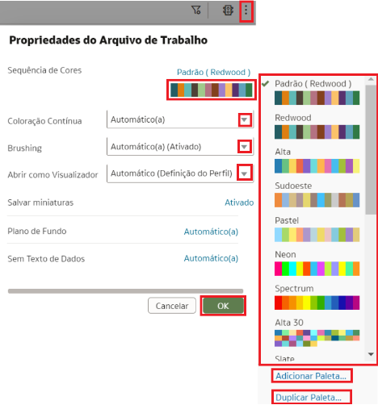
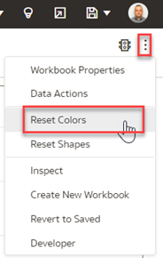
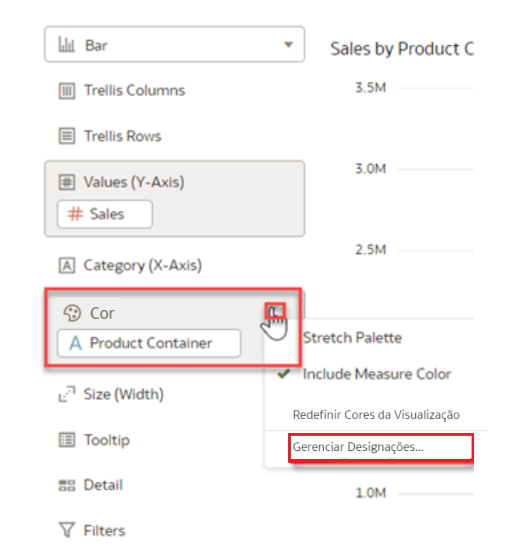
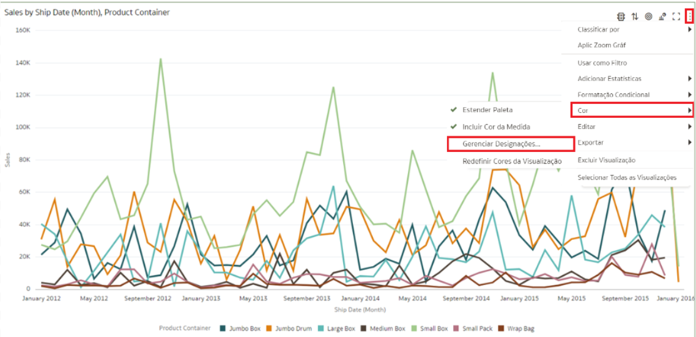
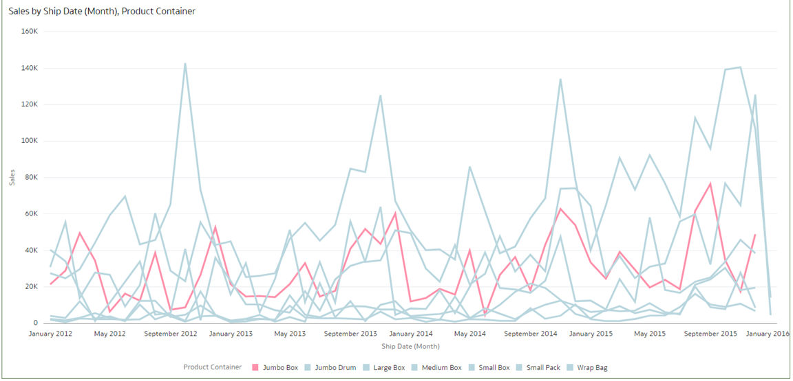

# Como posso mudar a paleta de cores para minhas visualizações no Oracle Analytics Cloud (OAC)?

Duração: 3 minutos

É importante mudar a paleta de cores e manter as cores consistentes. Demasiadas cores brilhantes ou escuras exigem atenção e rapidamente se tornam visualmente extenuantes.

   

Sua paleta de cores é compartilhada em todas as visualizações na tela, portanto, se você mudar as cores para um data point em uma visualização, então ela aparece também nas outras visualizações. Este Sprint mostrará como mudar a paleta de cores e gerenciar a atribuição de cores.

## Mudar a paleta de cores

O tema padrão para OAC é Redwood, o que facilita muito a leitura de dados, graças a um melhor manuseio do espaço branco, uma paleta de cores mais suave e novas fontes.
   > **Nota:** Você deve ter a permissão de **DV Content Author** para executar os passos a seguir.

1. Em sua pasta de trabalho, clique no ícone **Menu** e selecione **Workbook Properties**

   .  

2. As opções de cores disponíveis dependem de como as medidas e atributos são configuradas em sua visualização.

   

3. Experimente diferentes combinações de cores até criar uma paleta que se adapte ao tema da sua pasta de trabalho. Qualquer alteração feita sempre pode ser redefinida usando o botão **Reset Colors** para reverter para as cores originais. Cada paleta de cores contém 12 cores que você pode aplicar a uma visualização. Você também pode **Duplicate Palette** e editar as cores por conta própria.

       

4. O **Grammar Panel** possui uma seção **Color** onde você pode colocar uma coluna de medida, coluna de atributos ou conjunto de colunas de atributos.
   - Quando uma medida está na seção **Color**, então você pode selecionar diferentes tipos de intervalo de medida.
   - Quando um atributo está na Color section, a **Stretch Palette** é usada como padrão.
   - Quando há vários atributos na Color section, então a paleta hierárquica é usada por padrão, mas você pode optar por usar a stretch palette em vez disso.

     

      >**Nota:** **Stretch Palette** expande o número de cores na paleta, adicionando tons claros e escuros das cores da paleta para dar a cada valor uma cor única.

### Atribuir cores às colunas
Você pode atribuir cores específicas para ajustar o visual de suas visualizações. Digamos que você está interessado em destacar as vendas de um item específico como 'Jumbo Box' neste exemplo.

1. Clique no **Menu**, selecione **Color** e **Manage Assignments**.

     
     > **Nota:** Você tem 7 vendas de 'Product Container' e deseja detectar apenas 'Jumbo Box' é um desafio com os padrões.

2. Clique na caixa que contém a atribuição de cores que deseja alterar. A partir da caixa de diálogo do seletor de cores, selecione a cor que deseja atribuir. Clique em **Done**.

      

6. Agora, você pode rapidamente detectar as vendas 'Jumbo Box'. Gerenciar atribuições de cores para visualizações é uma ótima ferramenta para chamar insights específicos.

     

Parabéns! Você acabou de aprender a alterar a paleta de cores e atribuir cores às colunas para detectar valores distintos.

## Saiba Mais
* [Change the Color Palette](https://docs.oracle.com/en/cloud/paas/analytics-cloud/acubi/apply-color-visualizations.html#GUID-408A711F-6C66-4126-BBFF-46926128A91D)
* [Redwood – the exciting new face of Oracle Analytics](https://blogs.oracle.com/analytics/post/redwood-is-coming-to-oracle-analytics)
* [Alternative Color Strategies for the New Redwood Theme in OAC](https://vlamis.com/alternative-color-strategies-for-the-new-redwood-theme-in-oac/)
* [ColorBrewer website](http://colorbrewer2.org/)
*[Colors for data scientists](https://medialab.github.io/iwanthue/)
* [W3 Schools Color Picker](https://www.w3schools.com/colors/colors_picker.asp)

## Reconhecimentos
* **Autor** - Lucian Dinescu, Product Strategy, Analytics
* **Tradução** - Isabelle Dias, GenO, Brazil Data & AI Team
* **Última Atualização** - Isabelle Dias,  Setembro 2022
