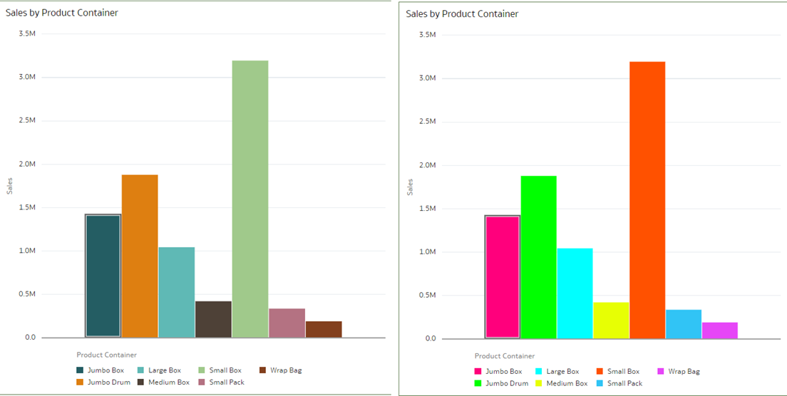
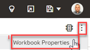
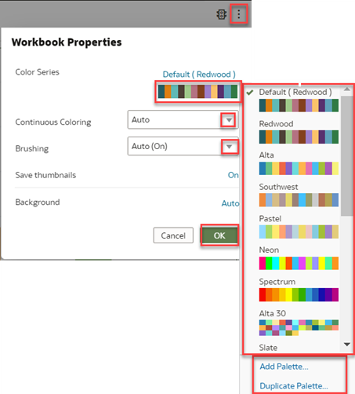
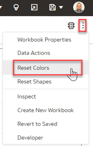
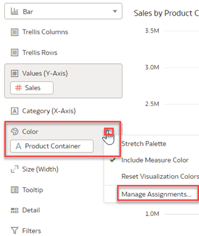
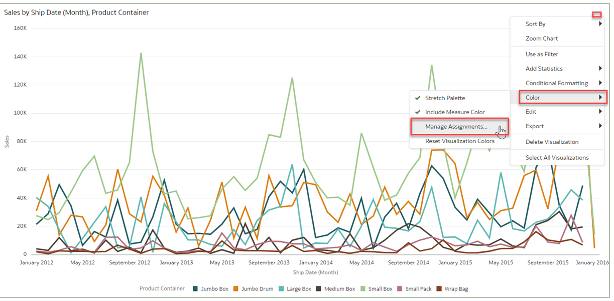
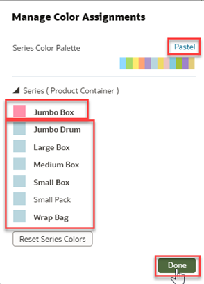
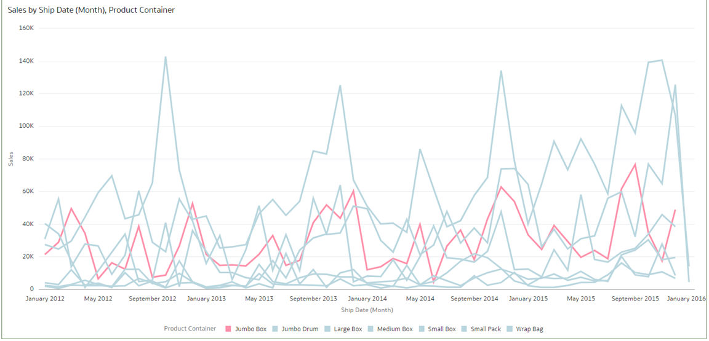

# How do I change the color palette for my visualizations in Oracle Analytics Cloud (OAC)?

Duration: 3 minutes

Changing the color palette and keeping colors consistent is important. Too many bright or dark colors demand attention and quickly become visually exhausting.

   

Your color palette is shared across all visualizations on the canvas, so if you change the colors for a data point in one visualization, then it appears on the other visualizations as well. This Sprint will show you how to change the color palette and manage color assignments.

## Change the color palette

The default theme for OAC is Redwood, which makes data driven insights that much easier to read, thanks to better handling of white space, a softer color palette, and new fonts.
   > **Note:** You must have the **DV Content Author** application role to execute the following steps.

1. In your workbook, click the **Menu** icon and select **Workbook Properties**

   .  

2. The available color options depend on how the measures and attributes are set up in your visualization.

   

3. Experiment with different color combinations until you create a palatte that suits your workbook theme. Any changes made can always be reset using the **Reset Colors** button to revert to the original colors. Each color palette contains 12 colors that you can apply to a visualization. You can also **Duplicate Palette** and edit the colors on your own.

       

4. The **Grammar Panel** has a **Color** section where you can put a measure column, attribute column, or set of attributes columns.  
   - When a measure is in the **Color** section, then you can select different measure range types.
   - When an attribute is in the Color section, then the **Stretch Palette** is used by default.
   - When there are multiple attributes in the Color section, then the hierarchical palette is used by default, but you can choose to use the stretch palette instead.

     

      >**Note:** **Stretch Palette** option expands the number of colors in the palette, adding light and dark shades of the palette colors to give each value a unique color

### Assign Colors to Columns
You can assign specific colors to fine-tune the look of your visualizations. Let's say that you are interested in highlighting sales for a specific item like 'Jumbo Box' in this example.

1. Click on the **Menu**, select **Color** and **Manage Assignments**.  

     
     > **Note:** You have 7 'Product Container' Sales and spotting just 'Jumbo Box' is challenging with the defaults.

2. Click the box containing the color assignment that you want to change. From the color picker dialog, select the color that you want to assign. Click **Done**.

      

6. Now, you can quickly spot out 'Jumbo Box' sales. Managing color assignments to visualizations is a great tool to call out specific insights.

     

Congratulations! You have just learned how to change the color palette and assign colors to columns to spot out distinct values.

## Learn More
* [Change the Color Palette](https://docs.oracle.com/en/cloud/paas/analytics-cloud/acubi/apply-color-visualizations.html#GUID-408A711F-6C66-4126-BBFF-46926128A91D)
* [Redwood – the exciting new face of Oracle Analytics](https://blogs.oracle.com/analytics/post/redwood-is-coming-to-oracle-analytics)
* [Alternative Color Strategies for the New Redwood Theme in OAC](https://vlamis.com/alternative-color-strategies-for-the-new-redwood-theme-in-oac/)
* [ColorBrewer website](http://colorbrewer2.org/)
*[Colors for data scientists](https://medialab.github.io/iwanthue/)
* [W3 Schools Color Picker](https://www.w3schools.com/colors/colors_picker.asp)

## Acknowledgements
* **Author** - Lucian Dinescu, Product Strategy, Analytics
* **Last Updated By/Date** - Lucian Dinescu,  June 2022
