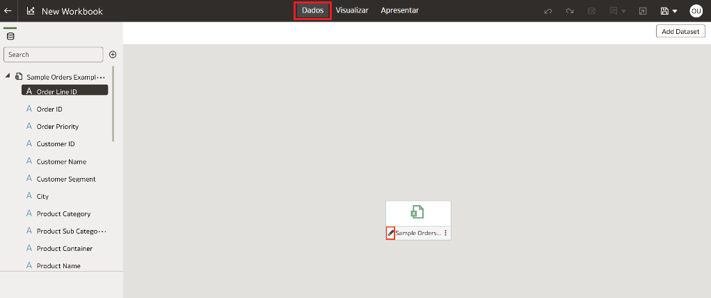
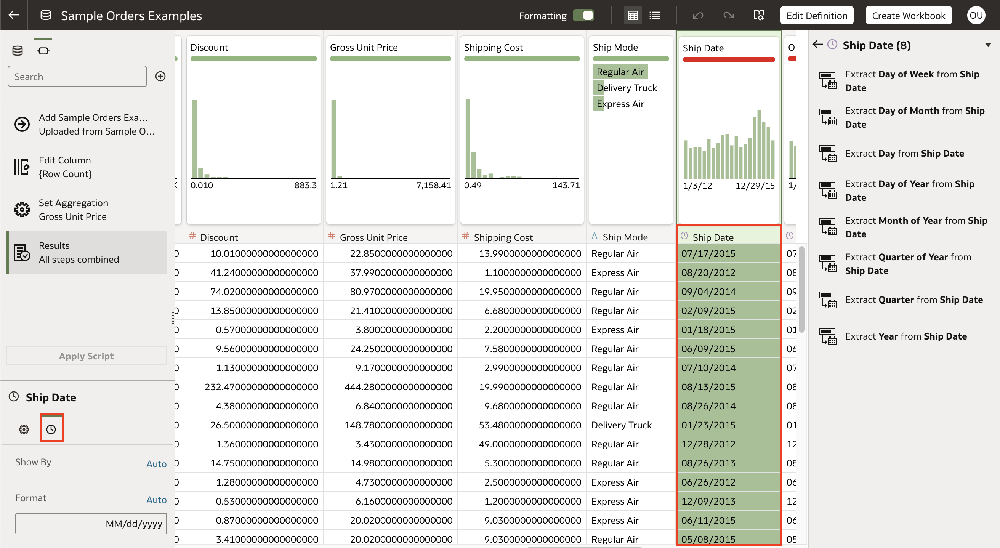
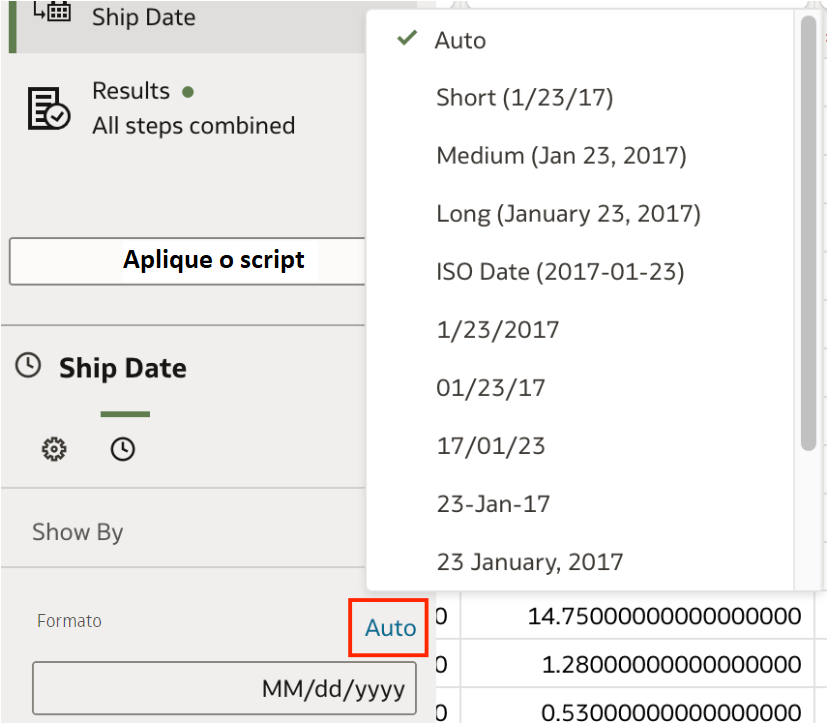
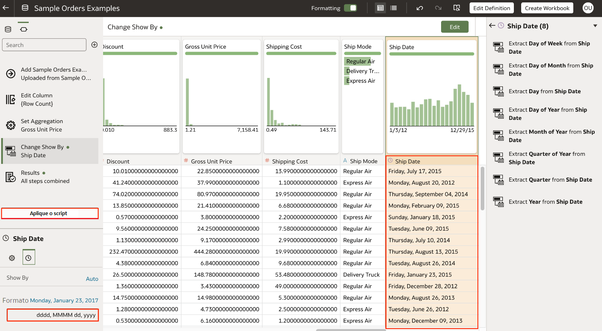

# Como posso alterar o formato padrão de data de uma coluna em um conjunto de dados no Oracle Analytics Cloud (OAC)?

Duração: 1 minuto

Quando você trabalha com colunas de datas no Oracle Analytics Cloud, há muitas alterações que você pode fazer. Você pode extrair sua data com diferentes precisões, como dias, meses, trimestres e anos, assim como alterar o formato de sua data. Neste Sprint, aprenderemos como alterar o formato de exibição de nossas colunas de data no Oracle Analytics Cloud.

## Alterar o formato de data

>**Nota:** Você deve ter o cargo **DV Content Author** para executar as seguintes etapas.

1. Em sua pasta de trabalho, abra o editor do conjunto de dados clicando em **Dados*** e depois clicando no ícone **Lápis*** do conjunto de dados que você deseja editar.

    

2. No editor do conjunto de dados, encontre e selecione a coluna de data da qual você deseja editar o formato de exibição. Isto irá alternar o **Painel de dados** para esta coluna específica que selecionamos. Clique no formato **Data/Hora Formato** como mostrado pelo ícone do relógio.

    

3. Na seção **Formato**, clique na seleção atual na qual é **Auto** e você verá as diferentes opções que você tem para formatar sua coluna de datas.

    

4. Escolha o formato desejado e a coluna de datas será atualizada para refletir a mudança que você fez. Clique em **Aplique o Script** para salvar suas mudanças.

    

Parabéns, você aprendeu como alterar o formato padrão de exibição da data de uma data no Oracle Analytics Cloud (OAC)!

## Saiba mais
* [Ajuste a formatação de Datas ou Números](https://docs.oracle.com/en/cloud/paas/analytics-cloud/acubi/adjust-display-format-date-or-number-column.html)

## Reconhecimentos
* **Autor** - Nagwang Gyamtso, Product Manager, Product Strategy
* **Tradução** - Isabelle Dias, GenO, Brazil Data & AI Team
* **Última Atualização** - Isabel Giannecchini,  Outubro 2022
