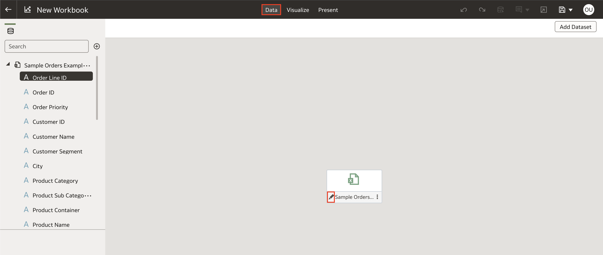
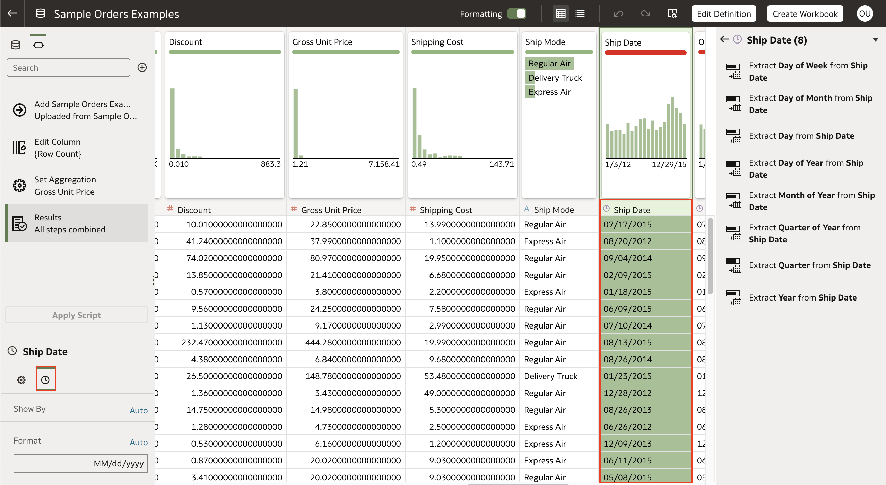
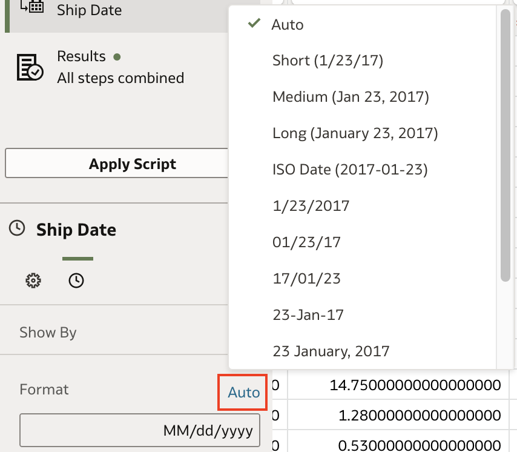
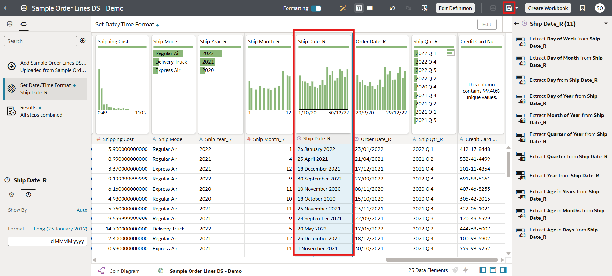

# How do I change the default date format of a column in a dataset in Oracle Analytics Cloud (OAC)?

Duration: 1 minute

When you are working with date columns in Oracle Analytics Cloud, there are many alterations you can make to it. You have the ability to extract parts of your date such as days, months, quarters and years as well as change the format of your date. In this Sprint, we will learn how to change the display format of our date columns in Oracle Analytics Cloud.

## Change date format

1. In your workbook, open the dataset editor by clicking on **Data** and then clicking the **Pencil** icon of the dataset you want to edit.

    

2. In the dataset editor, find and select the date column that you want to edit the display format of. This will toggle the **Data Pane** for this specific column we have selected. Click the **Date/Time Format** as shown by the clock icon. 

    

3. In the **Format** section, click the current selection which is **Auto** and you will see the different options you have for formatting your date column.

    

4. Choose the format you want and the date column will update to reflect the change you have made. Click **Apply Script** to save your changes.

    

Congratulations, you have learned how to change the default date display format of a date in Oracle Analytics Cloud (OAC)!

## Learn more
* [Adjust the Display Format of a Date or Number Column](https://docs.oracle.com/en/cloud/paas/analytics-cloud/acubi/adjust-display-format-date-or-number-column.html)