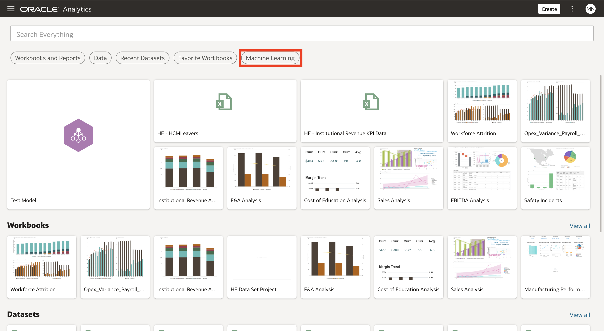
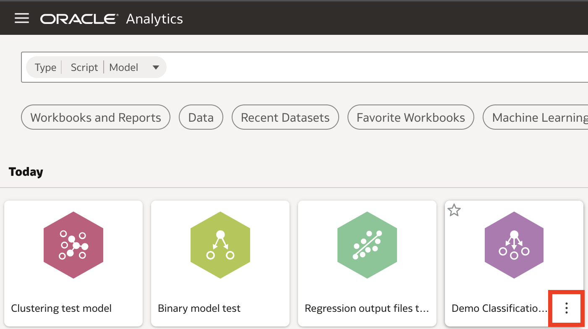
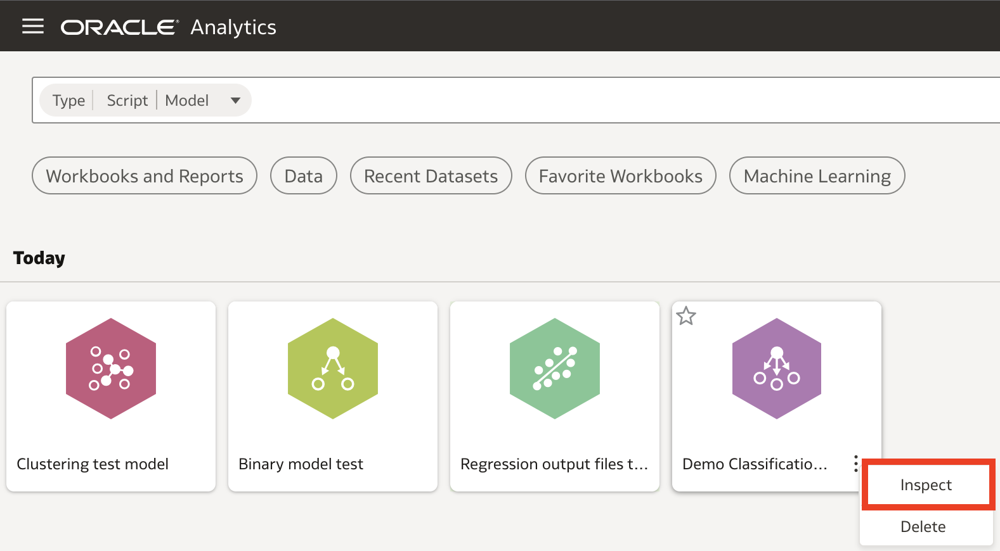
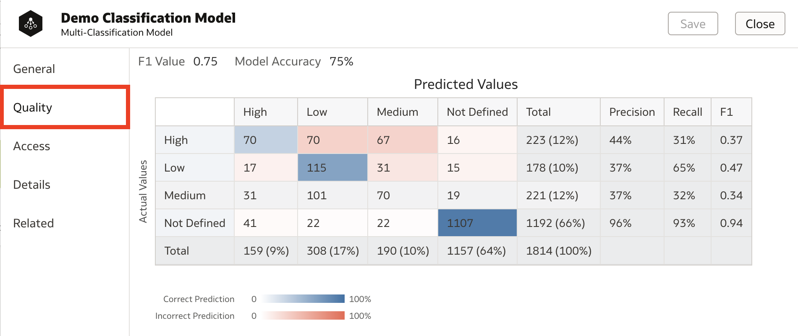
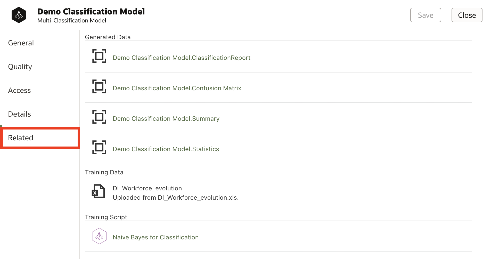
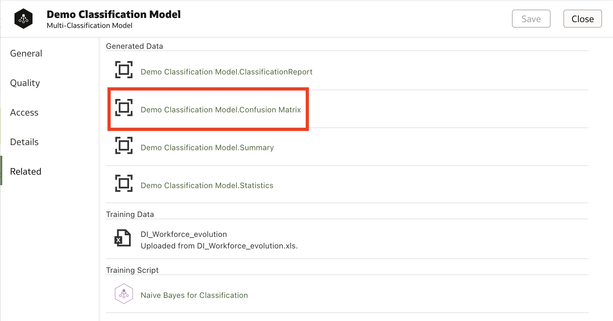
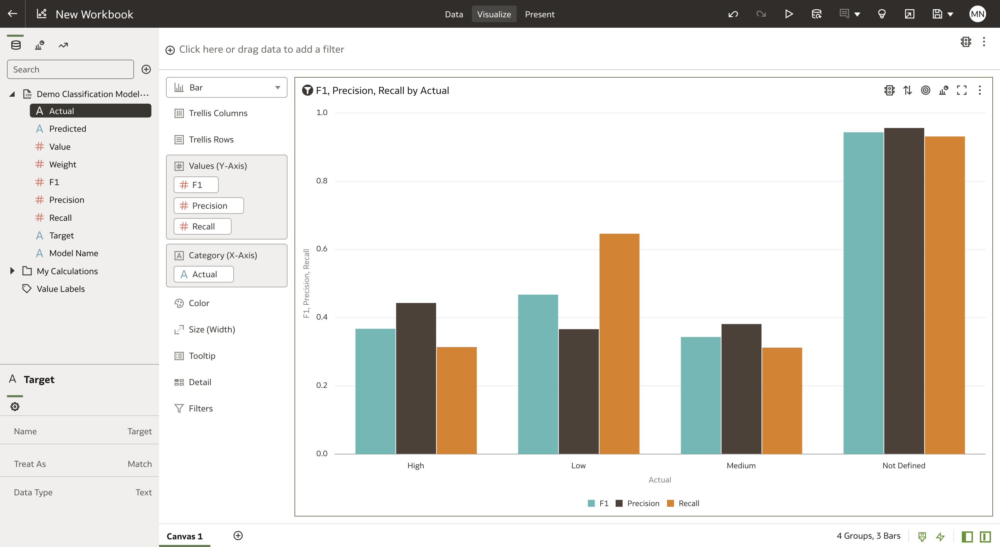

# How do I check a machine learning model's accuracy in Oracle Analytics Cloud (OAC)?
Duration: 2 minutes

Oracle Analytics Cloud gives you the ability to not only easily create machine learning models, but also assess their accuracy. You can view a pre-created display of accuracy metrics, or access datasets and create your own visualizations to understand model quality.

It is key to ensure the quality of a machine learning model before putting it into use. The following steps will show you how to quickly and effectively assess your model accuracy in Oracle Analytics Cloud.

## Check a machine learning model's accuracy.
>**Note:** You must first have trained a machine learning model in Oracle Analytics Cloud in order to complete the following steps. For a guide on model creation, look [here.](https://apexapps.oracle.com/pls/apex/r/dbpm/livelabs/run-workshop?p210_wid=3281&session=107730485068362)

1. From the OAC homepage, click on **Machine Learning** and find the trained model whose accuracy you would like to check.

    

2. Hover over the model and click on the three dots that appear in the bottom right corner.

    

3. Click the **Inspect** option.

    

4. Select the **quality** tab to view basic accuracy metrics for your model. The metrics that appear depend on the type of model. For Binary and Multi Classification models a confusion matrix as well as a number of accuracy metrics are shown. For Numeric Prediction models a graph of residual values and a number of accuracy metrics are shown.

      >**Note:** For clustering models NO information appears on this screen. Continue to the next step to learn how to access accuracy data for clustering models.

      

5. To gain insights beyond what is displayed here, click on **Related**. Under this tab we find objects related to our model such as the training data, and scripts for model training and scoring. We also find datasets that are generated when the model is trained that help us assess the model accuracy. Some of this data may have been displayed on the **Quality** page, while some may remain unused.

    

6. Click on any dataset that you would like to use to assess model quality in order to open a workbook using that dataset.

      >**NOTE:** Creating a workbook with the datasets generated from clustering models is the only way to assess their accuracy.

      

7. We can now visualize the data in any way we choose to assess model accuracy. For example, we display a bar graph comparing the precision, recall, and F1 score for the different possible classification outputs.

    

Congratulations! You have just learned how to check the accuracy of a machine learning model in Oracle Analytics Cloud!

## Learn More

* [Inspect and modify a prediction model](https://docs.oracle.com/en/cloud/paas/analytics-cloud/tutorial-inspect-modify-prediction-model/index.html)
* [What are a predictive model's related datasets?](https://docs.oracle.com/en/cloud/paas/analytics-cloud/acubi/create-and-use-oracle-analytics-predictive-models.html#GUID-4C55DF0E-7FBB-40B7-8650-71CCCA574F57)

### Acknowledgements

- Miles Novotny, Solution Engineer, North America Specialist Hub, July 27th, 2022

- Last Updated By - Miles Novotny, July 27th, 2022
