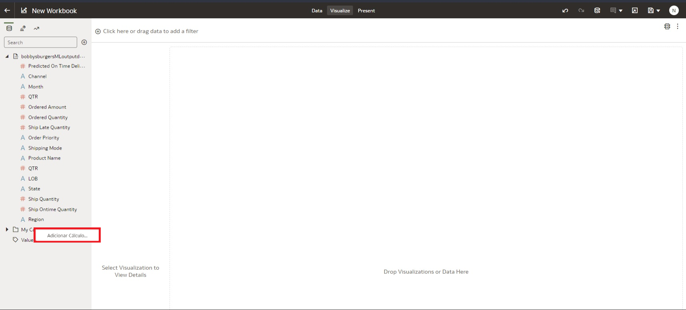
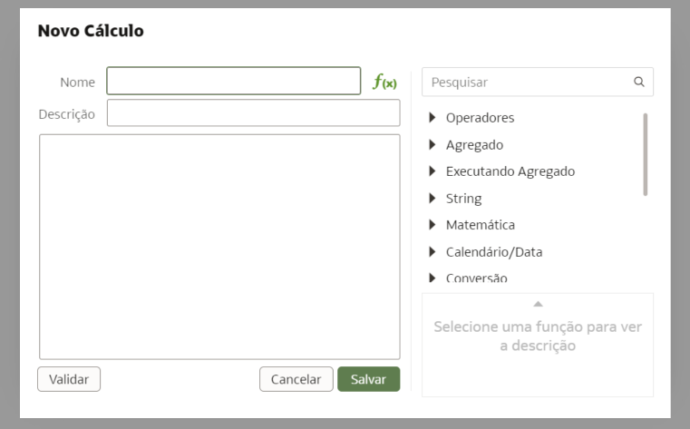
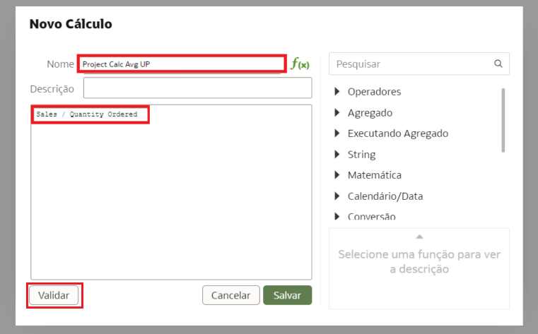
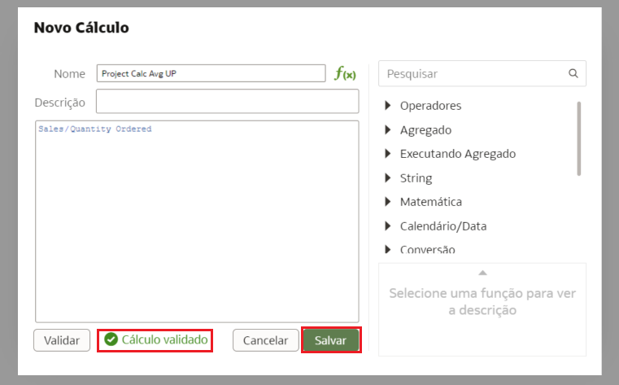
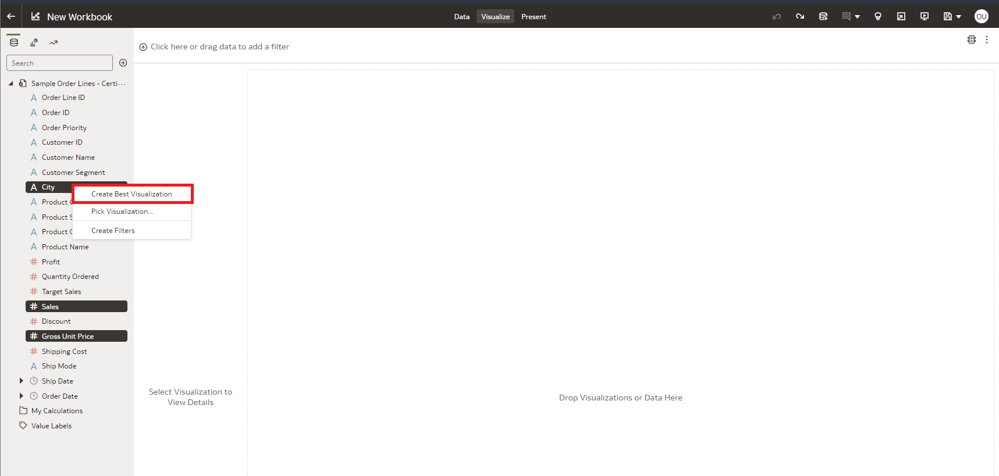
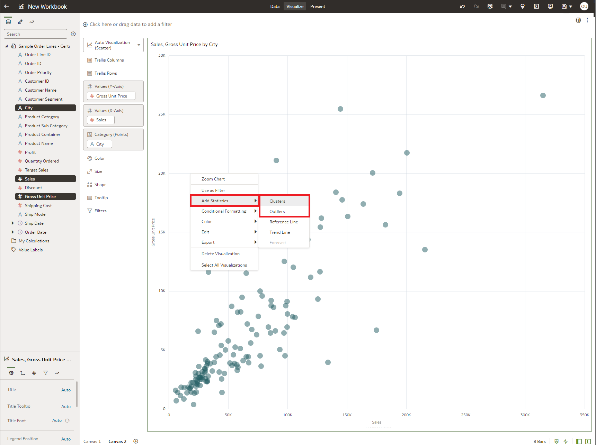
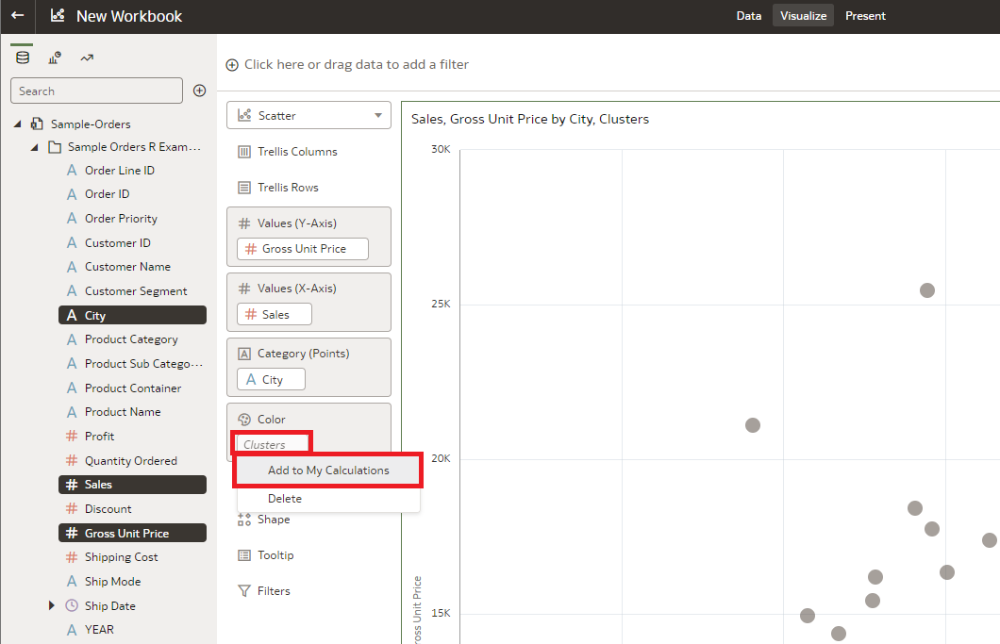
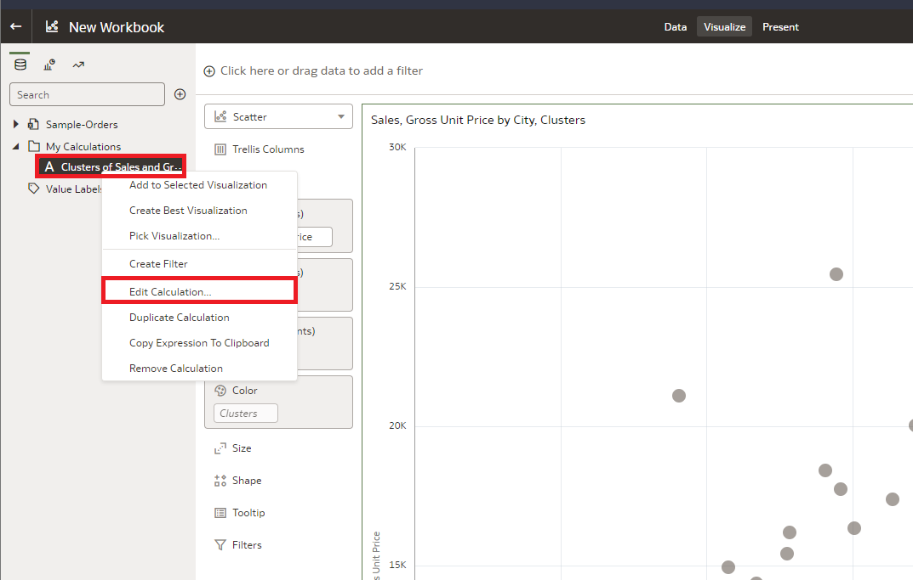
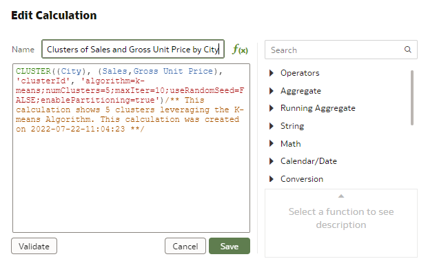

# Como posso criar cálculos avançados no Oracle Analytics Cloud (OAC)?
Duração: 3 minutos

A criação de cálculos avançados pode ser uma ferramenta eficaz para preencher rapidamente as visualizações. Ao criar visualizações, os cálculos automatizados podem ser rapidamente salvos para posterior reimplantação.  A partir de maio de 2022, o OAC permite uma análise poderosa de slice and dice com qualquer medida utilizando estes objetos calculados.

## Cálculos Avançados

>**Nota:** Você deve ter a permissão de **DV Content Author** para executar as seguintes etapas.

### Personalize Manualmente
Os cálculos avançados podem ser definidos rapidamente, usando um script personalizável.

1. Abra seu OAC Workbook. 

2. Observe a pasta **Meus Cálculos** no lado esquerdo do visor e clique com o botão direito do mouse na pasta para selecionar **Adicionar Cálculos**.

    

3. A página de cálculo será aberta com opções para nomear o cálculo, digitar o cálculo e validar antes de salvar. Isto pode ser usado para ajudar a povoar suas visualizações.

    

4. Nesta página, você poderá dar a seu cálculo um título e digitar variáveis, que serão autopovoadas de acordo com suas variáveis no conjunto de dados. Os operadores de funções estão disponíveis no lado direito da janela. Após a conclusão de sua função, certifique-se de **Validar** que sua função funciona, clicando no botão.

    

5. Após uma validação bem sucedida, a tela fornecerá uma resposta em código verde ao lado do botão. Agora você pode clicar em **Salvar** para gerar seu novo cálculo.
   
   

6. O novo cálculo será gerado na janela para que você possa usar nas visualizações.

   

### Cálculos de geração automática

Outra maneira de povoar a página de cálculo é predefinindo clusters ou outliers em seus dados e clicando com o botão direito do mouse na pasta **Meus Cálculos**. 

>**Nota:** Este procedimento está disponível apenas na versão OAC de maio de 2022 ou mais recente. As atualizações da OAS acontecem anualmente, enquanto as atualizações da OAC são mais freqüentes. Portanto, para implementar esta automação, você precisa garantir que a versão da OEA seja posterior a maio de 2022.

1. Com o notebook OAC ainda aberto, preencha uma visualização.

    

2. Clique com o botão direito na imagem e selecione adicionar estatísticas, selecionando **Clusters ou Outliers**. 

    

3. Clique com o botão direito do mouse nas estatísticas povoadas e selecione **Adicionar a Meus Cálculos**.

    
  
4. Observe que o cálculo foi adicionado à pasta de cálculos de maio, do lado esquerdo. Mais informações e edições podem ser feitas a este algoritmo clicando com o botão direito e selecionando **Editar Cálculo**.
   
    

5. Isto abrirá a janela de cálculo avançado, que mostra o algoritmo usado para criar o agrupamento ou diferenciação outlier. Salvar e sair. Agora você pode criar novas visualizações e preencher imagens usando este cálculo pré-definido.

    

## Saiba Mais

* [Crie Cálculos Avançados facilmente com em Oracle Analytics (Video)](https://www.youtube.com/watch?v=aRfYn2hB-Jg)
* [Atualizações OAC](https://docs.oracle.com/en/cloud/paas/analytics-cloud/acswn/index.html#ACSWN-GUID-CFF90F44-BCEB-49EE-B40B-8D040F02D476)
* [Duas formas de criar cálculos customizados em Oracle Analytics](https://blogs.oracle.com/analytics/post/two-ways-to-create-custom-calculations-in-oracle-analytics)

## Reconhecimentos

* **Autor** - Nicholas Cusato, Solution Engineer, Santa Monica Specialists Hub
* **Tradução** - Isabelle Dias, GenO, Brazil Data & AI Team
* **Última Atualização** - Thais Henrique,  Março 2023
