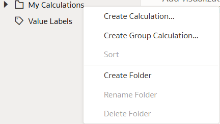
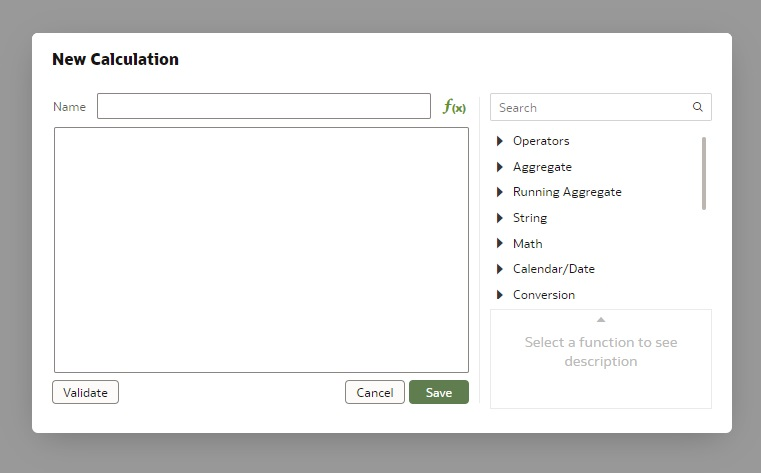
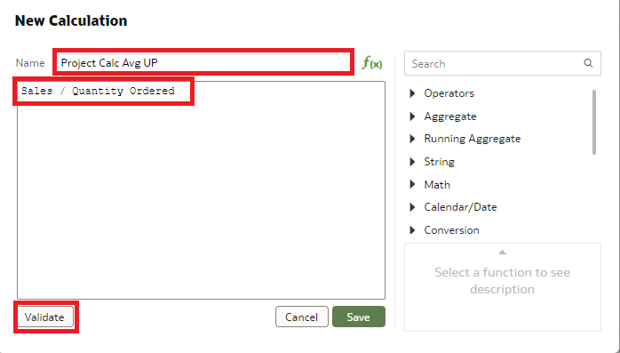
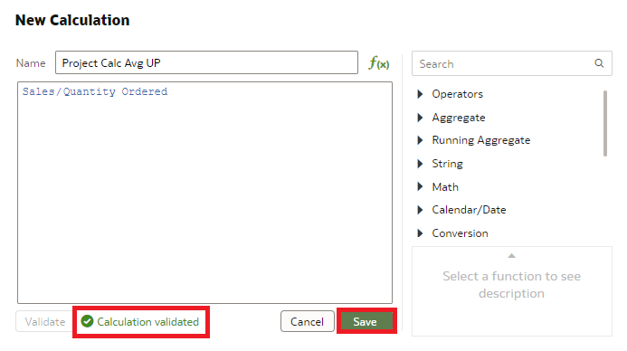
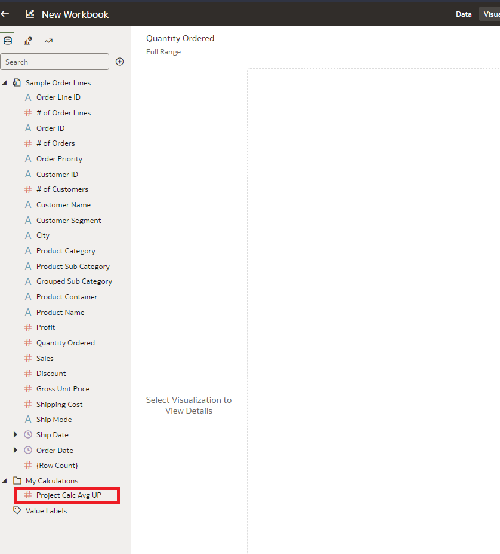
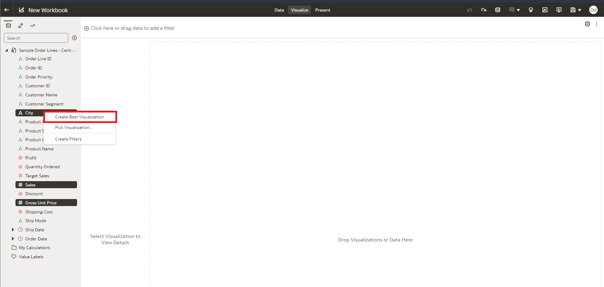
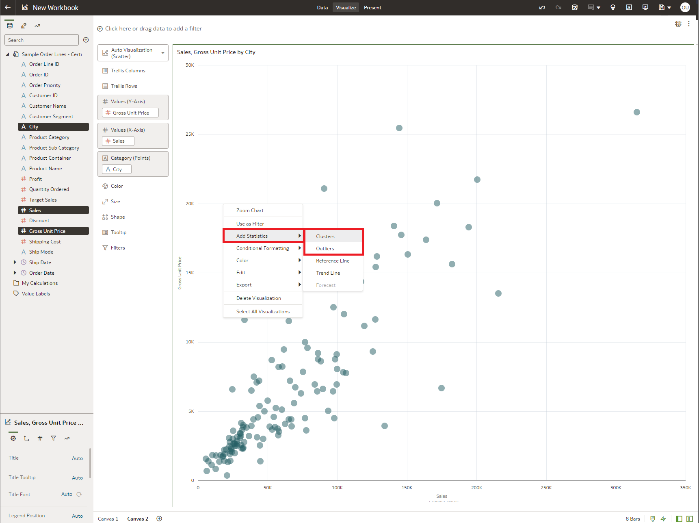
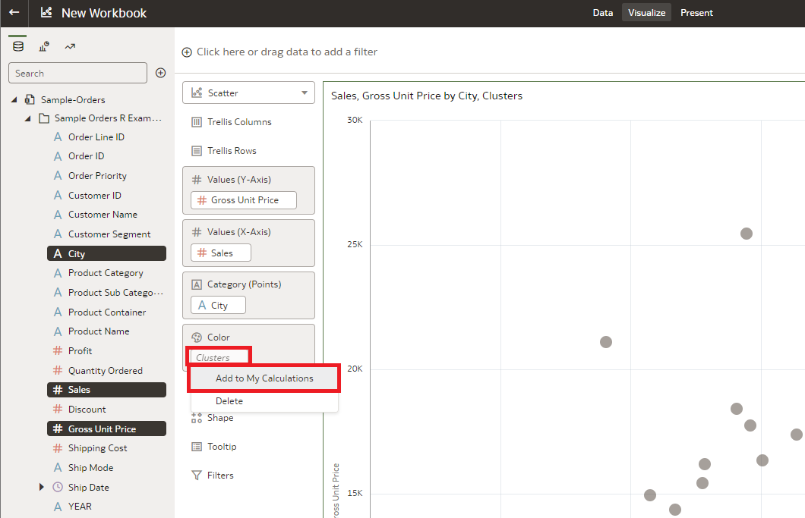
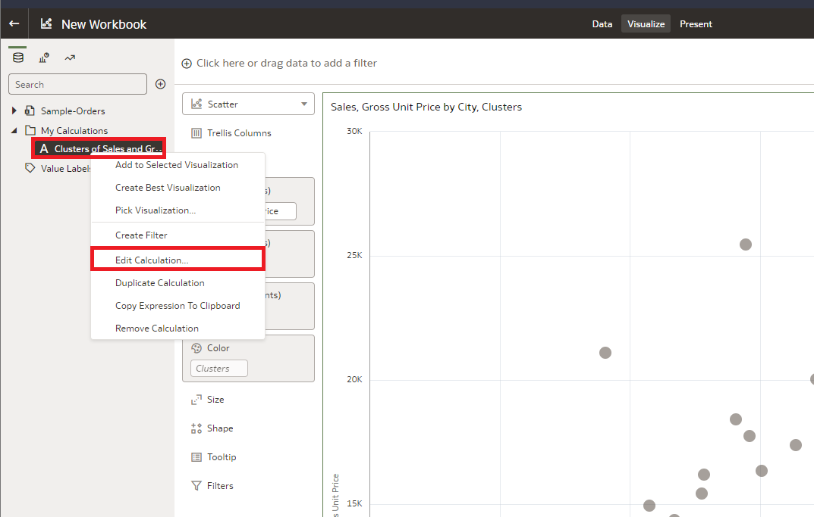
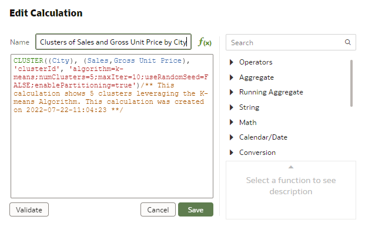

# How do I create advanced calculations in Oracle Analytics Cloud (OAC)?
Duration: 3 minutes

Creating advanced calculations can be an effective tool to quickly populate visualizations. When creating visualizations, automated calculations can be quickly saved for later repurposing.  As of May 2022, the most current update, OAC allows for powerful slice and dice analysis with any measure using these calculated objects.

## Advanced Calculations

### Manually Customized
Advanced calculations can be quickly defined, using a customizable script.

1. First, open your OAC Workbook. 

2. Notice the *My Calculations* folder on the left hand side of the display and right click the folder to select "add calculation".

    

3. The calculation page will open with options to name the calculation, type the calculation, and validate before saving. This can be used to help populate your visualizations.

    

4. On this page, you will be able to give your calculation a title and type out variables, which will auto-populate according to your variables in the dataset. Function operators are available to the right side of the window. After your function is complete, be sure to *validate* that your function works by clicking the button.

    

5. After a successful validattion, the screen will provide a green code response next to the button. You can now click save to generate your new calculation.
   
   

6. The new calculation will be generated in the window for you to use on visualizations.

   

### Automatically Generated

Another way to populate the calculation page is by predefining clusters or outliers in your data and right-click-save in *My calculations* folder. 

**Note:** This procedure is only available of OAC version May 2022 or newer. OAS updates happen annually, while OAC updates are more frequent. Therefore, in order to implement this automation, you need to ensure that the OAS version postdates May 2022.

1. With the OAC notebook still open, populate a visualization.

    

2. Right-click the image and select add statistics, selecting clusters or outliers. 

    

3. Right-click the populated statistics and select *add to my calculations*

    
  
4. Notice that the calculation was added to the may calculations folder on the left hand side. Right-click and select edit calculation.
   
    

5. This will open the advanced calculation window, which shows the alogorithm used to create the clustering or outlier differentiation. Save and exit. You can now create new visualizations and populate images using this predefined calculation.

    

## Learn More

* [Easily Create Custom Advanced Analytics Calculations in Oracle Analytics (Video)](https://www.youtube.com/watch?v=aRfYn2hB-Jg)
* [OAC updates](https://docs.oracle.com/en/cloud/paas/analytics-cloud/acswn/index.html#ACSWN-GUID-CFF90F44-BCEB-49EE-B40B-8D040F02D476)
* [Two ways to create custom calculations in Oracle Analytics](https://blogs.oracle.com/analytics/post/two-ways-to-create-custom-calculations-in-oracle-analytics)

## Acknowledgements

* **Author** - Nicholas Cusato, Solution Engineer, Santa Monica Specialists Hub

* **Last Updated By/Date** - Nicholas Cusato, July 2022
