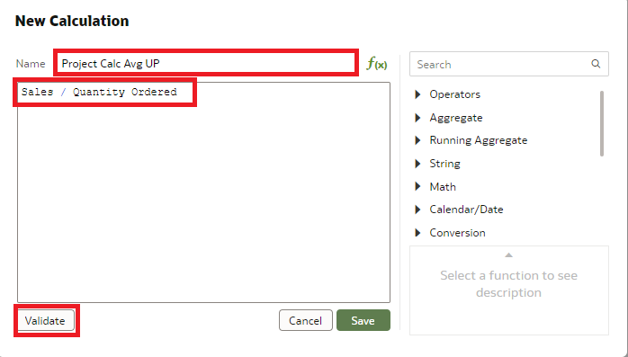
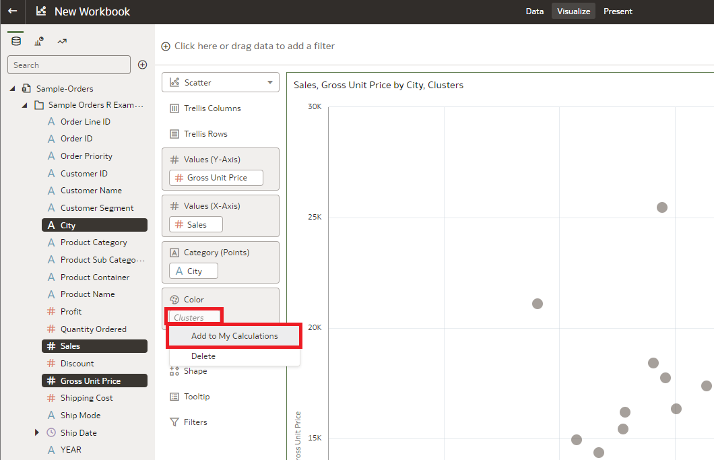

# How do I create advanced calculations in Oracle Analytics Cloud (OAC)?
Duration: 3 minutes

Creating advanced calculations can be an effective tool to quickly populate visualizations. OAC allows you to perform powerful slice and dice analysis with any measure using calculated objects. This sprints shows you how to  create calculations manually or generate them from visualizations.

## Advanced Calculations

>**Note:** You must have the **DV Content Author** role to complete the following steps.

### Manually create a calculation
You can use a customizable script to quickly define advanced calculations.

1. In the Home page, open the workbook you want to add advanced calculations to.

2. Go to **My Calculations**, right-click, and select **Create Calculation**.

    

3. In New Calculation, enter a name, enter the expression, click **Validate**, and then click Save.

    

4. After a successful validation, the screen will provide a green code response next to the button. You can now click **Save** to generate your new calculation.

   

5. The calculation you created is displayed in the My Calculations folder and is ready for you to include in visualizations.

   

### Generate a calculation

You can also populate a calculation by creating clusters and outliers in a workbook and saving them to the **My Calculations** folder.  

1. In the open workbook, select City, Sales, and Gross Unit Price, right-click, and select Create Best Visualization.

    

2. Right-click the visualization, select Add Statistics, and click either **Clusters or Outliers**.

    

3. In the Grammar panel, locate the cluster or outlier, right-click, and select **Add to My Calculations**.

    

4. To view or modify the calculation, go to My Calculation, right-click a calculation, and select **Edit Calculation**.

    

5. This will open the advanced calculation window, which shows the algorithm used to create the clustering or outlier differentiation. Save and exit. You can now create new visualizations and populate images using this predefined calculation.

    

Congratulations, you've learned how to create predefined calculations to use in visualizations!
## Learn More

* [Easily Create Custom Advanced Analytics Calculations in Oracle Analytics (Video)](https://www.youtube.com/watch?v=aRfYn2hB-Jg)
* [OAC updates](https://docs.oracle.com/en/cloud/paas/analytics-cloud/acswn/index.html#ACSWN-GUID-CFF90F44-BCEB-49EE-B40B-8D040F02D476)
* [Two ways to create custom calculations in Oracle Analytics](https://blogs.oracle.com/analytics/post/two-ways-to-create-custom-calculations-in-oracle-analytics)

## Acknowledgements

* **Author** - Nicholas Cusato, Solution Engineer, Santa Monica Specialists Hub

* **Last Updated By/Date** - Nicholas Cusato, July 2022
