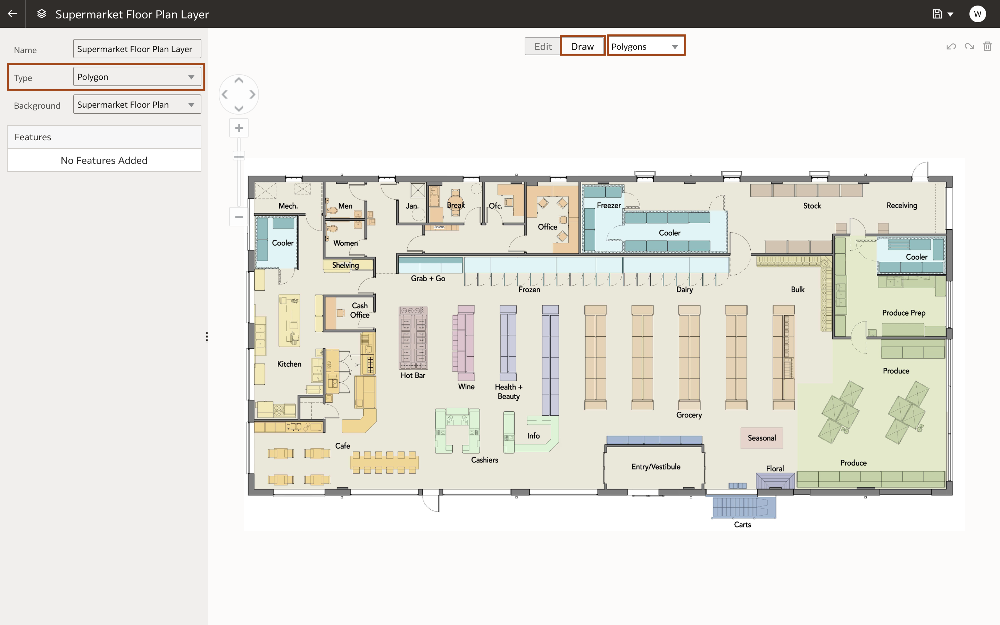

# How do I create a custom map layer using an image in OAS?
Duração: 5 minutos

Custom map layers are a unique way to leverage the geo spatial capabilities of Oracle Analytics.
Map backgrounds enhance visualizations within your workbooks. Based on the column values of your data, a specific set of dimensions and metrics is displayed on the map visualization. By using your own image background you can create engaging visuals that showcase your data in the context of your business, like visualizing the profit by product section on a top-down map of your store's floor plan.

## Create a custom map layer using an image
>**Nota:** You must have the **DV Content Author** role to be able to successfully execute the following steps.

1. From the Oracle Analytics homepage, click on the hamburger icon to expand the navigation menu and click on **Console**.

    

2. In the console, open **Maps** under **Visualizations and Sharing**.

    

3. In the maps page, navigate to the **Backgrounds** tab at the top of the page and expand the **Image Backgrounds** dropdown menu.

    

4. Select **Add Image** at the bottom and import the your image. Give your image background a descriptive name and press **Save**, in this workshop we will use the name 'Supermarket floor plan.'

    
    

5. Hover over the image background you have just added and click on the three dots on the right to expand an actions menu. Select **Create Map Layer**.

    

6. Select **Draw** at the top of the page and set the type to **Polygon** in the dropdown menu to the right.
    >**Note:** Lines and points can also be used to create custom map layers. This can be specified in the **Type** dropdown menu on the left.

    

7. Using the polygon tool, outline your desired area, as shown in the image below. Click on the corners of the desired area to add a vertex to your polygon.

    

8.  The outline of the desired area will appear on the left-hand side under **Features**. It will be titled with the format 'Image-<number\>'. Select the feature and rename it at the top of the page and press enter. In this lab we are naming the newly created feature 'Cafe.'
    >**Note:** Names for each shape you create must correspond to a key column value in your dataset.

    

9.  Click **Edit** at the top of the page. Then select one of your features in the left hand **Features** table or image background. To adjust the shape of your feature select and drag any of the circled vertices. Unwanted changes can be removed using the undo, redo, and delete buttons in the top right corner.

    

10. Now navigate back to the **Draw** tab and in the top drop down menu, select **Rectangles.**
    >**Note:** Circular areas in your custom map layer can be created by selecting **Circles** from the drop down menu and following the same directions in step 11.

11. Drag a rectangle over the rectangular sections in your image until they cover your desired area. Name and adjust them accordingly using the instructions shown in steps 8 and 9.

    

12. Save your custom map by pressing the **Save** icon in the top right corner.

    

Congratulations! You have made a custom map layer using an image background!

## Saiba Mais

* [Analytics Cloud Documentation](https://docs.oracle.com/en/cloud/paas/analytics-cloud/acubi/add-custom-map-layers.html)
* [Oracle Learning](https://www.youtube.com/watch?v=-tDUDMek7qA&ab_channel=OracleLearning)

## Reconhecimentos
* **Author** - Malia German, Solution Engineer, North America Specialist Hub
* **Tradução**
* **Last Updated By/Date** - Malia German, August 2022
