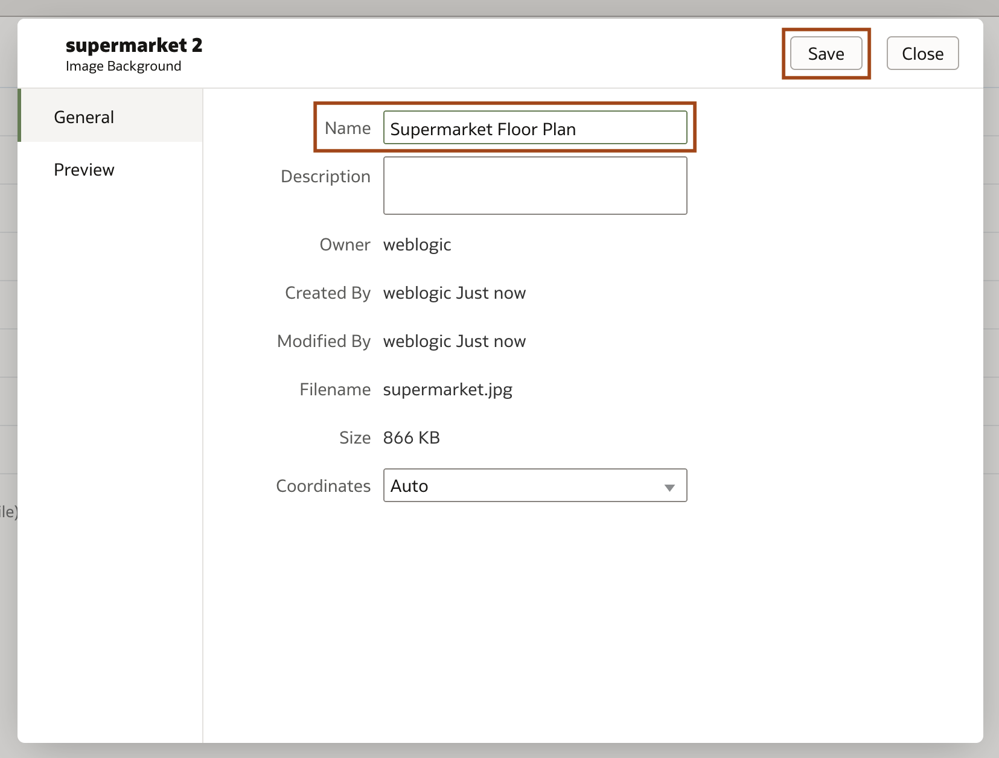

# Como criar uma camada customizada de mapa utilizando OAC?
Duração: 5 minutos

Camadas customizadas de mapas são uma forma de aproveitar recursos geoespaciais do Oracle Analytics.
Os planos de fundo de mapas aprimoram as visualizações de seus relatórios. Com base nos valores de seus dados, um conjunto específico de dimensões e métricas é exibido na sua visualização de mapa. Ao utilizar seu próprio plano de fundo de imagem, você pode criar visuais interessantes que mostram seus dados no contexto de sua empresa, como por exemplo, visualizar o lucro por seção de produto em um mapa que mostre em uma visão de cima para baixo a planta de sua loja.

## Criar uma camada de mapa customizada utilizando uma imagem
>**Nota:** Você precisa ter a role **DV Content Author** para conseguir executar os próximos passos com sucesso.

1. Na página inicial do Oracle Analytics, clique no ícone de hambúrger para expandir o menu de navegação e clique em **Console**.

    

2. Na Console, clique em **Maps** abaixo de **Extensions and Enrichments**.

    

3. Na página de mapas, navegue para a guia **Backgrounds** no topo da página e expanda o menu **Image Backgrounds**.

    

4. Selecione a opção **Add Image** no topo da tela e importe sua imagem. Dê a sua imagem de fundo um nome descritivo e clique em **Save**, nesse workshop usaremos o nome 'Supermarket floor plan.'

    
    

5. Passe o mouse sobre o plano de fundo da imagem que você acabou de adicionar e clique nos três pontos à direita para expandir um menu de ações. Selecione **Create Map Layer**.

    

6. Selecione **Draw** no topo da página e defina o tipo como **Polygon** no menu à direita.
    >**Nota:** Linhas e pontos também podem ser usados ​​para criar camadas de mapa personalizadas. Isso pode ser especificado na opção **Type** no menu à esquerda.

    

7. Usando a ferramenta polígono, determine a área desejada, conforme mostrado na imagem abaixo. Clique nos cantos da área desejada para adicionar um vértice ao seu polígono.

    

8.  O contorno da área desejada aparecerá no lado esquerdo em **Features**. Será intitulado com o formato 'Image-<number\>'. Selecione o recurso e renomeie-o na parte superior da página e pressione enter. Neste laboratório, estamos nomeando o recurso recém-criado como 'Cafe'.
    >**Nota:** Os nomes para cada forma que você cria devem corresponder a um valor de coluna chave em seu conjunto de dados.

    

9.  Clique em **Edit** no topo da página. Em seguida, selecione um dos recursos na tabela **Features** no menu da esquerda ou na imagem de fundo. Para ajustar a forma do seu recurso, selecione e arraste qualquer um dos vértices circulados. As alterações indesejadas podem ser removidas usando os botões desfazer, refazer e excluir no canto superior direito.

    

10. Agora, navegue de volta para a aba **Draw** e no menu do topo selecione **Rectangles.**
    >**Nota:** Áreas circulares no seu mapa de fundo customizado podem ser criadas selecionando **Circles** no menu e seguindo os mesmos passos da etapa 11.

11. Arraste um retângulo sobre as seções retangulares da imagem até que elas cubram a área desejada. Nomeie e ajuste-os de acordo com o esperado, utilizando as instruções mostradas nas etapas 8 e 9.

    

12. Salve seu mapa customizado clicando no ícone **Save** no topo direito da página.

    

Parabéns! Você criou uma camada de mapa personalizada usando um plano de fundo de imagem!

## Saiba Mais

* [Documentação Analytics Cloud](https://docs.oracle.com/en/cloud/paas/analytics-cloud/acubi/add-custom-map-layers.html)
* [Oracle Learning](https://www.youtube.com/watch?v=-tDUDMek7qA&ab_channel=OracleLearning)

## Reconhecimentos
* **Autor** - Malia German, Solution Engineer, North America Specialist Hub
* **Tradução** - Isabella Alvarez, Cloud Analytics Team Leader, Brazil Data & AI Team
* **Última Atualização** - Thais Henrique,  Março 2023
