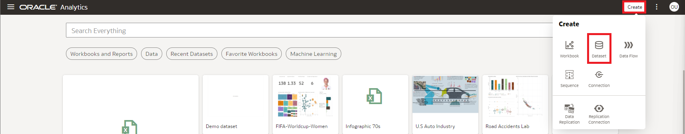
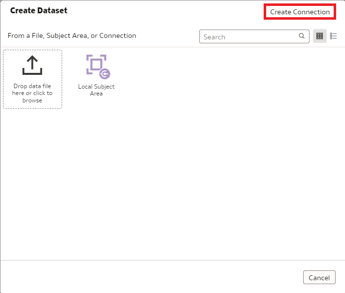
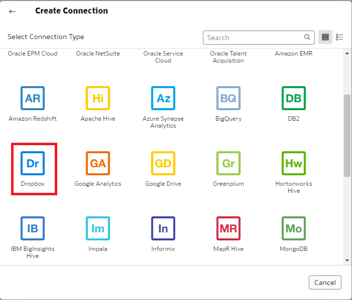
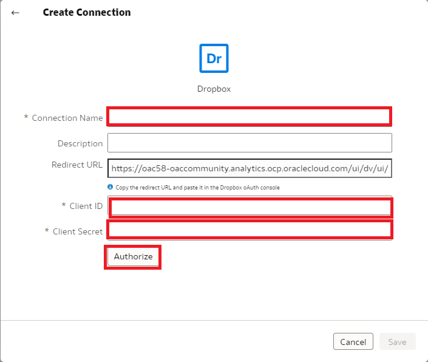
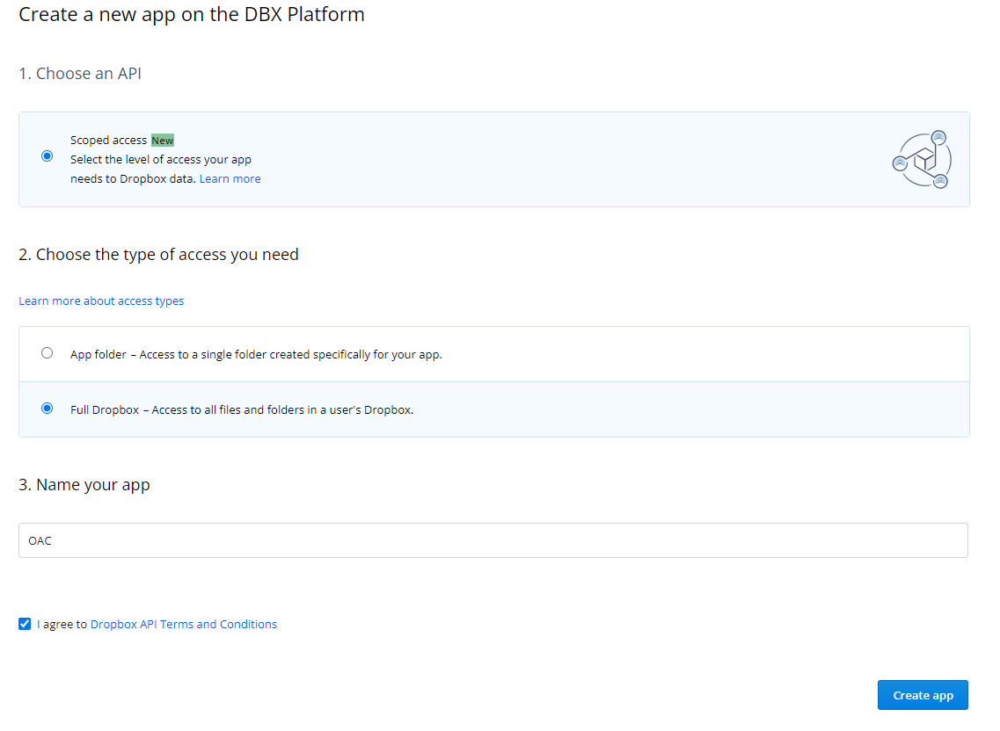
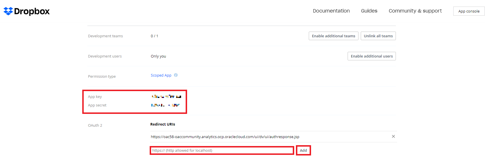
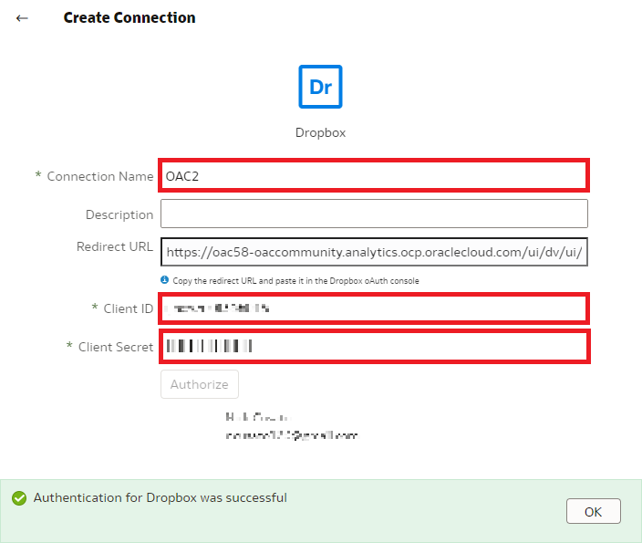
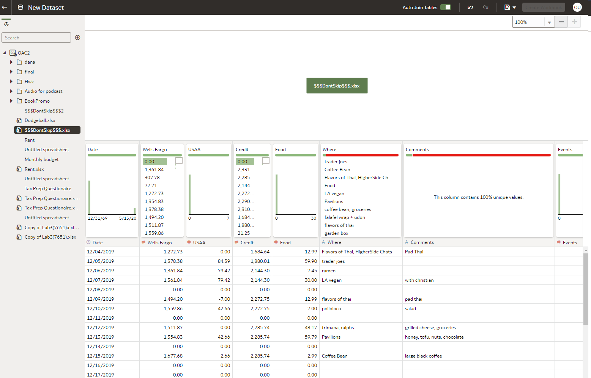

# How do I create a dataset using Dropbox in Oracle Analytics Cloud (OAC)?
Duration: 3 minutes

You can create a dataset from Dropbox by creating a connection in Oracle Analytics Cloud.

## Create a Dataset From a Dropbox Connection

>**Note:** You must have the **DV Content Author** application role to execute the following steps.

1. On the Home page, click **Create** and then click **Dataset.**

    

2. In the Create Dataset dialog, select **Create a Connection**.

    

3. Browse for and select the **Dropbox** Connection.

    

4. In the **Create Connection** dialog box, you'll need to enter your connection details.

    

5. The Client ID and Client Secret will be available after creating an app for Dropbox. You can access the Dropbox developers app console to create an app by clicking this link: [Dropbox apps](https://www.dropbox.com/developers/apps)

6. Sign into Dropbox and create an app. Fill out the information and click **Create app**.

    

7. The result will populate the **App key** and the **App secret**. Copy and paste the App key into the **Client ID** field and the App secret into the **Client Secret** in the OAC **Create Connection** dialogue box.

    >**Note:** You will need to paste the **Redirect URL** from OAC's create connection window.

  

8. Lastly, navigate to the **Permissions** tab and enable read/write permissions for the fields under **Account Info** and **Files and Folders**. Click **Submit**.

  

9. Select **Authorize** and in the Dropbox prompt to authorize the connection, click **Allow.** Then click **OK.**

    

10. You can now select files from the menu to create a dataset. Confirm that the file that you want to upload meets these requirements:
* The file is either an Excel spreadsheet in .XLSX or .XLS format, a CSV file, or a TXT file.
* The spreadsheet contains no pivoted data.
* The spreadsheet is structured properly for import and use as a dataset.

    

Congratulations! You have successfully learned how to create a dataset using Dropbox in Oracle Analytics Cloud.

## Learn More

* [What's new in the Oracle Analytics Cloud May 2022 update (Video)](https://www.youtube.com/watch?v=K3YaJlmfSpM)
* [Connect to Dropbox](https://docs.oracle.com/en/cloud/paas/analytics-cloud/acsds/connect-dropbox.html#GUID-694C72CE-900A-4AFE-8637-862DF8988835)
* [Dropbox API permissions](https://developers.dropbox.com/oauth-guide)

## Acknowledgements

* **Author** - Nicholas Cusato, Solution Engineer, Santa Monica Specialists Hub
* **Contributors** Nagwang Gyamtso, Product Manager, Product Strategy
* **Last Updated By/Date** - Nicholas Cusato, October 2022
