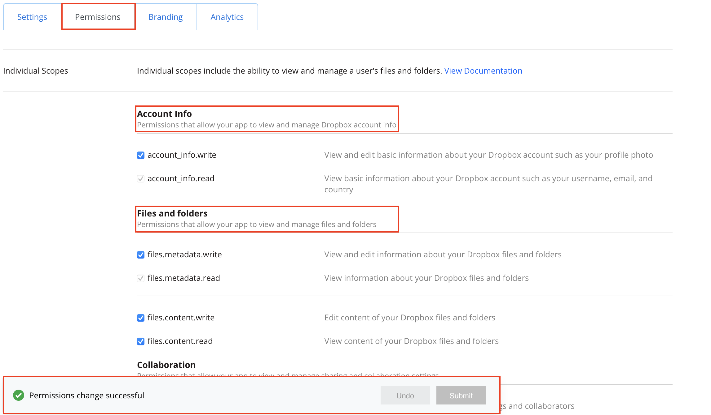

# How do I create a dataset using Dropbox in Oracle Analytics Cloud (OAC)?
Duration: 5 minutes

You can create a dataset from Dropbox by creating a connection in OAC.

>**Note:** You must have the **DV Content Author** application role to execute the following steps.

## Create a Dataset from a File Uploaded from Dropbox

1. On the Home page, click **Create** and then click **Dataset.**

    

2. In the Create Dataset dialog, select a connection

    

3. Browse for and select the **Dropbox** Connection.

    

    This will popup a credentials page for you to fill out using the following step.

    

4. The Client ID and Key will be available after creating an app for dropbox. You can access the app console (to create an app) by clicking this link: 
    - [Dropbox apps](https://www.dropbox.com/developers/apps)

    Fill out the information to access the API Credentials.

    

    The result will populate the API credentials. 
    IMPORTANT: You will also need to paste the **Redirect URL** from OAC's create connection window.

    

    Lastly, navigate to the **Permissions** tab to **enable all** permissions for read/write privileges of files.

    
  
5. Select **Authorize** and then **OK.** The menu will then populate with your storage data. You can select the dataset from the menu options.
    
    
    

6. You can now select files from the menu to create a dataset.

    Confirm that the file that you want to upload meets these requirements:
        - The file is either an Excel spreadsheet in .XLSX or .XLS format, a CSV file, or a TXT file.
        - The spreadsheet contains no pivoted data.
        - The spreadsheet is structured properly for import and use as a dataset. 

    

Congratulations! You have successfully learned how to create a dataset using Dropbox in Oracle Analytics Cloud and some best practices around it.

## Learn More

* [What's new in the Oracle Analytics Cloud May 2022 update (Video)](https://www.youtube.com/watch?v=K3YaJlmfSpM)
* [OAC - Create Datasets from Files](https://docs.oracle.com/en/cloud/paas/analytics-cloud/acubi/create-dataset-files.html#GUID-04CF3C71-DE49-4D6C-971E-6EAFDBB92D82)
* [Dropbox API permissions](https://developers.dropbox.com/oauth-guide)

## Acknowledgements

* **Author** - Nicholas Cusato, Solution Engineer, Santa Monica Specialists Hub

* **Last Updated By/Date** - Nicholas Cusato, September 2022