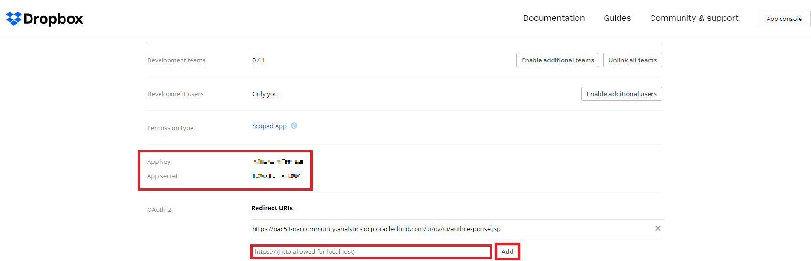
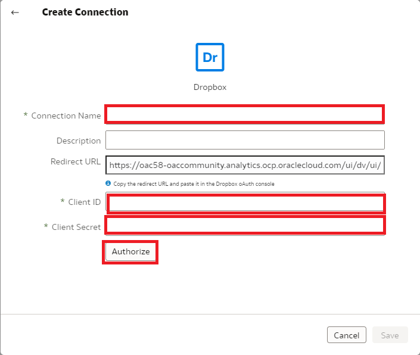

# How do I create a dataset using Dropbox in Oracle Analytics Cloud and Server (OAC & OAS)?
Duration: 3 minutes

You can create a connection to Dropbox to access files to use in datasets.

## Create a dataset From a Dropbox Connection

>**Note:** You must have the **DV Content Author** role to complete the following steps.

1. The Client ID and Client Secret will be available after creating an app for Dropbox. Click this link: [Dropbox apps](https://www.dropbox.com/developers/apps) to access the console.

2. In Dropbox, create an app as shown below. Click **Create app**.

    

3. Creating the app populates the **App key** and the **App secret**. These are the values you'll need when you create the OAC connection to Dropbox.

    >**Note:** You will need to paste the **Redirect URL** from Oracle Analytics' create connection window.

  

4. Lastly, navigate to the **Permissions** tab and enable read/write permissions for the fields under **Account Info** and **Files and Folders**. Click **Submit**.

  

5. On the Home page, click **Create** and then click **Dataset.**

    

6. In the Create Dataset dialog, select **Create a Connection**.

    

7. Browse for and select the **Dropbox** connection.

    

8. In **Create Connection**, enter a name in Connection Name. In Client ID paste the Dropbox App key, and in Client Secret paste the Dropbox App App secret. Click Authorize.

    

9. Select **Authorize** and in the Dropbox prompt to authorize the connection, click **Allow.** Then click **OK.**

    

10. You can now select files from the menu to create a dataset. Confirm that the file that you want to upload meets these requirements:
* The file is either an Excel spreadsheet in .XLSX or .XLS format, a CSV file, or a TXT file.
* The spreadsheet contains no pivoted data.
* The spreadsheet is structured properly for import and use as a dataset.

    

Congratulations! You have learned how to create a dataset using Dropbox in Oracle Analytics Cloud and Server (OAC & OAS).

## Learn More

* [What's new in the Oracle Analytics Cloud May 2022 update (Video)](https://www.youtube.com/watch?v=K3YaJlmfSpM)
* [Connect to Dropbox](https://docs.oracle.com/en/cloud/paas/analytics-cloud/acsds/connect-dropbox.html#GUID-694C72CE-900A-4AFE-8637-862DF8988835)
* [Dropbox API permissions](https://developers.dropbox.com/oauth-guide)

## Acknowledgements

* **Author** - Nicholas Cusato, Solution Engineer, Santa Monica Specialists Hub
* **Contributors** Nagwang Gyamtso, Product Manager, Product Strategy
* **Last Updated By/Date** - Nicholas Cusato, October 2022
