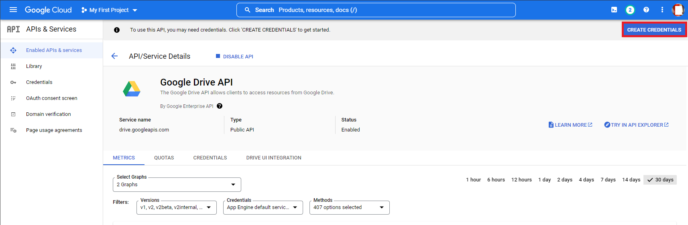
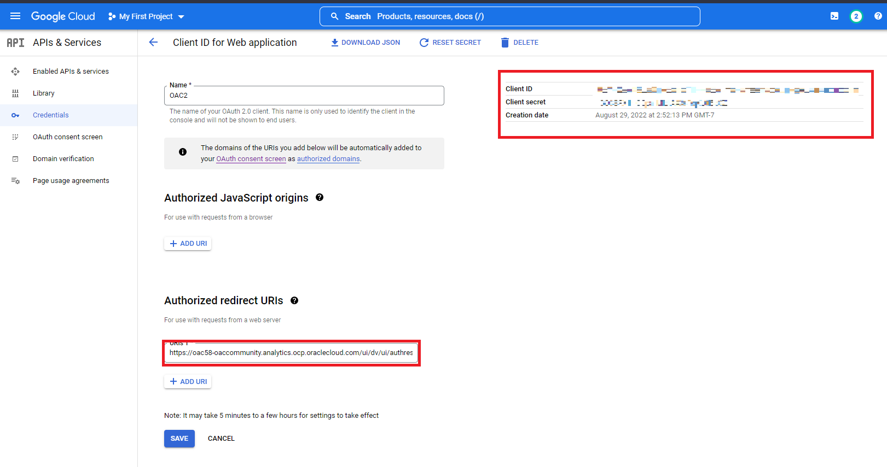
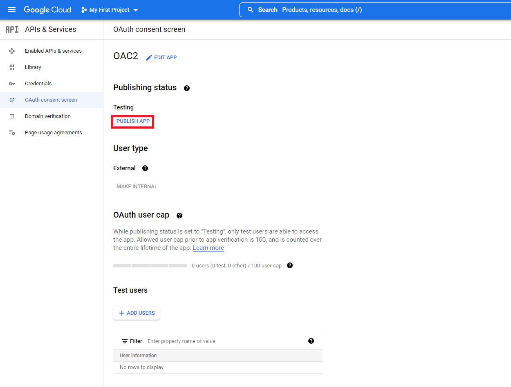

# How do I join local and Dropbox/Google Drive tables in Oracle Analytics Cloud (OAC)?
Duration: 15 minutes

You can add files from Google Drive by adding a connection in OAC.

## Add files to datasets with multiple tables
Before you create the dataset, confirm that the connection you need exists. Confirm that the file that you want to upload meets these requirements:
    - The file is either an Excel spreadsheet in .XLSX or .XLS format, a CSV file, or a TXT file.
    - The spreadsheet contains no pivoted data.
    - The spreadsheet is structured properly for import and use as a dataset. 

>**Note:** You must have the **DV Content Author** application role to execute the following steps.

### Create a Dataset from a File Uploaded from Dropbox or Google Drive

Another way to populate the calculation page is by predefining clusters or outliers in your data and right-click-save in **My Calculations** folder. 

1. On the Home page, click **Create** and then click **Dataset.**

    

2. In the Create Dataset dialog, select a connection

    

3. After you provide connection information, browse for and select the file that you want to upload.

    

    The Client ID and Key will be found after enabling the API. You access the app console by clicking this link: 
    - [Google Drive API](https://console.cloud.google.com/apis/library/drive.googleapis.com?project=buoyant-planet-241022)

    You need to **Enable** the API and create credentials to access Key and secret.

    

    Paste the **Redirect URL** from OAC's connection window.

    

    In order to access the API, it needs to be published first.

    
  
4. Select **Authorize** and then **OK.** The menu will then populate with your storage data. You can select the dataset from the menu options.

    

Congratulations! You have successfully learned how to create a dataset using Google Drive in Oracle Analytics Cloud and some best practices around it.

## Learn More

* [What's new in the Oracle Analytics Cloud May 2022 update (Video)](https://www.youtube.com/watch?v=K3YaJlmfSpM)
* [OAC - Create Datasets from Files](https://docs.oracle.com/en/cloud/paas/analytics-cloud/acubi/create-dataset-files.html#GUID-04CF3C71-DE49-4D6C-971E-6EAFDBB92D82)
* [Dropbox API permissions](https://developers.dropbox.com/oauth-guide)

## Acknowledgements

* **Author** - Nicholas Cusato, Solution Engineer, Santa Monica Specialists Hub

* **Last Updated By/Date** - Nicholas Cusato, August 2022