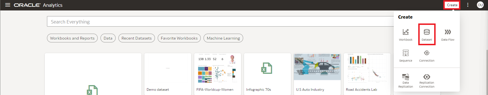
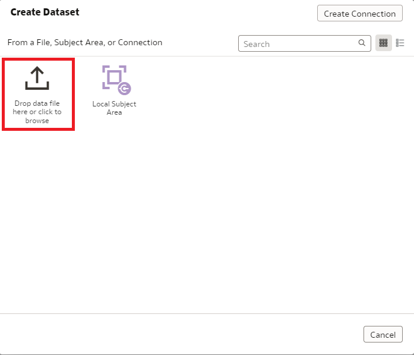
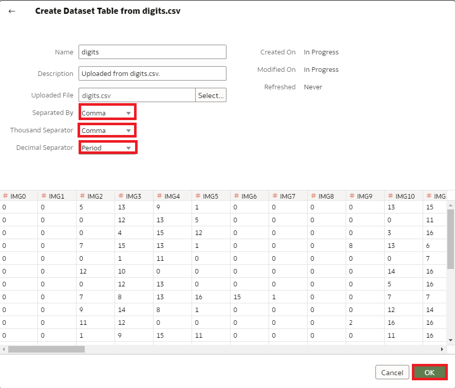
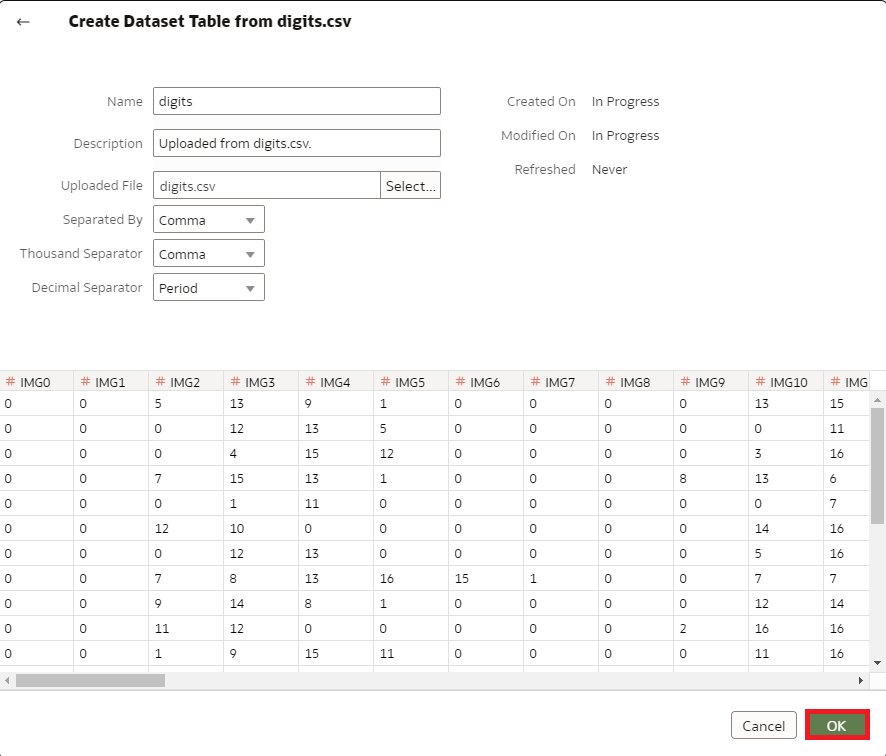

# How do I create a dataset using a local file in Oracle Analytics Cloud (OAC)?
Duration: 3 minutes

A dataset is able to created from a local file in Oracle Analytics Cloud 

## Add files to datasets with multiple tables
Before you create the dataset, confirm that the connection you need exists. Confirm that the file that you want to upload meets these requirements:
    - The file is either an Excel spreadsheet in .XLSX or .XLS format, a CSV file, or a TXT file.
    - The spreadsheet contains no pivoted data.
    - The spreadsheet is structured properly for import and use as a dataset. 

>**Note:** You must have the **DV Content Author** application role to execute the following steps.

### Create a Dataset from a File Uploaded from Your Computer
You can upload Excel spreadsheets (XLSX or XLS), CSV files, and TXT files from your computer to create a dataset.

1. On the Home page, click Create and then click Dataset.

    

2. In the Create Dataset dialog, either drag and drop a file to the dialog, or click **Drop data file here or click to browse** to browse your computer for a file to upload.

    

3. In the Create Dataset page's **Name** field, provide a name for the dataset table created from the file. 

4. (Optional) If you’re uploading a CSV or TXT file, then in the Separated By, Thousand Separator, and Decimal Separator fields, confirm or change the default delimiters. To specify a custom delimiter, choose Custom in the Separated By field and enter the character you want to use as the delimiter. In the CSV or TXT file, a custom delimiter must be one character. The following example uses a pipe (|) as a delimiter: Year|Product|Revenue|Quantity|Target Revenue| Target Quantity.

    

5. Click OK to upload the file and create the dataset.
   
   

Congratulations! You have successfully learned how to create a dataset using a local file in Oracle Analytics Cloud and some best practices around it.

## Learn More

* [What's new in the Oracle Analytics Cloud May 2022 update (Video)](https://www.youtube.com/watch?v=K3YaJlmfSpM)
* [OAC - Create Datasets from Files](https://docs.oracle.com/en/cloud/paas/analytics-cloud/acubi/create-dataset-files.html#GUID-04CF3C71-DE49-4D6C-971E-6EAFDBB92D82)

## Acknowledgements

* **Author** - Nicholas Cusato, Solution Engineer, Santa Monica Specialists Hub

* **Last Updated By/Date** - Nicholas Cusato, September 2022