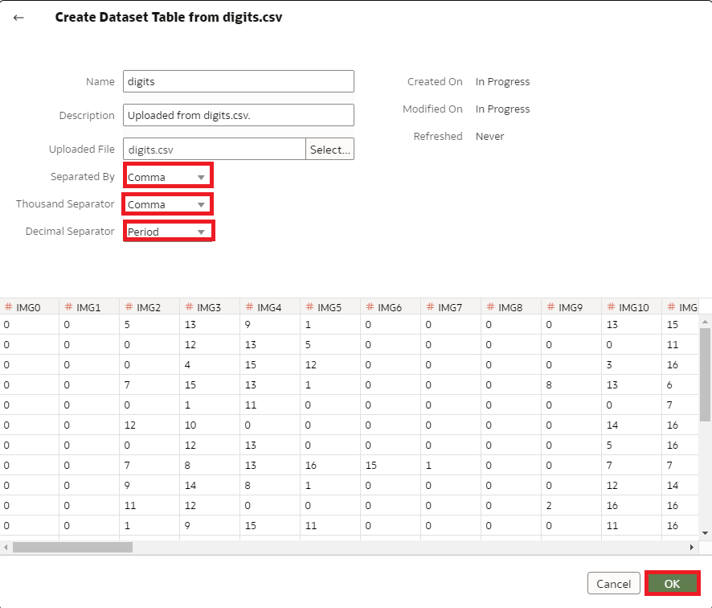

# How do I create a dataset using a local file in Oracle Analytics Cloud and Server (OAC & OAS)?

>**Note:** You must have the **DV Content Author** application role to execute the following steps.

## Create a Dataset from a File Uploaded from Your Computer
You can upload Excel spreadsheets (XLSX or XLS), CSV files, and TXT files from your computer to create a dataset.

1. On the Home page, click Create and then click Dataset.

    

2. In the Create Dataset dialog, either drag and drop a file to the dialog, or click **Drop data file here or click to browse** to browse your computer for a file to upload.

    

3. In the Create Dataset page's **Name** field, provide a name for the dataset table created from the file. Specify the **Separator type** and select **OK** to create the dataset.

    

Congratulations! You have successfully learned how to create a dataset using a local file in Oracle Analytics Cloud and Server (OAC & OAS).

## Learn More

* [What's new in the Oracle Analytics Cloud May 2022 update (Video)](https://www.youtube.com/watch?v=K3YaJlmfSpM)
* [OAC - Create Datasets from Files](https://docs.oracle.com/en/cloud/paas/analytics-cloud/acubi/create-dataset-files.html#GUID-04CF3C71-DE49-4D6C-971E-6EAFDBB92D82)

## Acknowledgements

* **Author** - Nicholas Cusato, Solution Engineer, Santa Monica Specialists Hub

* **Last Updated By/Date** - Nicholas Cusato, September 2022
