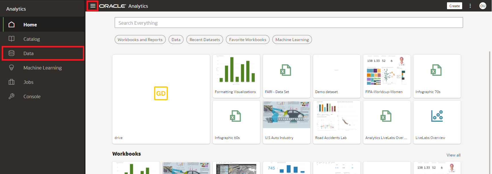
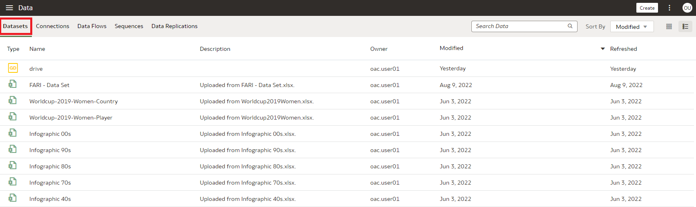
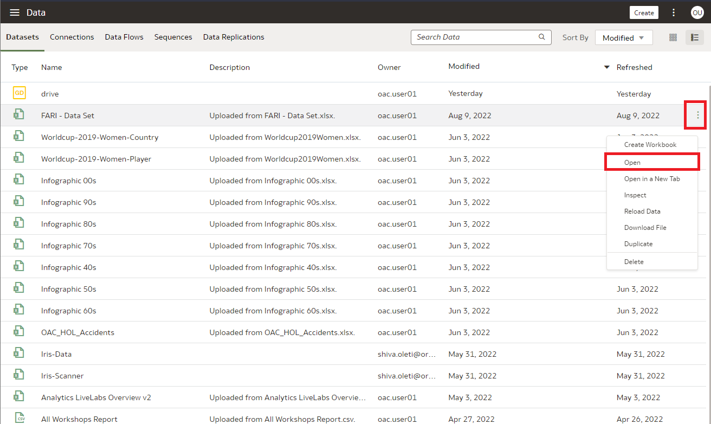
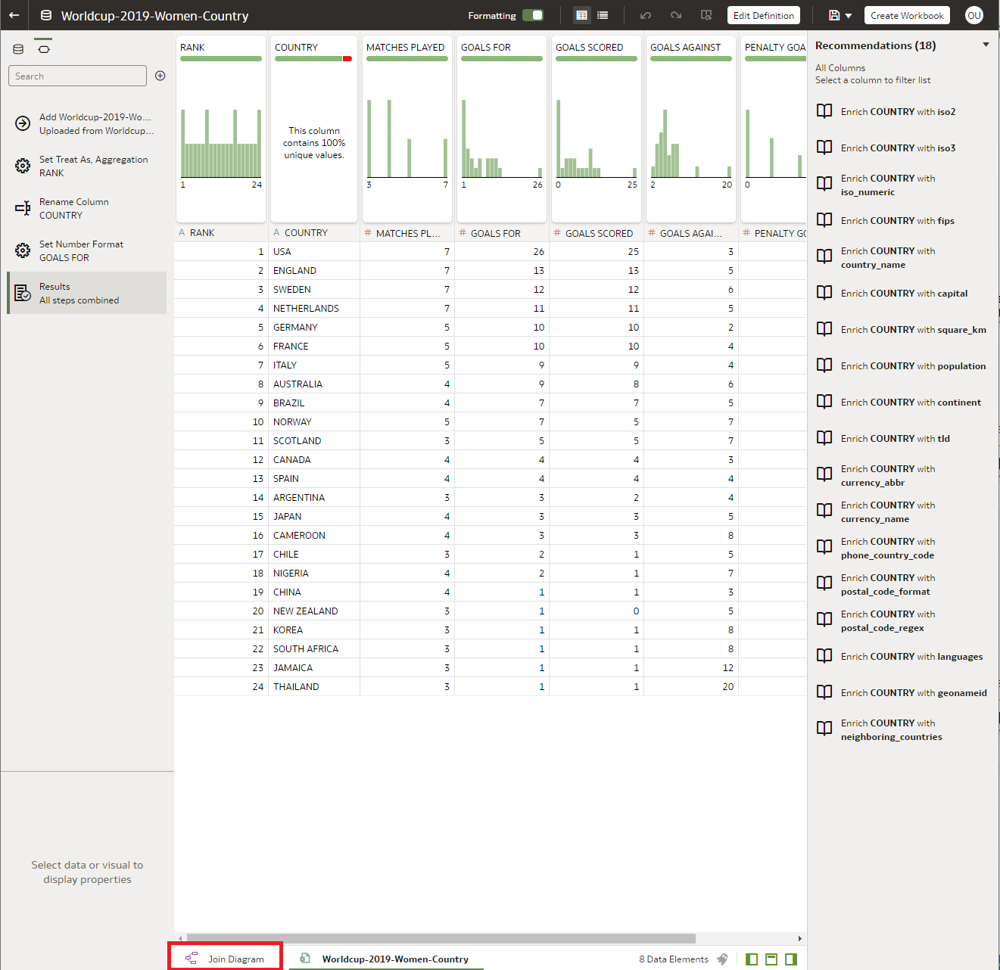
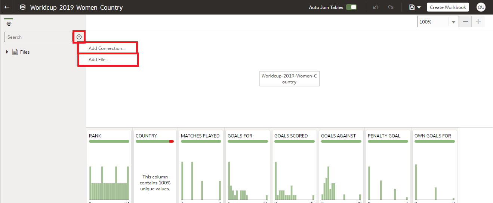
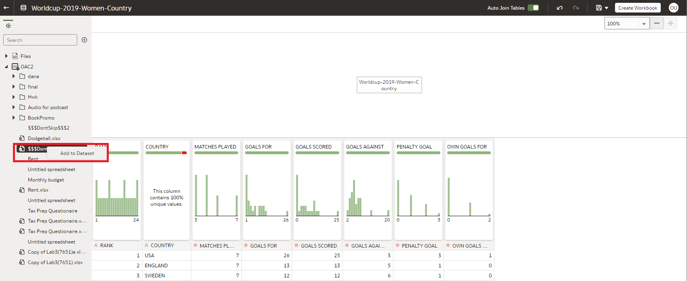
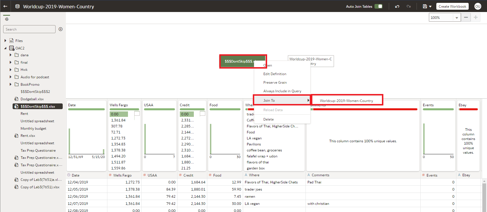
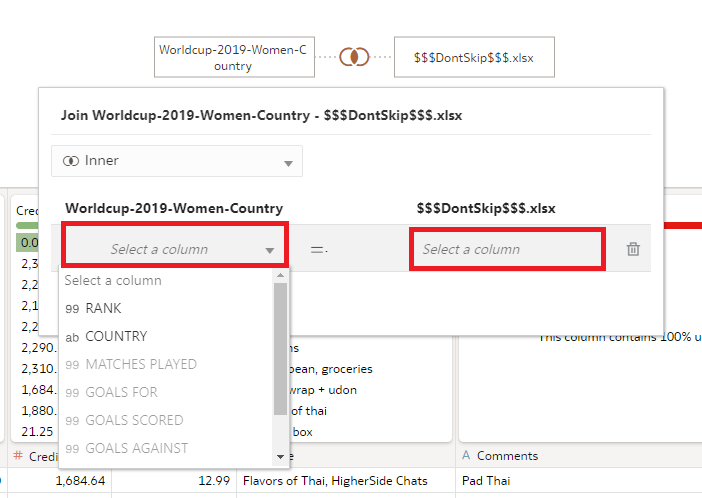
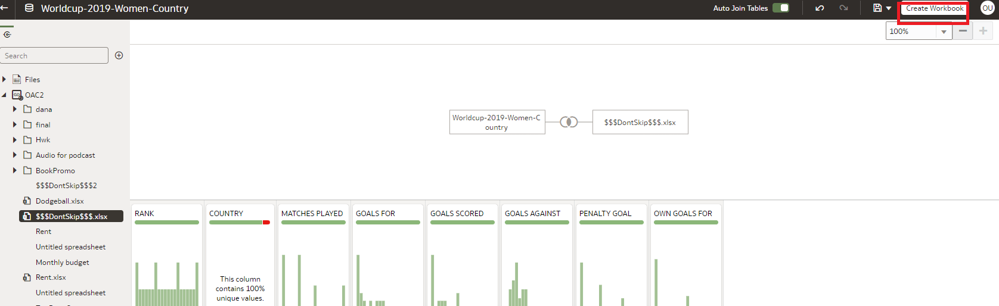
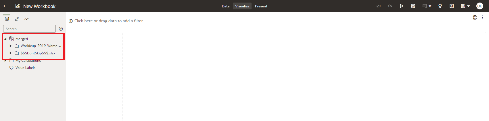

# How do I create a multi-table dataset from local and remote data sources in Oracle Analytics Cloud (OAC)?
Duration: 5 minutes

Joining tables in Oracle Analytics Cloud (OAC) has received some new updates as of May 2022. You can add files to datasets with multiple tables. When you create a dataset, you can add tables from relational sources, local subject areas, and files. Each new entity created in datasets can be based on any of these data sources. This enables you to add multiple files to one dataset where each file becomes a table and to define joins between tables within a dataset. In addition, you can add files from Dropbox or Google Drive to a dataset with multiple tables. 

Before you create the dataset, confirm that the connection you need exists. Confirm that the file that you want to upload meets these requirements:
    - The file is either an Excel spreadsheet in .XLSX or .XLS format, a CSV file, or a TXT file.
    - The spreadsheet contains no pivoted data.
    - The spreadsheet is structured properly for import and use as a dataset. 

This procedure is only available of OAC version May 2022 or newer. OAS updates happen annually, while OAC updates are more frequent. Therefore, in order to implement this automation, you need to ensure that the OAS version postdates May 2022.

>**Note:** You must have the **DV Content Author** application role to execute the following steps.

## Add Multiple Files to a Dataset

1. On the Home page, click **Navigator** and then click **Data.**

    

2. Click the **Datasets** tab.

    

3. Locate the dataset that you want to open, click **Actions (ellipsis)**, and then click **Open**.

    

4. Select **Join Diagram** at the bottom of the page.

    

5. Select the **Plus sign** on the left side menu to add a file. Select **add Connection** to upload via Dropbox or Google Drive. Select **Add file...** if the file is local.

    

    - If the file you want to add is located on Dropbox or Google Drive, then in the Dataset editor's Connections pane, right-click  the file and select **Add to Dataset.**

    

   - If you’re uploading a CSV or TXT file, then in the **Separated By,** **Thousand Separator,** and **Decimal Separator** fields, confirm or change the default delimiters. To specify a custom delimiter, choose Custom in the **Separated By** field and enter the character you want to use as the delimiter. In the CSV or TXT file, a custom delimiter must be one character. The following example uses a pipe (|) as a delimiter: Year|Product|Revenue|Quantity|Target Revenue| Target Quantity.

    

6.  Right click the new dataset on the Join Diagram, select **Join To** and then select the other dataset to join the two together.

    

7. Select the matching columns to join the two datasets together. You can select the join type from Inner, Left, Right, or Outer. To add another condition, select **Add Join Condition.**

    

8. You can now create a workbook from this new joined tables by saving and selecting **Create Workbook** in the top right corner. 

    

9. The merged datasets will appear on the left hand side of the new workbook.

    

Congratulations! You have successfully learned how to join local and Dropbox/Google Drive tables in Oracle Analytics Cloud and some best practices around it.

## Learn More

* [What's new in the Oracle Analytics Cloud May 2022 update (Video)](https://www.youtube.com/watch?v=K3YaJlmfSpM)
* [OAC - Create Datasets from Files](https://docs.oracle.com/en/cloud/paas/analytics-cloud/acubi/create-dataset-files.html#GUID-04CF3C71-DE49-4D6C-971E-6EAFDBB92D82)

## Acknowledgements

* **Author** - Nicholas Cusato, Solution Engineer, Santa Monica Specialists Hub

* **Last Updated By/Date** - Nicholas Cusato, September 2022