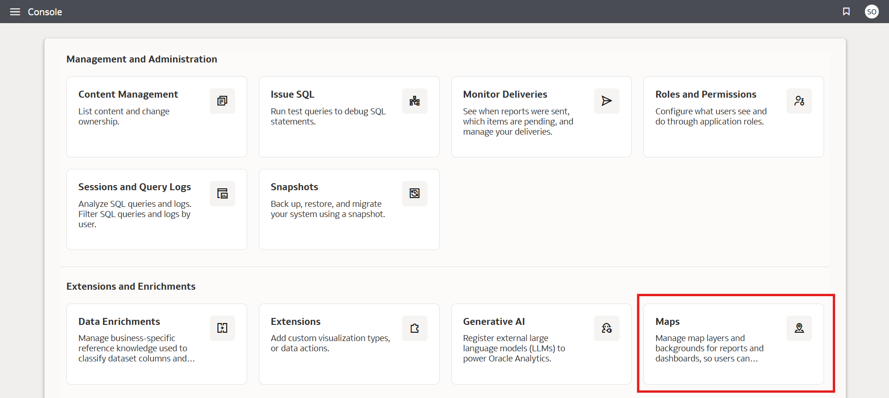
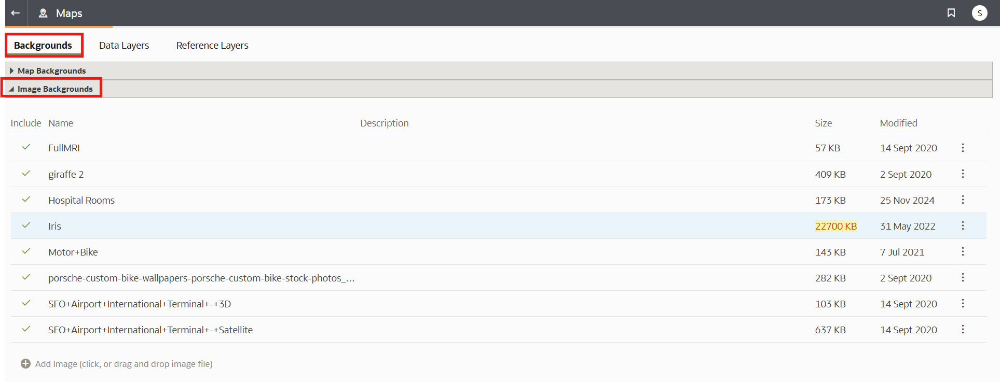
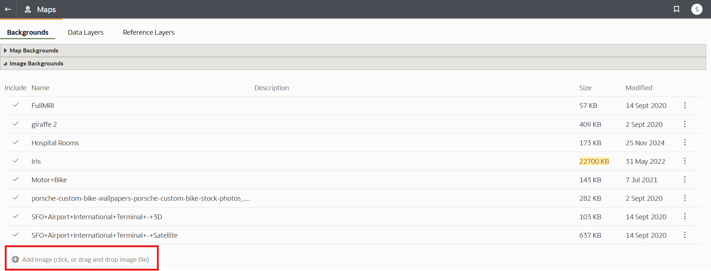
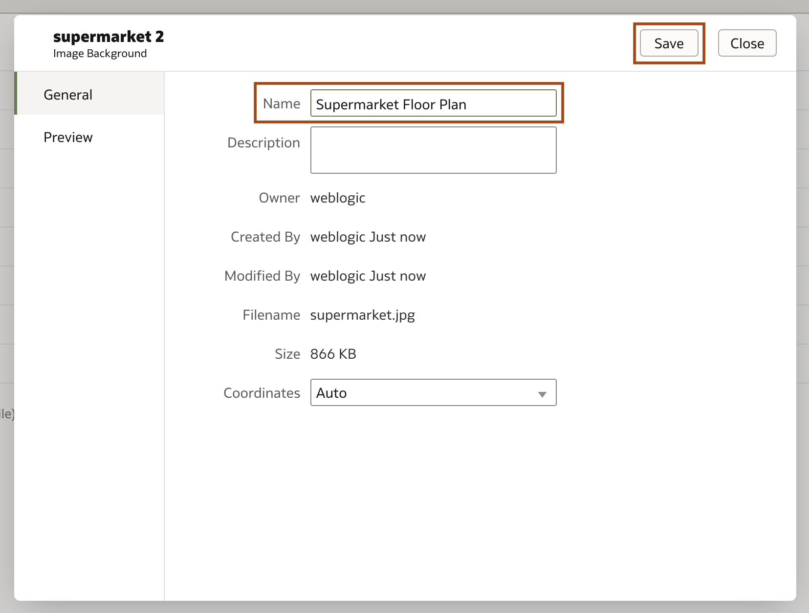
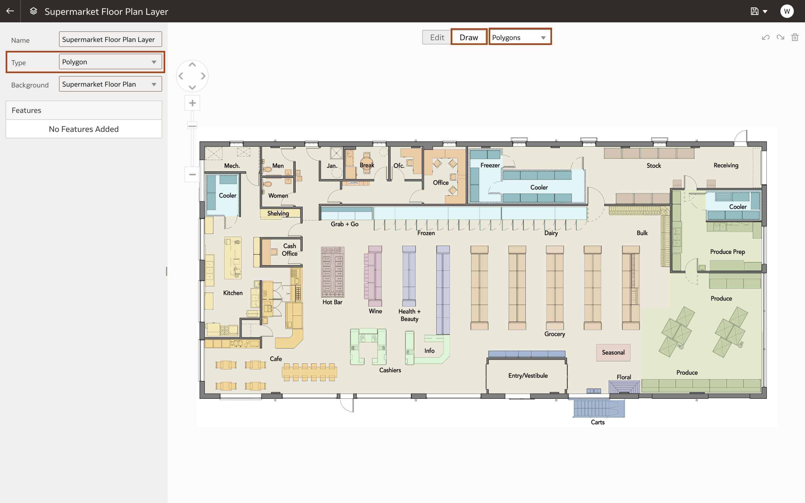
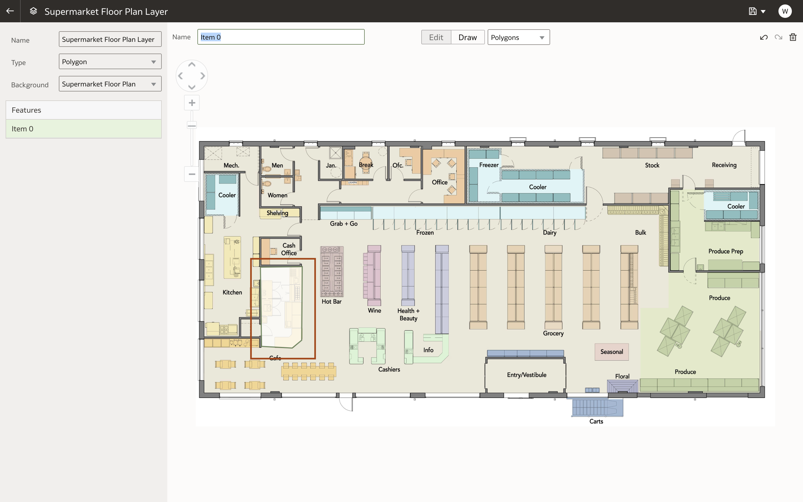
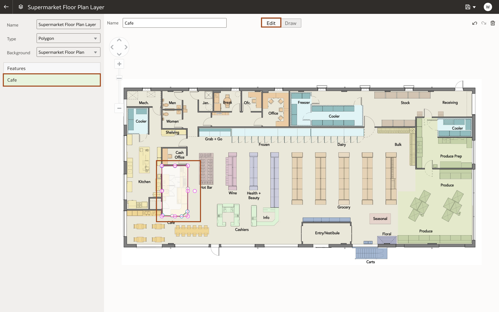
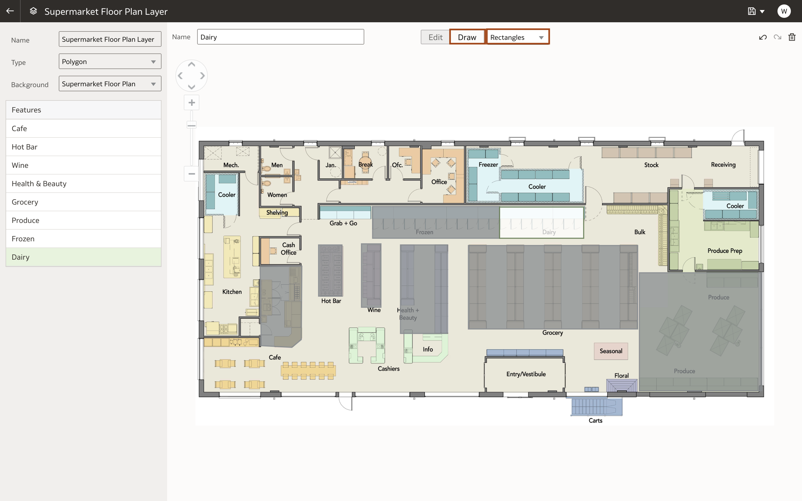

# How do I create a custom map layer using an image in Oracle Analytics Cloud and Server (OAC & OAS)?
Duration: 5 minutes

Custom map layers are a unique way to leverage the geo spatial capabilities of Oracle Analytics.
Map backgrounds enhance visualizations within your workbooks. Based on the column values of your data, a specific set of dimensions and metrics is displayed on the map visualization. By using your own image background you can create engaging visuals that showcase your data in the context of your business, like visualizing the profit by product section on a top-down map of your store's floor plan.

## Create a custom map layer using an image
>**Note:** You must have the **DV Content Author** role to be able to complete the following steps.

1. In the Oracle Analytics home page, click Navigator and select **Console**.

    

2. In the Console, open **Maps** under **Extensions and Enrichments**.

    

3. In Maps, click **Backgrounds** and expand the **Image Backgrounds** section.

    

4. Click **Add Image**. In the Image Background dialog, enter name for the image and provide a description. Click **Save**. Note that in this sprint we named the image background 'Supermarket Floor plan.'

    
    

5. Hover over the Supermarket Floor Plan image and click Actions. Select **Create Map Layer**.

    

6. Click **Draw** and then select  **Polygons**.
    >**Note:** You can specify lines and points in the Type field.

    

7. Use the polygon tool to outline an area, as shown in the image. Click on the corners of the area to add a vertex to the polygon.

    

8.  The outline is displayed under **Features** and is titled using the format 'Image-<number>'. Select the feature and rename it and press Enter. Note that in this sprint we named the feature Café.
    >**Note:** Names for each shape you create must correspond to a key column value in your dataset.

    

9.  Click **Edit** at the top of the page. Then select one of your features in the left hand **Features** table or image background. To adjust the shape of your feature select and drag any of the circled vertices. Use Undo, Redo, and Delete icons to remove unwanted changes.

    

10. Click **Draw** and select **Rectangles**.

11. Draw rectangles over the rectangular sections in the image. Name and adjust them as explained in Steps 8 and 9.

    

12. Click **Save** to save the custom map.

    

Congratulations, you've learned how to make a custom map layer in Oracle Analytics!

## Learn More

* [Use an Image as a Map Background and Draw Map Layer Shapes on the Image](https://docs.oracle.com/en/cloud/paas/analytics-cloud/acubi/add-custom-map-layers.html)
* [Add Custom Map Layers in Oracle Analytics](https://www.youtube.com/watch?v=-tDUDMek7qA&ab_channel=OracleLearning)

## Acknowledgements
* **Author** - Malia German, Solution Engineer, North America Specialist Hub
* **Last Updated By/Date** - Malia German, August 2022
