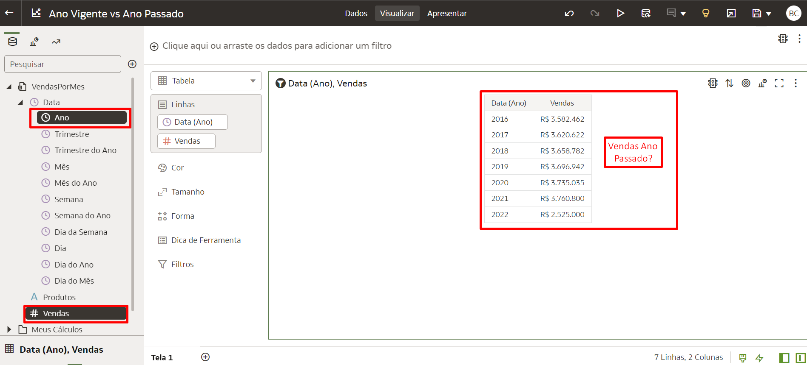
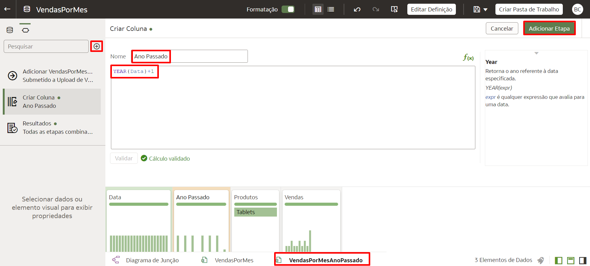
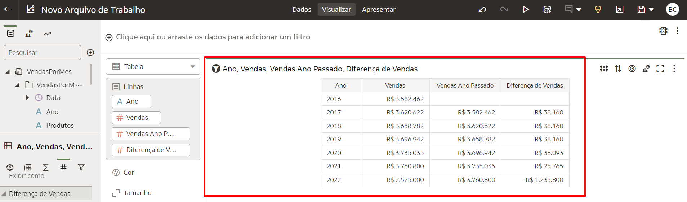

# Como criar uma análise Ano Vigente vs Ano Passado com o mesmo conjunto de dados no Oracle Analytics Cloud (OAC)?

Duração: 4 minutos

Com o Oracle Analytics Cloud, você pode adicionar múltiplos arquivos em um único conjunto de dados, para que cada um desses arquivos se torne uma tabela e você consiga definir junções (Joins) entre eles.

### Situação
Você acabou de carregar seu conjunto de dados "VendasPorMes" e está tentando criar uma análise visual com o tema "Vendas no Ano Vigente vs Vendas no Ano Passado". O desafio é que existe apenas uma coluna representando Vendas e outra representando Ano. Para criar uma análise comparando anos, será necessária outra coluna para as vendas do Ano Passado.

   

## Criar Análise Ano Vigente vs Ano Passado
Nós iremos fazer upload e join do mesmo conjunto de dados, e no processo de preparação de dados adicionaremos funções para criar as colunas que precisamos.

>**Nota:** É mandatório possuir a Atribuição do Aplicativo (Application Role) **DV Content Author** para executar esse sprint com sucesso.

1. Crie o conjunto de dados e faça o upload do mesmo arquivo de dados duas vezes.

2. Para o segundo arquivo de dados, mude o nome adicionando 'Ultimo Ano' no fim do nome do conjunto de dados.

     

3. Crie a coluna **Ano** em cada dataset, e a utilize para realizar um join entre eles. Comece com o primeiro dataset clicando em **Adicionar etapa de preparação**, representado pelo ícone **"+"** no painel de dados. Para o **Nome** do campo, escreva "Ano". Na área da função, escreva **Year(Data)**. Clique em  **Validar** e depois em **Adicionar Etapa**.
      >**Nota:** No seu caso, substitua 'Data' pela coluna com a data que você deseja comparar.

      

4. Clique no segundo conjunto de dados e clique em **Adicionar etapa de preparação**. Para o **Nome**, coloque 'Ano Passado' e adicione a função **Year(Data)+1**, clique em **Validar** e em  **Adicionar Etapa**.

   

5. Localize a coluna **Vendas**, dê um duplo-clique e a renomeie como '**Vendas Ano Passado**'.

     

6. Vá até o **Diagrama de Junção** e clique na junção no centro. Escolha a opção Esquerda (Left Join) e selecione as duas colunas criadas para serem utilizadas no Join. Por exemplo, "Ano" e "Ano Passado". Feito isso, **Salve** o dataset.
    > **Note:** Você seleciona um Left Outer Join para preservar todos os dados do Ano Vigente.

     

7. Clique com o botão direito no primeiro conjunto de dados e selecione **Preservar Granularidade**.

      >**Nota:** Clique [aqui](https://docs.oracle.com/en/cloud/paas/analytics-cloud/acubi/what-is-preserve-grain.html) para aprender como o "Preservar Granularidade" funciona. 

      

8.  **Salve** o conjunto de dados e dê um nome a ele. Depois clique em **OK**.

      

9.  Crie uma tabela na Pasta de Trabalho utilizando esse conjunto de dados para comparar as vendas entre anos. Clique em **Criar Pasta de Trabalho**.

      

10. Selecione **Vendas**, **Ano** e **Vendas Ano Passado**. Clique com o botão direito em  **Selecionar Visualização...** e escolha **Tabela**.

      

11. Agora você possui Vendas e Vendas Ano Passado em uma única tabela. Você pode compará-las visualmente ou criar um cálculo para trazer a diferença entre esses valores.

      

Parabéns! Você acabou de aprender como analisar Ano Vigente vs Ano Passado dentro de um mesmo conjunto de dados.

## Saiba Mais
* [Add Multiple Files to a Dataset](https://docs.oracle.com/en/cloud/paas/analytics-cloud/acubi/create-dataset-files.html#GUID-3314A9C3-9780-40C6-A71E-AA0B29689165)
* [Joining Multiple Files In a Single Oracle Analytics Dataset](https://www.youtube.com/watch?v=mJmuDIdqCqU)

## Reconhecimentos
* **Autor** - Lucian Dinescu, Product Strategy, Analytics
* **Tradução** - Breno Comin, Cloud Solution Engineer, Brazil Data & AI Team
* **Last Updated By/Date** - Breno Comin,  Agosto 2022
