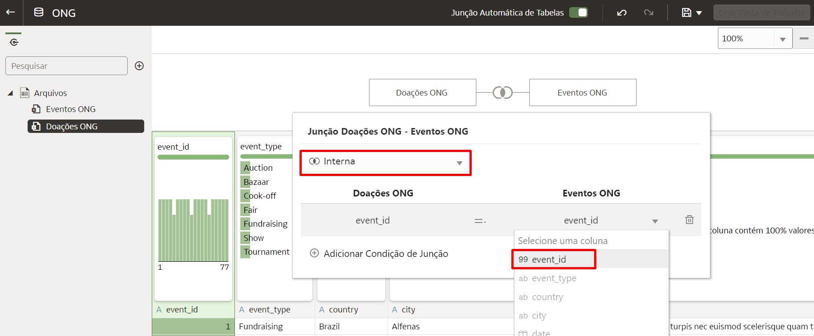

# Como realizar um join entre duas tabelas em um conjunto de dados no Oracle Analytics Cloud (OAC)?

Duração: 3 minutos

O Oracle Analytics Cloud permite a realização de Joins entre várias tabelas em um conjunto de dados através de suas robustas capacidades de preparação de dados. Quando você arrasta uma tabela e a solta em um conjunto de dados, o OAC automaticamente cria Joins entre as tabelas se houver nomes de colunas iguais. Se os nomes não forem iguais, pode-se criar facilmente um Inner, Left, Right ou Full Outer Join. Esse sprint te guiará em como realizar essas junções!

## Criar Joins
>**Nota:** É mandatório possuir a Atribuição do Aplicativo (Application Role) **DV Content Author** para executar esse sprint com sucesso.

1. A partir da **Página Inicial** do seu OAC, crie um conjunto de dados clicando em **Criar** e selecionando **Conjunto de Dados**.

    

2. Selecione o arquivo de dados a partir do qual você deseja criar um conjunto de dados. Ele pode vir da sua máquina local, de uma área de assunto ou de uma conexão. Se é da sua máquina local, selecione o arquivo e clique em **Abrir**

    

3. This will load the dataset and allow you to change the Name and Description of your file and change the file if you need to. Click **OK**.

    

4. Add another file by clicking on the **+** and selecting **Add File**. Once your file has loaded, you will again have the option to change the name and description of your file. Once changes are made, select **OK** to add the file to your dataset.

    

5. Once your dataset is added, you will notice that the two tables are automatically joined. This happens when Oracle Analytics identifies exact column names in both datasets.

    >**Note:** Auto join works on more than 2 tables as well.

    

6. If auto join is enabled and Oracle Analytics cannot find matching column names but you know there are columns that you can create joins on, **right-click** on one of the tables and select **Join To** and select the table you want to create a join to.

    >**Note:** You can also drag and drop the table you want to join onto the table you want to join to to initiate a join.

    

7. Select the column names you want to create a join on from the two tables. Notice here that auto join did not work because **State** and **States** do not match. You can strengthen your join if you have multiple column names you can join on by clicking **Add Join Condition** and selecting the extra columns.

    

8. Once you have created your joins, click **Save** and click **OK** after giving your dataset a name.

    

Congratulations! You have learned how to create joins between two tables in a dataset in Oracle Analytics Cloud!

## Learn More

* [Add Joins Between Dataset Tables](https://docs.oracle.com/en/cloud/paas/analytics-cloud/acubi/add-joins-dataset-tables.html)

* [Understand Dataset Table Joins](https://docs.oracle.com/en/cloud/paas/analytics-cloud/acubi/understand-dataset-table-joins.html)

## Acknowledgements
* **Author** - Nagwang Gyamtso, Product Manager, Product Strategy
* **Last Updated By/Date** - Nagwang Gyamtso,  June 2022
