# How do I create a Current Year vs Previous Year analysis with the same dataset in Oracle Analytics Cloud (OAC)?

Duration: 4 minutes

With Oracle Analytics Cloud, you can add multiple files to one dataset, where each file becomes a table and you can define joins between tables within a dataset. 

### Situation 
You have just uploaded your dataset, "SampleOrders-DS" and you are trying to create a visualization analyzing the 'Current Year Sales vs Previous Year Sales'. The challenge is that you only one column representing Sales and one column representing years. To create an analysis between years, you need a column for last year's sales.

   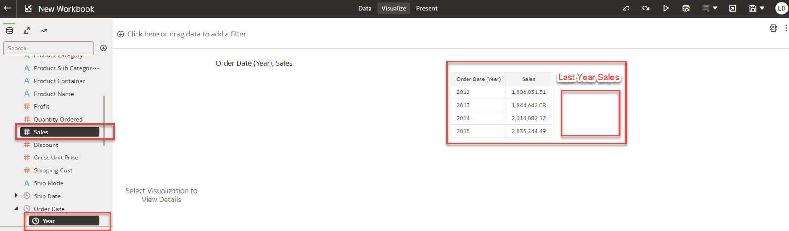

## Create Current Year vs Previous Year analysis
We are going to upload and join the same dataset to each other and in our data preparation step, we will add functions to create the columns we need. You must have the **DV Content Author** application role to successfully execute this Sprint.

1. Create a dataset and upload the same data file twice. 
   >**Note:** Refer to the related Sprint "How do I join tables in a dataset in Oracle Analytics Cloud (OAC)" to learn how to create a dataset and create joins. 

2. For the second data file, change the name by adding 'Last Year' to the end of the dataset name. 

   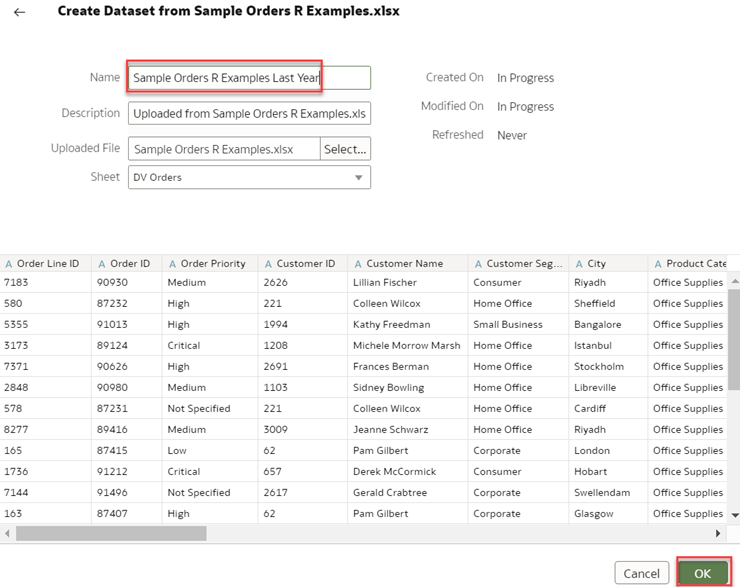  

3. You are going to create a **YEAR** column in each dataset, and use it to join the datasets. Start with the first dataset by clicking **Add Preparation Step** represented by the '+' icon in the data pane. For the **Name** field, type 'YEAR'. In the function box, type **YEAR(Order Date)**. Click **Validate** and click **Add Step**.
      >**Note:** In your own example, replace 'Order Date' in the function with the date you want to compare.

      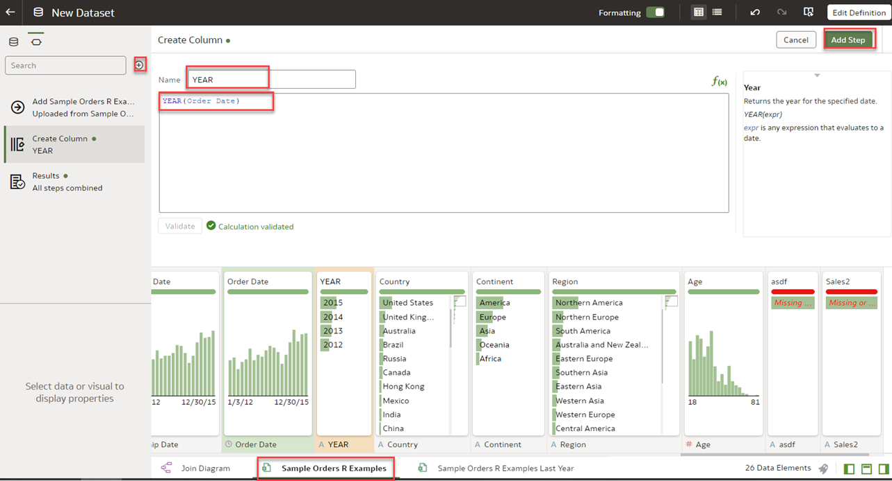

4. Click the second dataset and click **Add Preparation Step**. For **Name**, type 'Previous YEAR' and add the function **YEAR(Order Date)+1**, click **Validate** and click **Add Step**.

   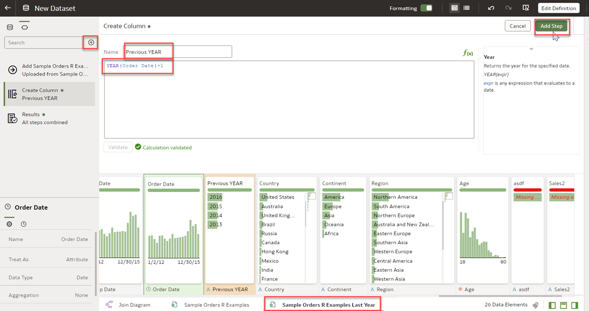

5. Locate the **Sales** column, double-click and rename it as '**Sales Previous YEAR**'.

   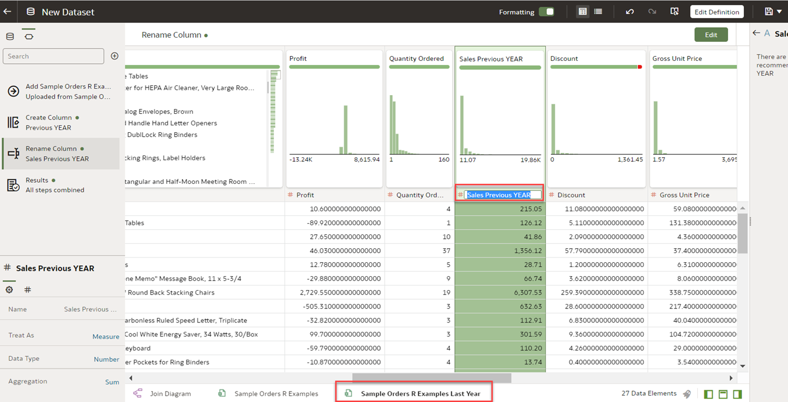  

6. Go to the **Join Diagram** and click the join in the middle. Choose Left Join for the join type and select the two columns you created to join on. For example, join 'YEAR' with 'Previous Year'.
    
    > **Note:** You choose Left Outer to get all the data for the current Year column 

   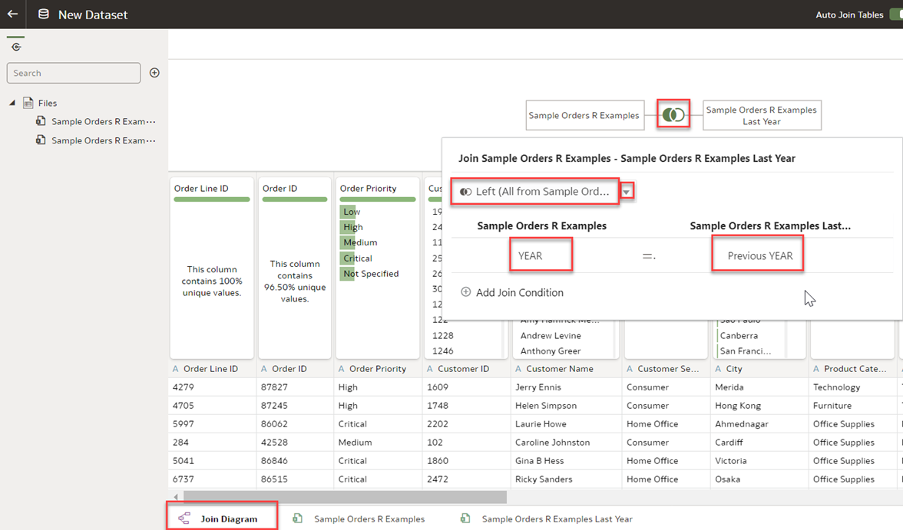  
   

7. Right-click on the first dataset and select **Preserve Grain**.

      >**Note:** Click [here](https://docs.oracle.com/en/cloud/paas/analytics-cloud/acubi/what-is-preserve-grain.html) to learn more about how preserve grain works.

      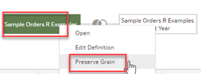 

8. **Save** the dataset and give it a name. Then click **OK**.

    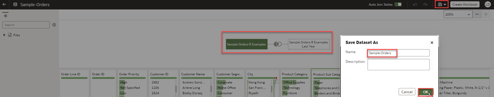  

9. We will now create a table in a workbook using this dataset to compare sales between years. Click **Create Workbook**.

    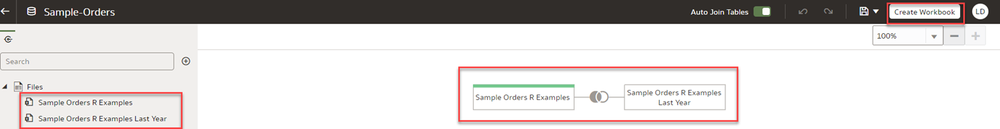  

10. Select **Sales**, **YEAR** and **Sales Previous YEAR**. Right click **Pick Visualization** and select **Table**.

    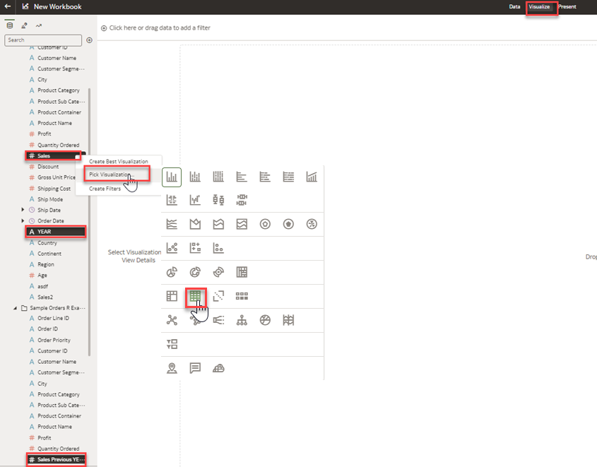  

11. Now you have Sales and Previous Year Sales in one table. You can 

    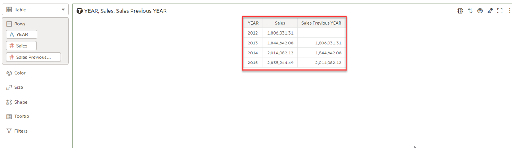  

Congratulations! You have just learned how to analyze current year vs previous year data using the same dataset. 

## Learn More
* [Add Multiple Files to a Dataset](https://docs.oracle.com/en/cloud/paas/analytics-cloud/acubi/create-dataset-files.html#GUID-3314A9C3-9780-40C6-A71E-AA0B29689165)
* [Joining Multiple Files In a Single Oracle Analytics Dataset](https://www.youtube.com/watch?v=mJmuDIdqCqU)
