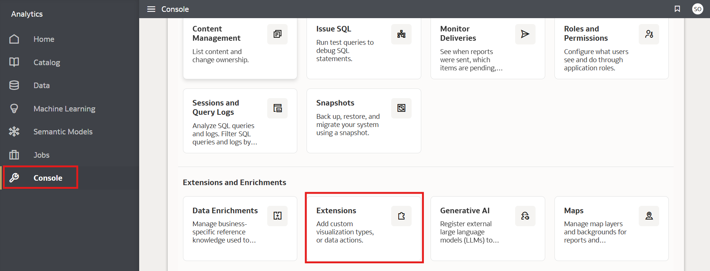
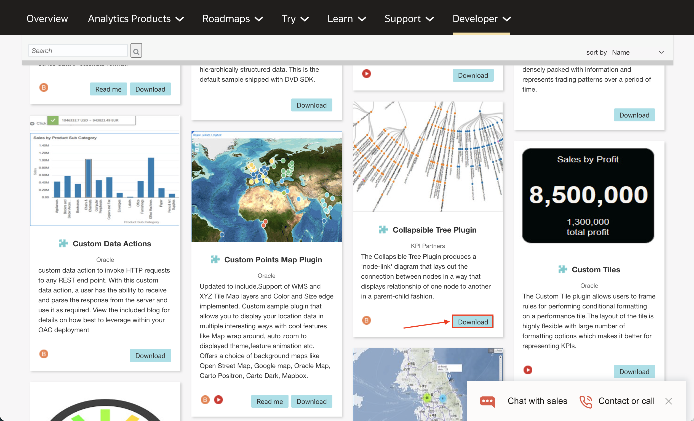
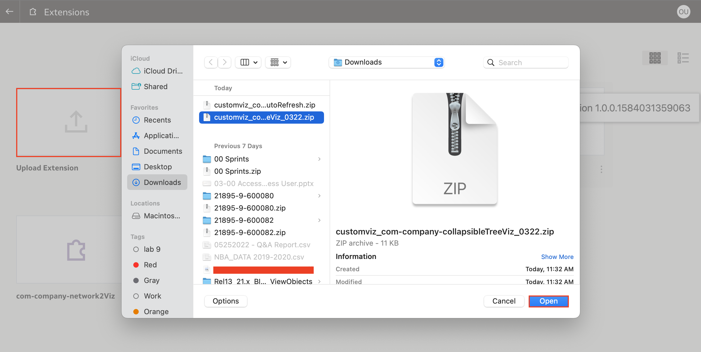
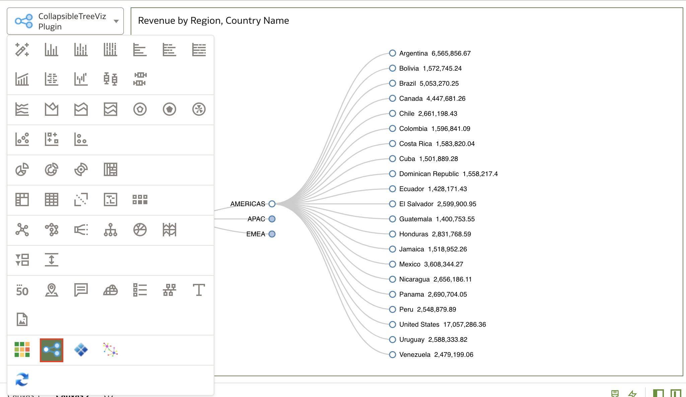

# Como importar extensões customizadas, visualizações e plug-ins no Oracle Analytics Cloud (OAC)?

Duração: 2 minutes

Ao trabalhar com visualizações no Oracle Analytics Cloud, é possível escolher entre mais de 45 tipos de visualização pré-construídas. Se o tipo de visualização que você necessita não está disponível, então você pode importar suas próprias visualizações customizadas. A [Oracle Analytics Extensions Library](https://www.oracle.com/business-analytics/data-visualization/extensions/) possui várias extensões desenvolvidas pela comunidade disponíveis para download. Elas podem aprimorar seus projetos e otimizar seus relatórios de dados.

## Importe extensões customizadas
Os passos abaixo te guiarão em como importar extensões customizadas.

>**Nota:** É mandatório possuir a Atribuição do Aplicativo (Application Role) **BI Service Administrator** para executar esse sprint com sucesso. Essa atribuição te dá acesso a região de Console do OAC.

1. Na página inicial do OAC abra o **Menu de Navegação**, clique em **Console** e selecione **Extensions**.

    

2. Explore a [Oracle Analytics Extensions Library](https://www.oracle.com/business-analytics/data-visualization/extensions/) para encontrar as extensões desenvolvidas pela comunidade e faça o download do plug-in de extensão que você deseja utilizar no seu projeto.
    >**Nota:** Será necessário realizar um login em sua conta Oracle ao clicar em **Download** para iniciar de fato o processo de download.

    

3. Na página **Extensions** de sua instância OAC, clique em **Upload**  e abra o arquivo de extensão. Uma vez carregado, a extensão deverá ser listada na página de extensões.

    

4. Para verificar se o processo foi um sucesso, abra a Pasta de Trabalho e cheque a lista de visualizações disponíveis.
    >**Nota:** Se a visualização não estiver listada, recarregue a página e ela provavelmente aparecerá.

    

Parabéns, você aprendeu como carregar visualizações customizadas no Oracle Analytics Cloud!

## Saiba mais

* [Manage Custom Plug-ins](https://docs.oracle.com/en/cloud/paas/analytics-cloud/acubi/manage-custom-plug-ins.html)

* [Extending Oracle Analytics Cloud’s Data
Visualization Using Custom Plug-ins](https://analyticsanddatasummit.org/wp-content/uploads/2019/06/TechCasts-How-to-Use-OAC-Data-Viz-Plug.pdf)

## Reconhecimentos
* **Autor** - Nagwang Gyamtso, Product Manager, Product Strategy
* **Tradução** - Breno Comin, Cloud Solution Engineer, Brazil Data & AI Team
* **Última Atualização** - Thais Henrique,  Março 2023
