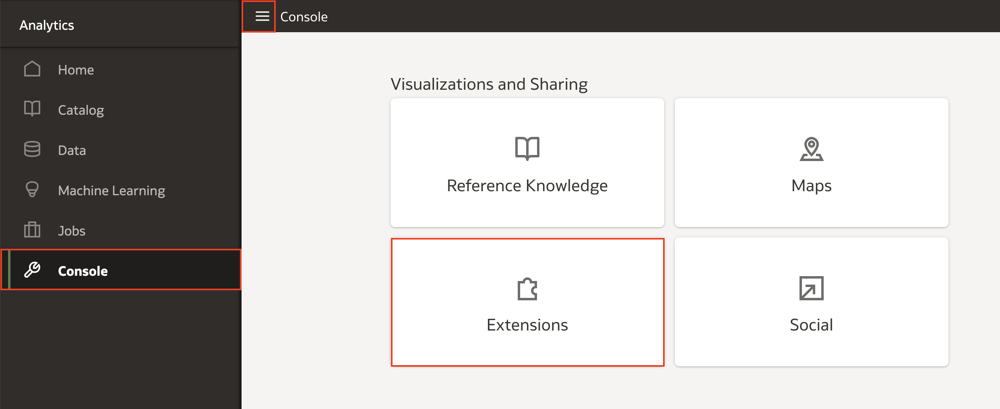
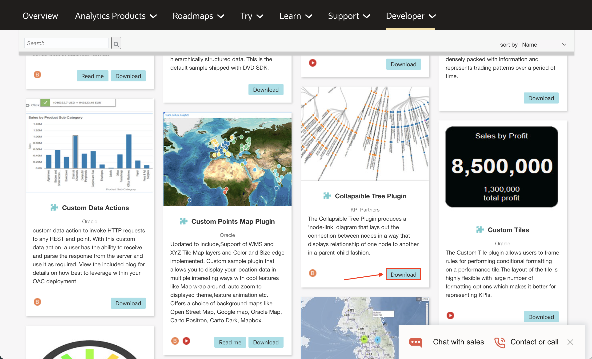
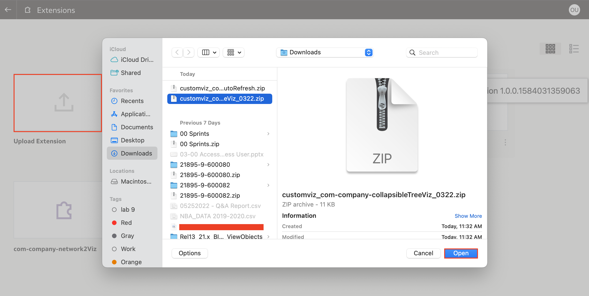
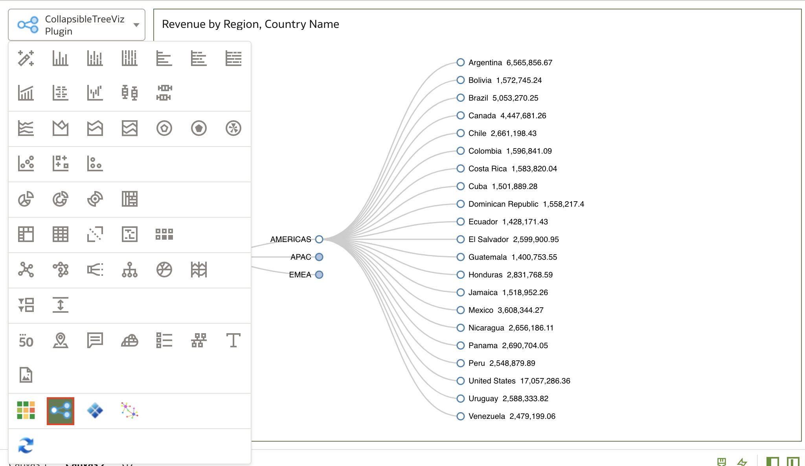

# How do I import custom extensions/visualizations/plugins-ins in Oracle Analytics Cloud (OAC)?
Duration: 2 minutes

When working with visualizations in Oracle Analytics Cloud, there are over 45 pre-built visualizations to choose from. If the visualization you need is not available, then you have the ability to import your own custom visualizations. The [Oracle Analytics Extensions Library](https://www.oracle.com/business-analytics/data-visualization/extensions/) has many community developed visualizations available for download to enhance your visualizations and improve the reporting of your data.

## Import custom extensions
The following steps will guide you on how to import custom extensions.

>**Note:** You must have the **BI Service Administrator** role to be able to execute the following steps. This role allows you to work in the OAC console.

1. From the OAC homepage **Navigation menu**, click on **Console** and select **Extensions**.

    

2. Explore the [Oracle Analytics Extensions Library](https://www.oracle.com/business-analytics/data-visualization/extensions/) for all community developed custom visualizations and download the extension plugin you want to use for your visualization.
    >**Note:** You will need to login to your Oracle account once you click **Download** to start the download process.

    

3. On the **Extensions** page in your OAC instance, click **Upload** and open the extension file. Once uploaded, the extension should be listed in the extensions page.

    

4. To verify that the extension has been uploaded, open a workbook and check the list of visualizations available.
    >**Note:** If the visualization is not listed, refresh the page and it will appear.

    

Congratulations, you have learned how to upload custom visualization extentions in Oracle Analytics Cloud!

## Learn More

* [Manage Custom Plug-ins](https://docs.oracle.com/en/cloud/paas/analytics-cloud/acubi/manage-custom-plug-ins.html)

* [Extending Oracle Analytics Cloud’s Data
Visualization Using Custom Plug-ins](https://analyticsanddatasummit.org/wp-content/uploads/2019/06/TechCasts-How-to-Use-OAC-Data-Viz-Plug.pdf)
