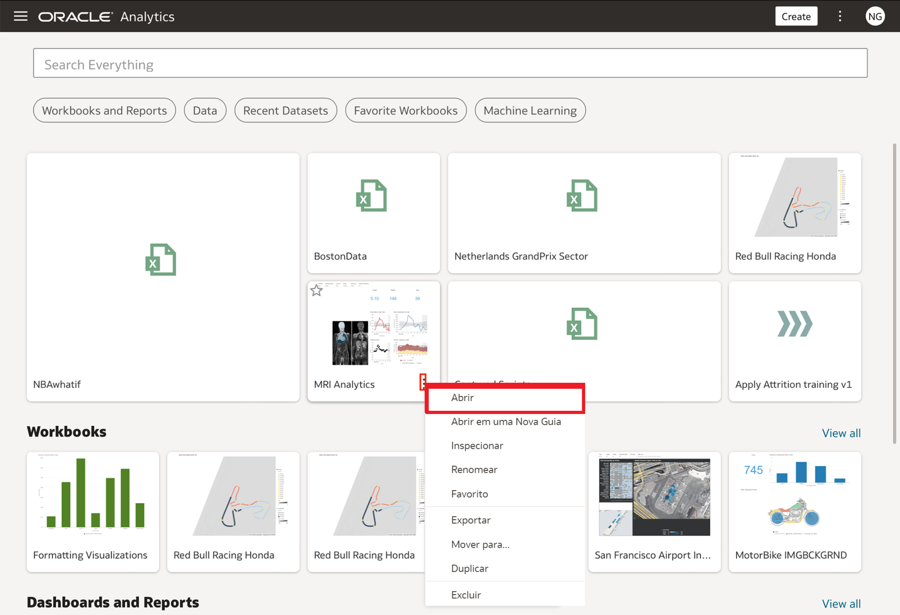
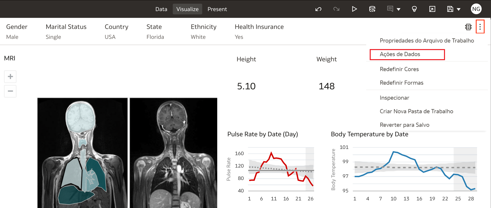
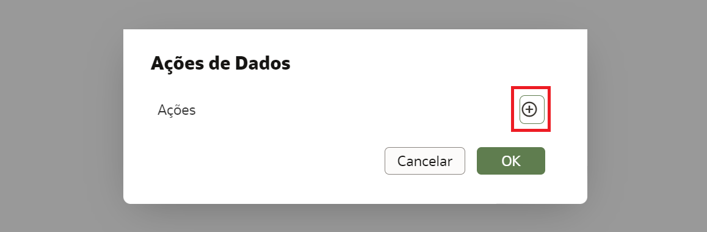
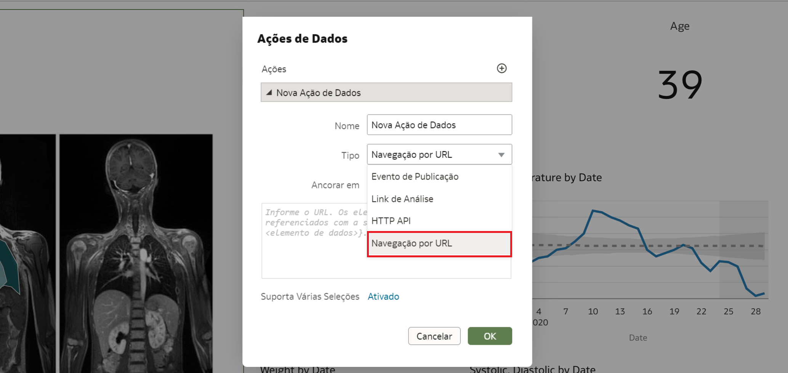
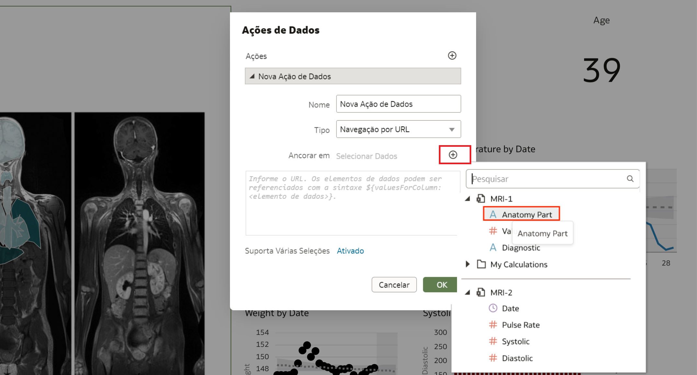
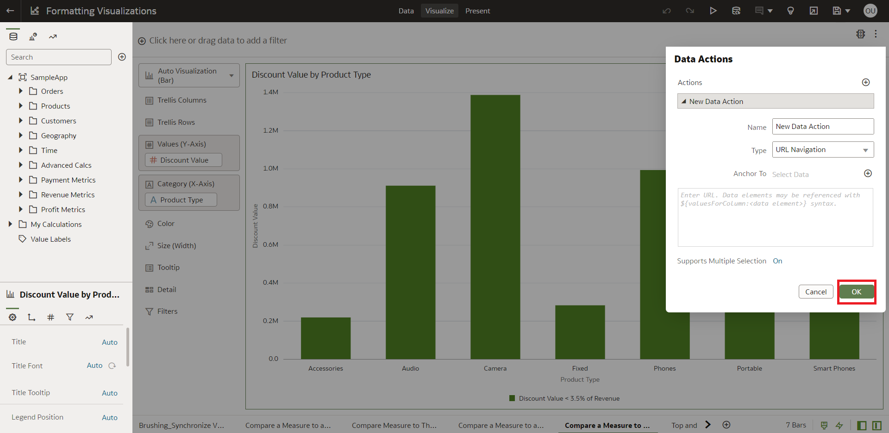

# Como criar Data Actions para conexão com URLs externas a partir de Telas de Visualização?

Duração: 3 minutos

Ao clicar em uma coluna de dados específica, você tem a opção de direcionar o usuário para um site externo para fornecer mais informações sobre essa coluna específica. Por exemplo, você pode vincular o website de um fornecedor quando clica em uma coluna como "fornecedor". Esta Sprint irá guiá-lo sobre como criar ações de dados para se conectar a URLs externas a partir de sua tela DV.

## Criando a Data Action (Ação de Dados)
>**Nota:** Você deve ter a função **DV Content Author** para executar as seguintes etapas.

1. Em sua página inicial do OAC, selecione a pasta de trabalho para a qual você deseja criar uma Data Action (Ação de Dados) e clique no menu de **Ações** ao passar o mouse sobre a pasta de trabalho. Clique em **Abrir**.

    

2. Entre no modo de edição, depois clique nos 3 pontinho na parte superior direita da tela e selecione **Ação de Dados**

    

3. Clique no símbolo **+** para adicionar uma Data Action

    

4. Digite um nome para o novo link de navegação no campo **Nome**. O padrão **Tipo** está definido como **URL Navigation**.

    

5. Clique no campo **Ancorar a** e selecione as colunas às quais você deseja que a URL se aplique a partir das opções.

    

6. Digite um endereço URL e opcionalmente inclua notações e parâmetros.

   Por exemplo, onde <em>http://www.example.com?q=${keyValuesForColumn:"COLUMN"}</em> é exibido como <em>www.oracle.com?q=${keyValuesForColumn:"Sales"."Products"."Brand"}</em> Os nomes das colunas que você seleciona aqui são substituídos por valores quando você invoca a Data Action.

    

7. Clique em **Suportar Seleção Múltipla** para definir o valor. As opções são **On*** ou **Off**

8. Clique em **OK** para salvar

    

Parabéns, você aprendeu com sucesso como criar Data Actions para se conectar a URLs externas a partir de Telas de Visualização

## Saiba Mais
[Create Data Actions to Connect to External URLs from Visualization Canvases](https://docs.oracle.com/en/cloud/paas/analytics-cloud/acubi/create-data-actions-connect-external-urls-visualization-canvases.html)

[Work with Multiple Visualizations on a Canvas](https://docs.oracle.com/en/cloud/paas/analytics-cloud/acubi/work-multiple-visualizations-canvas.html)

## Reconhecimentos
* **Autor** - Thea Lazarova, Solution Engineer, North America Specialist Hub
* **Tradução** - Isabelle Dias, GenO, Brazil Data & AI Team
* **Última Atualização** - Isabelle Dias,  Novembro 2022
