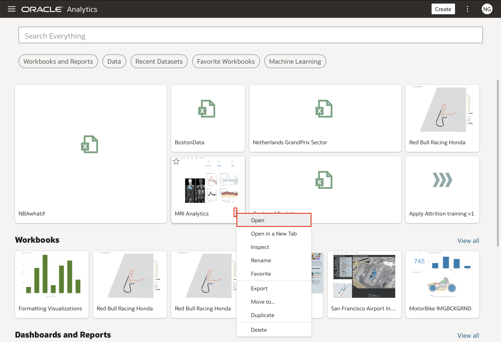
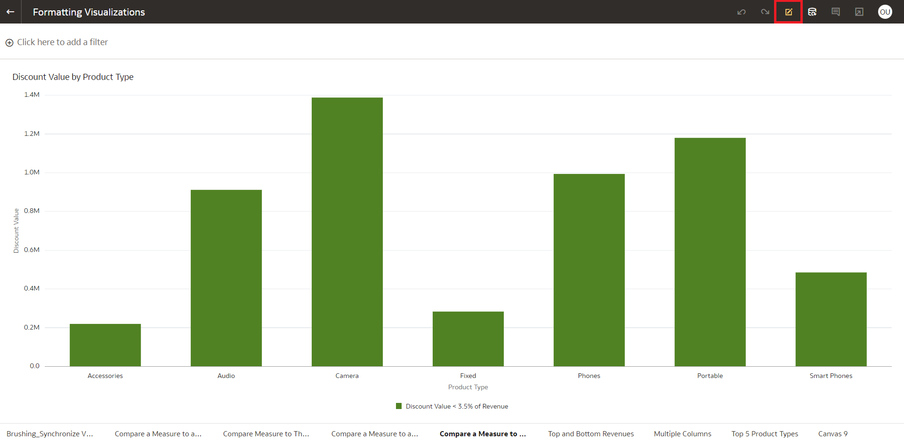
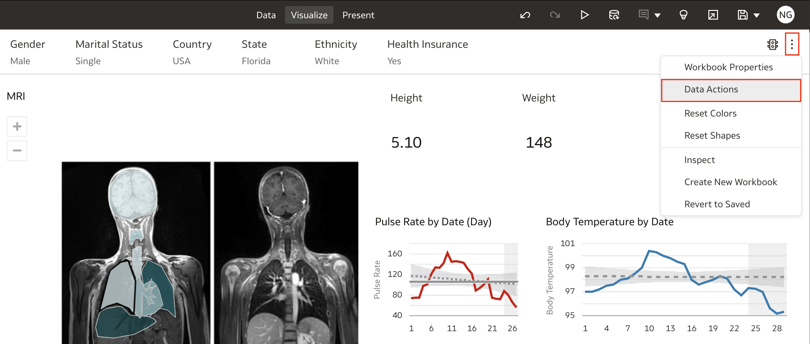
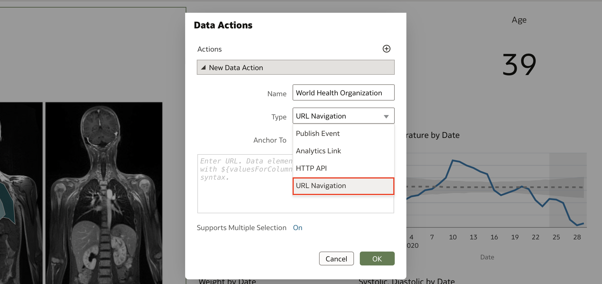
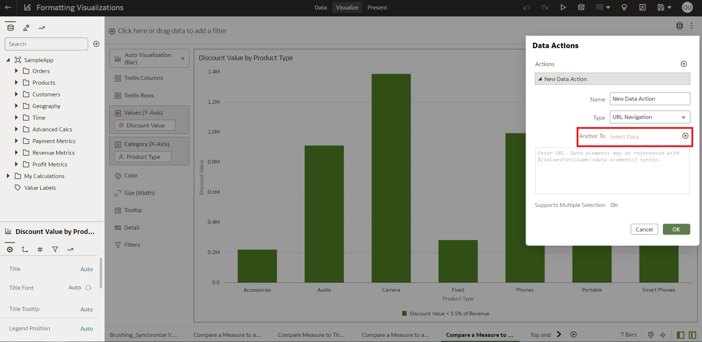
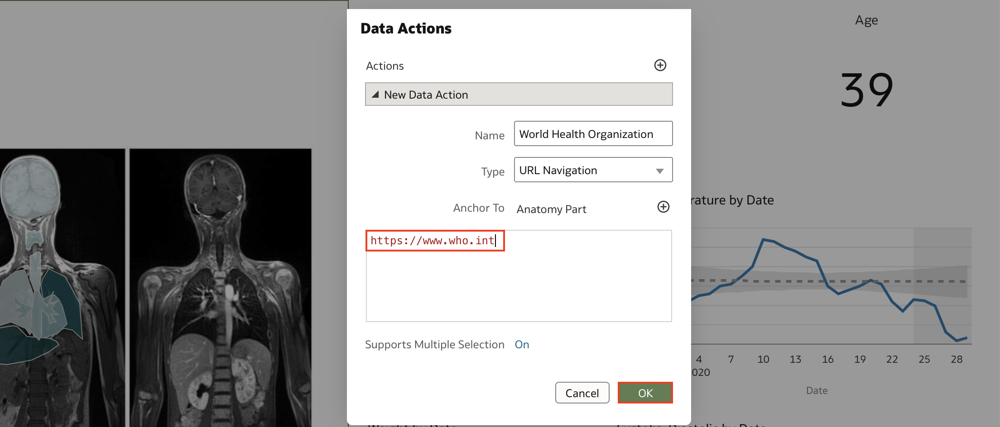
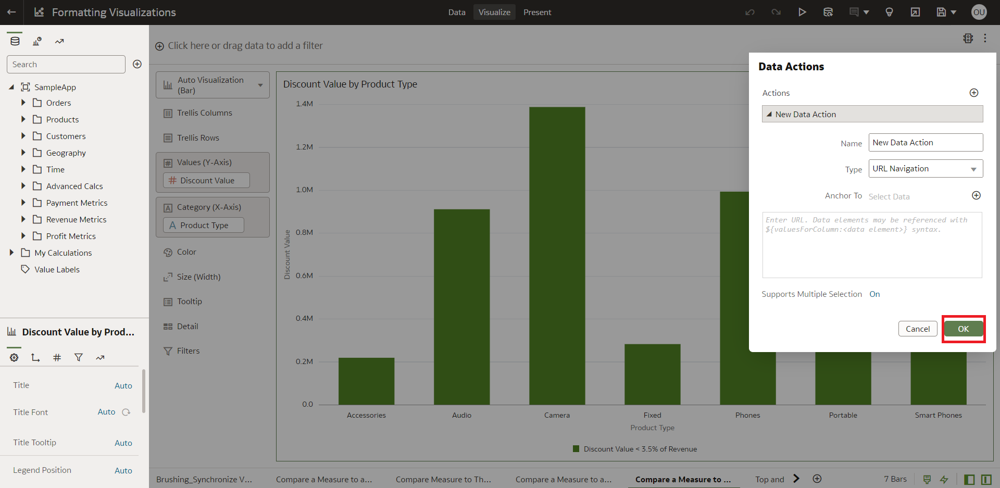

# How do I create data actions to connect to external URLs from Visualization Canvases?

Duration: 3 minutes

You can use data actions to navigate to an external URL from a canvas so that when you select a column such as the supplier ID, it displays a specific external website.

## Creating the data action 

1. In Oracle Analytics Cloud home page, select any workbook, click the **Actions menu** when hovering your mouse over the workbook and select **Open**

    

2. Click the **edit** icon, then click on the **Actions menu** and select **Data Actions**

    
    

4. Click the **+** symbol to add a Data Action

    

5. In the **Name** field enter a name for the new navigation link

6. The default **Type** is set to **URL Navigation** but if it is not, please select it

    

7. Click the **Anchor To** field and select the columns that you want the URL to apply to from the options

    

8. Enter a URL address and optionally include notation and parameters

   For example, where <em>http://www.example.com?q=${keyValuesForColumn:"COLUMN"}</em> is displayed like <em>www.oracle.com?q=${keyValuesForColumn:"Sales"."Products"."Brand"}</em> The column names that you select here are replaced with values when you invoke the data action.

    

9. Click **Support Multiple Selection** to set the value. The options are **On** or **Off**

10. Click **OK** to save

    

Congratulations, you have successfully learned how to create Data Actions to connect to external URLs from Visualization Canvases

## Learn More
[Documentation](https://docs.oracle.com/en/cloud/paas/analytics-cloud/acubi/create-data-actions-connect-external-urls-visualization-canvases.html)
 
[Work with Multiple Visualizations on a Canvas](https://docs.oracle.com/en/cloud/paas/analytics-cloud/acubi/work-multiple-visualizations-canvas.html)

## Acknowledgements
* **Author** - Thea Lazarova, Solution Engineer, North America Specialist Hub 
* **Last Updated By/Date** - Thea Lazarova,  August 2022
