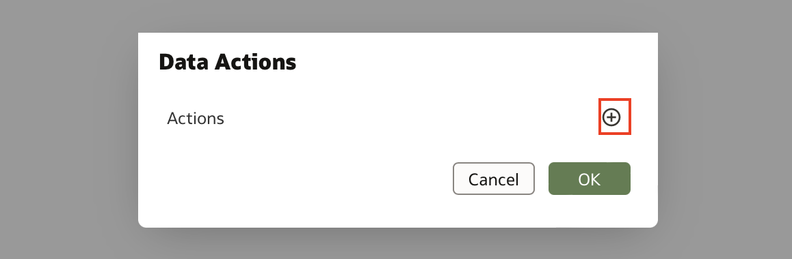
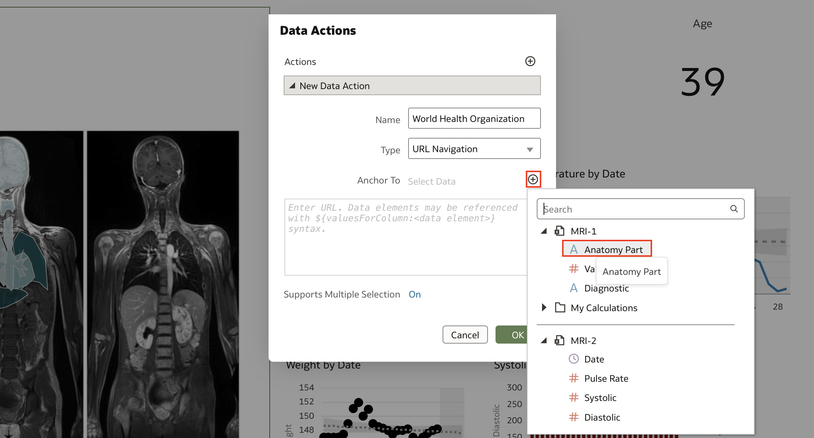

# How do I create data actions to connect to external URLs from Visualization Canvases?

Duration: 3 minutes

When you click on a specific data column, you have the option to direct the user to an external website to provide more information about that specific column. For example, you can link a vendor’s website to the vendor name column and when you right click on a visualization containing that column, you have the option to direct to the website.

## Creating the data action
>**Note:** You must have the **DV Content Author** application role to successfully complete this action.

1. In your OAC homepage, select the workbook you want to create a data action for and click the **Actions menu** when hovering your mouse over the workbook. Click **Open**.

    

2. Click the **edit** icon, then click on the **Actions menu** and select **Data Actions**

    

3. Click the **+** symbol to add a Data Action

    

4. Enter a name for the new navigation link in the **Name** field. The default **Type** is set to **URL Navigation**.

    

5. Click the **Anchor To** field and select the columns that you want the URL to apply to from the options.

    

6. Enter the URL address that you want the data action to direct to.

    

7. Click **Support Multiple Selection** to set the value. When it's set to **On**, the data action can be invoked when one or multiple data points are selected. When it's set to **Off**, the data action can only be invoked when a single data point is selected. Click **OK** to save.

8. To invoke the data action, right-click a visualization that contains the columns that you anchored the external URL to and select the name of the data action.

    

Congratulations, you have successfully learned how to create Data Actions to connect to external URLs from Visualization Canvases.

## Learn More
[Create Data Actions to Connect to External URLs from Visualization Canvases](https://docs.oracle.com/en/cloud/paas/analytics-cloud/acubi/create-data-actions-connect-external-urls-visualization-canvases.html)

## Acknowledgements
* **Author** - Thea Lazarova, Solution Engineer, North America Specialist Hub
* **Contributors** - Nagwang Gyamtso, Product Manager, Product Strategy
* **Last Updated By/Date** - Thea Lazarova,  August 2022
