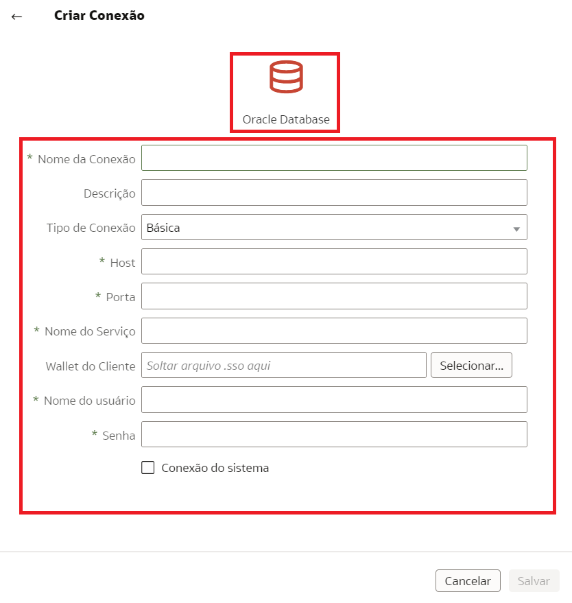
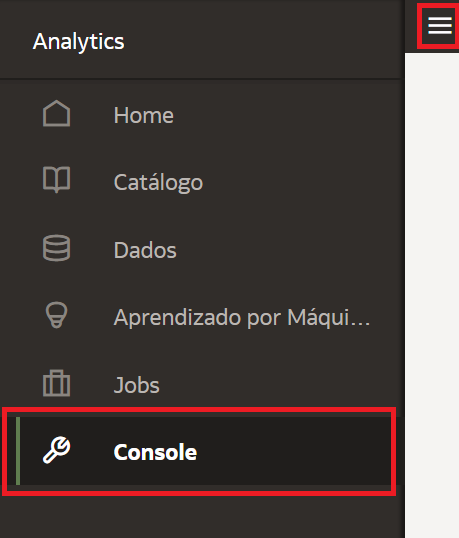
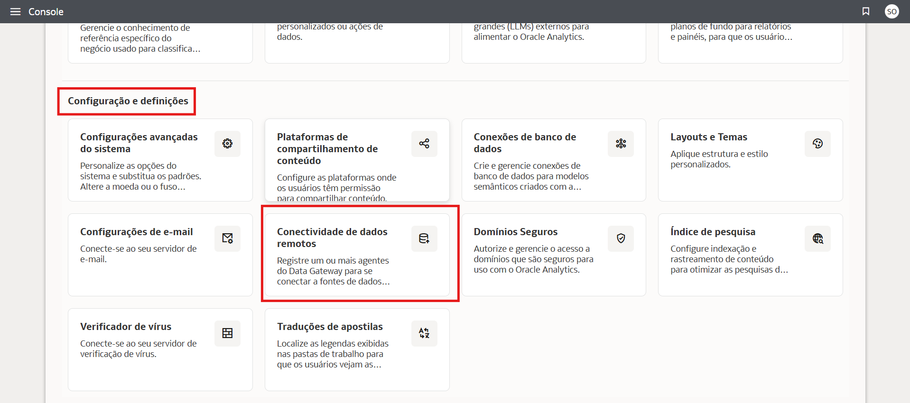
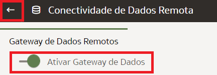
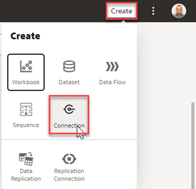
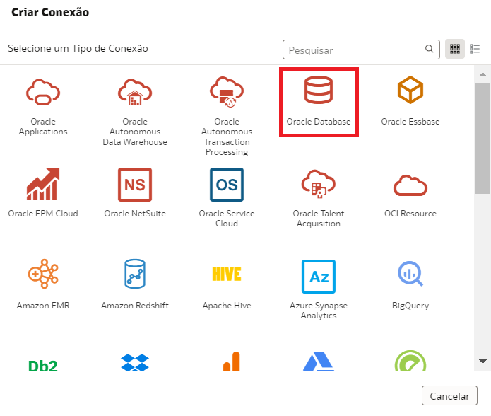
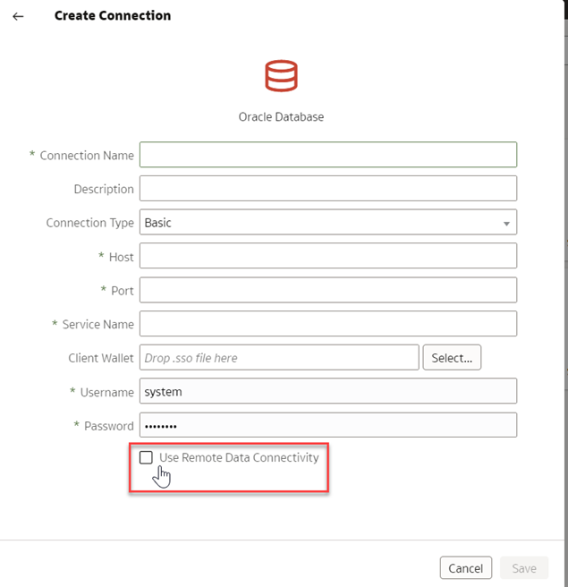

# Como posso me conectar com fontes de dados privadas usando a edição OAC-Professional no Oracle Analytics Cloud (OAC)?

Duração: 2 minutos

Com Oracle Analytics Cloud, você pode se conectar a uma variedade de fontes de dados, incluindo fontes de dados privadas.

### **Cenário:**
Você quer se conectar ao seu banco de dados local, mas **Conexão de banco de dados** não tem a opção **Usar Conectividade Remota de Dados** caixa de seleção. Neste Sprint, aprenderemos como habilitar a Conectividade Remota de Dados para nos permitir a conexão com bancos de dados locais.

   

## Habilitar Gateway de Dados Remoto
Você pode se conectar a fontes de dados remotas on-premises através de um [Private Access Channel](https://docs.oracle.com/en/cloud/paas/analytics-cloud/acsds/connect-private-data-sources-private-access-channel.html#GUID-F3E9ED24-5396-40A4-B675-C6B7D3BDCE7C) ou  [Data Gateway](https://docs.oracle.com/en/cloud/paas/analytics-cloud/acsds/connect-premises-data-sources-using-data-gateway.html). Você vai usar **Gateway De Dados** porque o Canal de Acesso Privado ainda não é suportado na edição OAC - Professional.  A caixa de seleção **Usar Conectividade Remota de Dados** está faltando porque você não habilitou **Gateway De Dados** no **Console**.
 > **Nota:** Você deve ter o cargo **BI Service Administrator** para executar as seguintes etapas.

1. Na página Oracle Analytics Cloud **Home**, clique em **Navigador** e selecione **Console**.  

   

2. Clique em **Conectividade Remota de Dados**.
     

3. Alterne para a opção **Ativar Gateway De Dados** 

      

4. Volte para sua página **Home**. Crie uma nova conexão clicando no botão **Criar** e selecionando **Conexão**.

     

5. Selecione a conexão **Oracle Database** 

      

6. A opção **Usar Conectividade de Dados Remota*** estará agora disponível.

     

Parabéns! Você acabou de aprender como ativar a opção **Utilizar a Conectividade Remota de Dados** para conectar-se a fontes de dados privadas.

## Saiba Mais
* [Conecte a dados On-premises](https://docs.oracle.com/en/cloud/paas/analytics-cloud/acsds/connect-premises-data-sources.html)

## Reconhecimentos
* **Autor** - Lucian Dinescu, Product Strategy, Analytics
* **Tradução** - Isabelle Dias, GenO, Brazil Data & AI Team
* **Última Atualização** - Thais Henrique,  Março 2023
