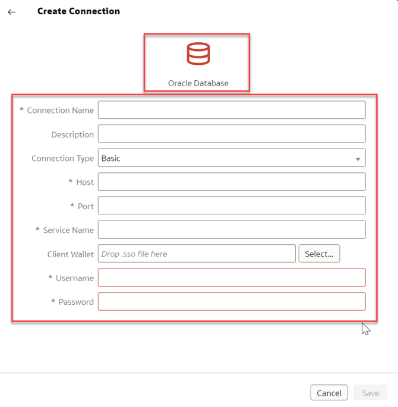

# How do I connect with private data sources using OAC-Professional edition in Oracle Analytics Cloud (OAC)?

Last updated June 6, 2022

Duration: 2 minutes

With Oracle Analytics Cloud, you can connect to a variety of data sources, including private data sources. 

### Scenario
You want to connect to your local database, but **Database Connection** doesn't have the **Use Remote Data Connectivity** option check box. In this Sprint, we will learn how to enable Remote Data Connectivity to allow us to connect to local databases. 

   

## Enable Remote Data Gateway
You can connect to remote on-premises data sources over a [Private Access Channel](https://docs.oracle.com/en/cloud/paas/analytics-cloud/acsds/connect-private-data-sources-private-access-channel.html#GUID-F3E9ED24-5396-40A4-B675-C6B7D3BDCE7C) or  [Data Gateway](https://docs.oracle.com/en/cloud/paas/analytics-cloud/acsds/connect-premises-data-sources-using-data-gateway.html). You are going to use **Data Gateway** because Private Access Channel is not supported on OAC-Professional edition yet. The **Use Remote Data Connectivity** check box option is missing because you have not enabled **Data Gateway** in the **Console**.
 > **Note:** You must have the **BI Service Administrator** application role to execute the following steps.

1. From the Oracle Analytics Cloud **Home** page, click **Navigator** and select **Console**.  
  
  
   

2. Click **Remote Data Connectivity**.
     

3. **Enable Data Gateway** option by clicking on the toggle.

      

4. Go Back to your OAC **Home** page. Create a new connection by clicking the **Create** button and selecting **Connection**.

     

5. Select **Oracle Database** connection.

      

6. The **Remote Data Connectivity** option will now be available.

     

Congratulations! You have just learned how to enable **Use Remote Data Connectivity** option to connect to private data sources.

## Learn More
* [Connect to On-premises Data Sources](https://docs.oracle.com/en/cloud/paas/analytics-cloud/acsds/connect-premises-data-sources.html)
