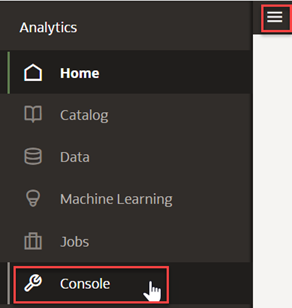
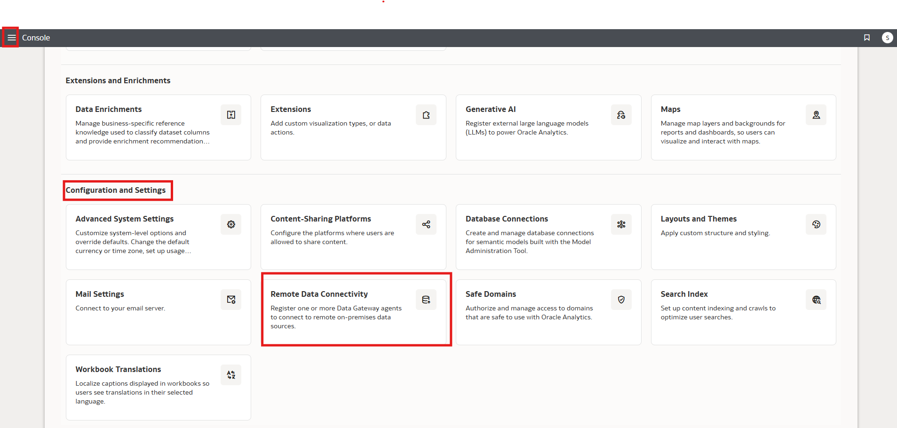
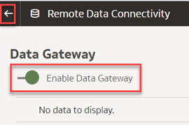
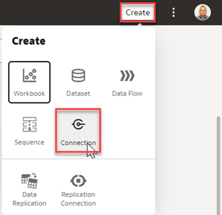
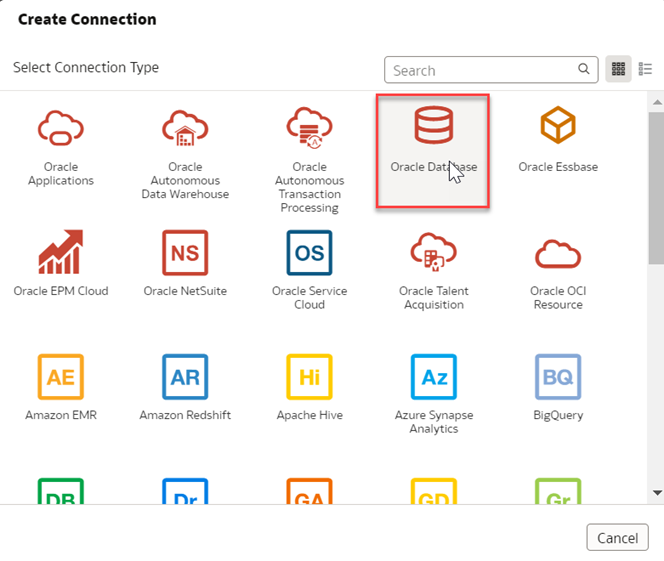
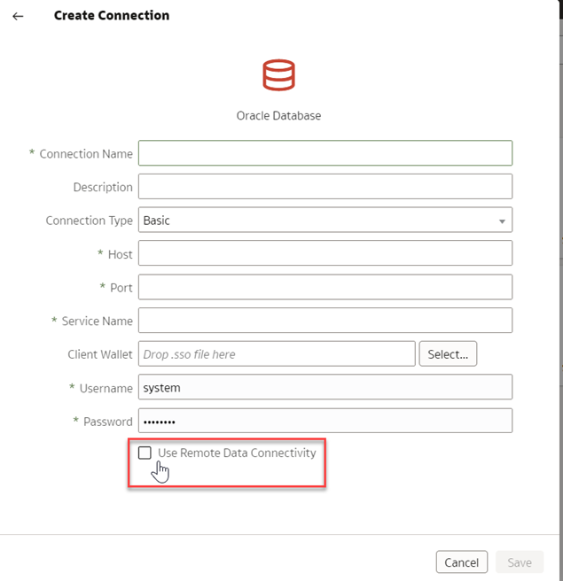

# How do I connect to private data sources in Oracle Analytics Cloud and Server (OAC and OAS)?

Duration: 2 minutes

With Oracle Analytics Cloud, you can connect to a variety of data sources, including private data sources.

### Scenario
In Oracle Analytics, the **Use Remote Data Connectivity** setting must be enabled for you to connect to and use private data sources in datasets and semantic models.

In this sprint you'll learn how to enable the Remote Data Connectivity setting.

## Enable Remote Data Gateway
You can connect to remote on-premises data sources over a [Private Access Channel](https://docs.oracle.com/en/cloud/paas/analytics-cloud/acsds/connect-private-data-sources-private-access-channel.html#GUID-F3E9ED24-5396-40A4-B675-C6B7D3BDCE7C) or  [Data Gateway](https://docs.oracle.com/en/cloud/paas/analytics-cloud/acsds/connect-premises-data-sources-using-data-gateway.html). You are going to use **Data Gateway** because Private Access Channel is not supported on OAC/OAS-Professional edition yet. The **Use Remote Data Connectivity** check box option is missing because you have not enabled **Data Gateway** in the **Console**.

 > **Note:** You must have the **BI Service Administrator** role to complete the following steps.

1. From the Oracle Analytics **Home** page, click **Navigator** and select **Console**.  

   

2. In Console, Click **Remote Data Connectivity**.

     

3. Click the **Enable Data Gateway** toggle.

      

4. Click Go Back to go back and select **Home** to go to the Home page. In the Home page, click **Create** and select **Connection**.

     

5. Select **Oracle Database** connection.

      

6. The **Remote Data Connectivity** option will now be available.

     

Congratulations, you've learned hot to enable the **Use Remote Data Connectivity** option to connect to private data sources!

## Learn More
* [Connect to On-premises Data Sources](https://docs.oracle.com/en/cloud/paas/analytics-cloud/acsds/connect-premises-data-sources.html)

## Acknowledgements
* **Author** - Lucian Dinescu, Product Strategy, Analytics
* **Last Updated By/Date** - Shiva Oleti,  June 2025
