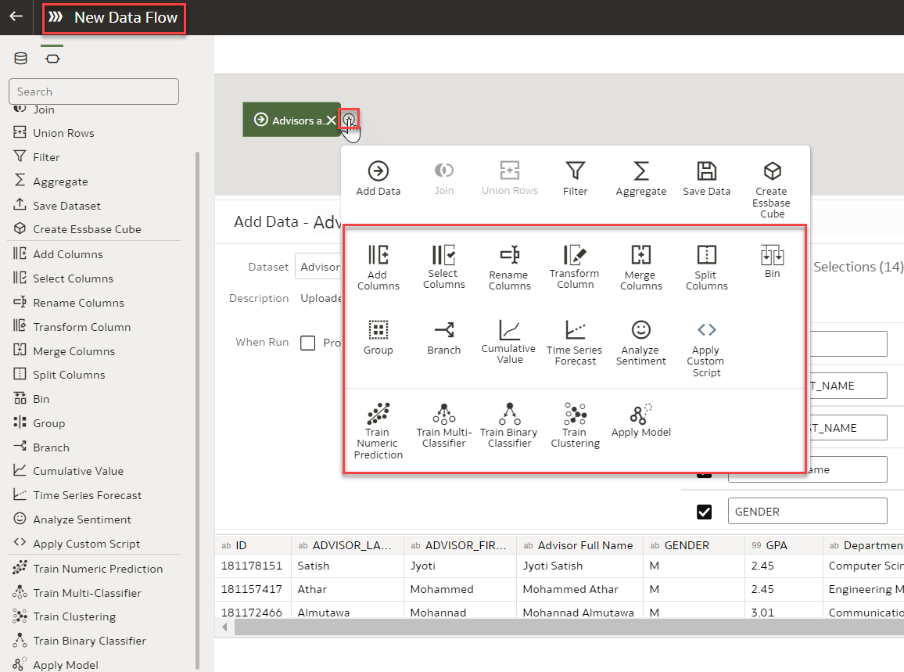
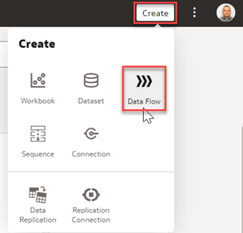
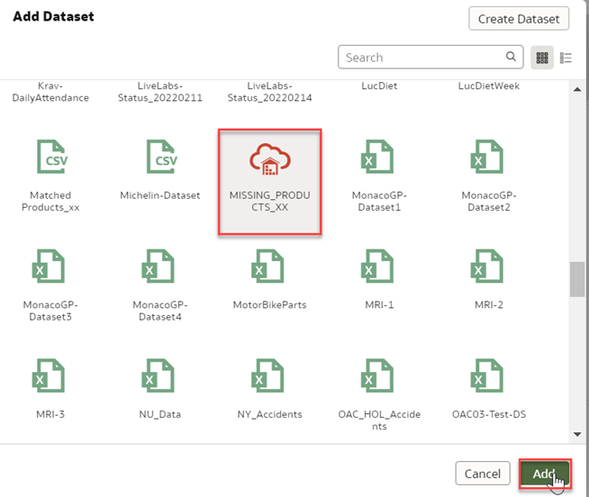
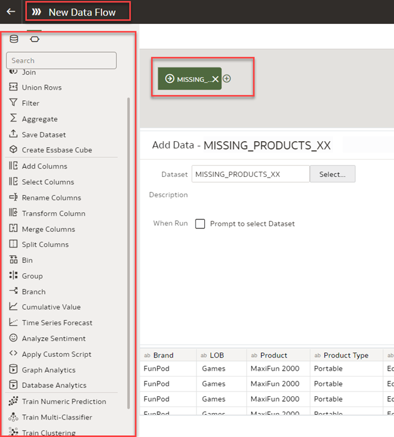
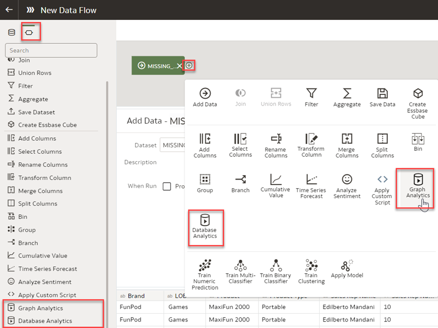

# How do I enable the Database Analytics option within the Data Flow in Oracle Analytics Cloud (OAC)?

Duration: 2 minutes

When working with the Data Flow in Oracle Analytics Cloud, you have the option to leverage the power of Oracle Database Analytics functions. The two database functions you have access to are Database Analytics and Graph Analytics.

* **Análise de banco de dados**: permite a realização de análises avançadas e análise de data mining  
* **Análise gráfica**: permite a realização de análises geoespaciais

O Fluxo De Dados (data flow) é uma ferramenta leve, simples e fácil de usar para que os usuários empresariais possam combinar, organizar, integrar e produzir um conjunto de dados com curadoria. O Fluxo de Dados é um importante capacitador de um ambiente analítico self-service.

Se você estiver trabalhando com um conjunto de dados no Fluxo de Dados (data flow) e não estiver vendo as opções de Análise de Banco de Dados e Análise Gráfica, os seguintes passos lhe mostrarão como solucionar este problema.

  

## Habilitar Análise de Banco de Dados no Fluxo de Dados
  >**Nota:** A opção Análise de Banco de Dados só está disponível no Fluxo de Dados se sua fonte de dados for um Banco de Dados Autônomo Oracle (Oracle Autonomous Database) ou um Banco de Dados Oracle.
  **Nota:** Você deve ter a função **DV Content Author** para executar as seguintes etapas.

1. Em sua página inicial do OAC, clique em **Criar** e selecione **Fluxo de dados**.

   

2. Em **Adicionar conjunto de dados**, selecione seu conjunto de dados de sua fonte de banco de dados, depois clique em **Adicionar**.
    > **Nota:** note que o ícone é específico para um conjunto de dados de banco de dados

      

3. Você pode ver o **Editor de Fluxo de Dados** com as etapas de fluxo de dados.

   

4. Para cada função que você deseja realizar, clique em **Adicionar um Passo,** representado pelo ícone +. Aqui, você verá que agora você tem à sua disposição as funções de Análise Gráfica e Analítica de Banco de Dados.
    >**Dica**: Passe o mouse sobre a última etapa para exibir a opção **Adicionar uma etapa**.  

    

Parabéns! Você acabou de aprender como habilitar as funções **Análise de banco de dados** e **Análise gráfica** com seu **Fluxo de dados OAC***.

## Saiba Mais
* [Database Analytics Functions](https://docs.oracle.com/en/cloud/paas/analytics-cloud/acubi/database-analytics-functions.html)
* [Graph Analytics Functions](https://docs.oracle.com/en/cloud/paas/analytics-cloud/acubi/graph-analytics-functions.html)

## Reconhecimentos
* **Autor** - Lucian Dinescu, Product Strategy, Analytics
* **Tradução** - Isabelle Dias, GenO, Brazil Data & AI Team
* **Última Atualização** - Isabelle Dias,  Outubro 2022
