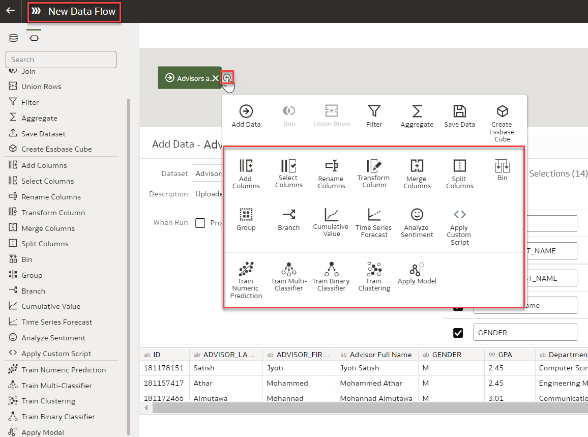

# How do I enable the Database Analytics option within the Data Flow in Oracle Analytics Cloud (OAC)?

Duration: 2 minutes

When working with the Data Flow in Oracle Analytics Cloud, you have the option to leverage the power of Oracle Database Analytics functions. The two database functions you have access to are Database Analytics and Graph Analytics.

* **Database Analytics**: enable you to perform advanced analysis and data mining analysis  
* **Graph Analytics**: enable you to perform geo-spatial analysis

Data Flow is a lightweight, simple and easy to use tool for business users to combine, organize, integrate and produce a curated dataset. Data Flow is an important enabler of a self-service analytics environment. 

If you are working with a dataset in Data Flow and you are not seeing the Database Analytics and Graph Analytics options, the following steps will show you how to troubleshoot this.

  

## Enable Database Analytics in Data Flow
  >**Note:** the Database Analytics option is only available in Data Flow if your data source is an Oracle Autonomous Database or an Oracle Database.
  You must have the **DV Content Author** application role to execute the following steps.

1. On you OAC homepage, click **Create** and select **Data Flow**.

   

2. In the **Add Dataset** dialog, select your dataset from your Database source, then click **Add**.
    > **Note:** notice that the icon is specific to a database dataset
    
      
    

3. You can see the **Data Flow Editor** with the Data Flow steps.

   

4. For each function that you want to perform, click **Add a Step,** represented by the + icon. Here, you will see that you now have the Graph Analytics and the Database Analytics functions available to you. 
    >**Tip**: Hover over the last step to display the **Add a Step** option.  
  
    

Congratulations! You have just learned how to enable **Database Analytics** functions and **Graph Analytics** with your **OAC Data Flow**.

## Learn More
* [Database Analytics Functions](https://docs.oracle.com/en/cloud/paas/analytics-cloud/acubi/database-analytics-functions.html)
* [Graph Analytics Functions](https://docs.oracle.com/en/cloud/paas/analytics-cloud/acubi/graph-analytics-functions.html)
