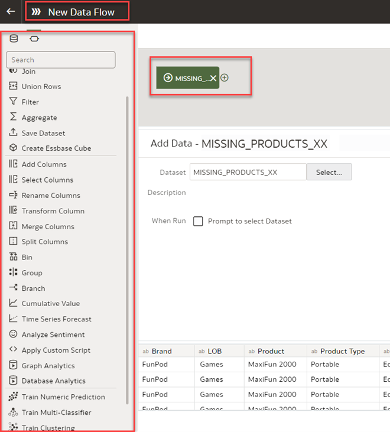

# How do I enable the Database Analytics option within the Data Flow in Oracle Analytics Cloud and Server (OAC & OAS)?

Duration: 2 minutes

When you work with data flow, you can leverage the power of Oracle Database's functions. The two functions you can access are Database Analytics and Graph Analytics.

* **Database Analytics**: Enable you to perform advanced analysis and data mining analysis.  
* **Graph Analytics**: Enable you to perform geo-spatial analysis.

Data Flow is a lightweight, simple, and easy to use tool for business users to combine, organize, integrate, and produce a curated dataset. Data flow is an important component of the self-service analytics environment.

## Enable Database Analytics in Data Flow
  >**Note:** The Database Analytics option is only available in Data Flow if your data source is an Oracle Autonomous Database or an Oracle Database.
  You must have the **DV Content Author** role to complete the following steps.

1. In the Oracle Analytics Home page, click **Create** and select **Data Flow**.

   

2. In the **Add Dataset** dialog, select your dataset from your database source, then click **Add**.
    > **Note:** Notice that the icon is specific to a database dataset

      

3. The **Data Flow editor** is displayed and includes these steps.

   

4. For each function that you want to perform, click **Add a Step,** represented by the + icon. In this image note the Graph Analytics and Database Analytics functions.
    >**Tip**: Hover over the last step to display the **Add a Step** option.  

    

Congratulations! You've learned how to enable **Database Analytics** functions and **Graph Analytics** in your **Data Flow**.

## Learn More
* [Database Analytics Functions](https://docs.oracle.com/en/cloud/paas/analytics-cloud/acubi/database-analytics-functions.html)
* [Graph Analytics Functions](https://docs.oracle.com/en/cloud/paas/analytics-cloud/acubi/graph-analytics-functions.html)

## Acknowledgements
* **Author** - Lucian Dinescu, Product Strategy, Analytics
* **Last Updated By/Date** - Lucian Dinescu,  June 2022
