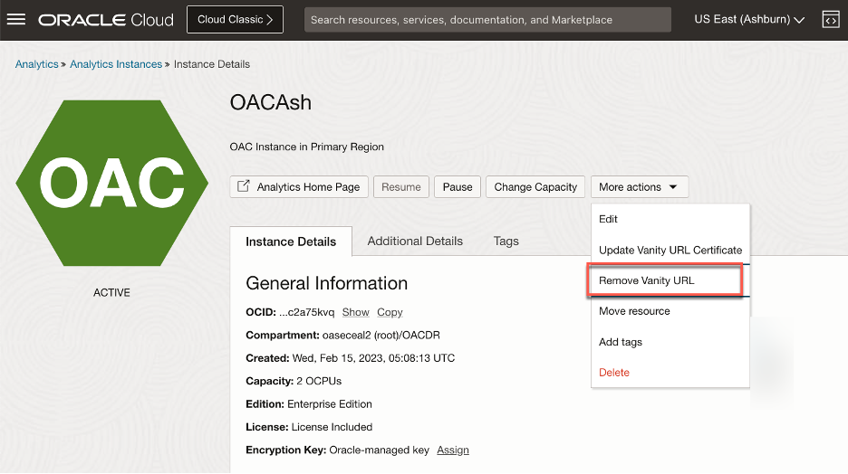
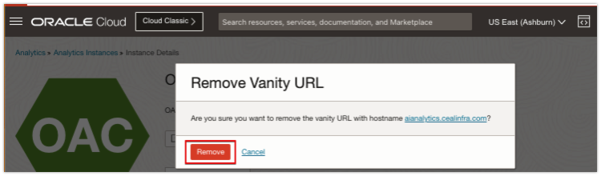

# How do I delete an Oracle Analytics Cloud(OAC) Vanity URL?

Duration: 1 minute

You can delete a vanity URL when you no longer need it. You must delete and recreate a vanity URL when the domain name has changed.

Deleting a vanity URL removes its SSL certificates

## Delete an OAC Vanity URL

>**Note:** You must have an **OAC Administrator** role to complete the following steps.

1. Go to https://cloud.oracle.com and Sign into Oracle Cloud.

2. In Oracle Cloud Infrastructure Console, click **Navigation menu** in the top left corner.

3. Click **Analytics & AI**. Under Analytics, click **Analytics Cloud**.

3. Select the compartment that contains the OAC instance you're looking for.

4. Click the OAC instance with the vanity URL you want to delete.

5. On the **Instance Details** page, click **More Actions** and then select **Remove Vanity URL**.

  

6. Click **Remove** to confirm. In few minutes the Vanity URL should be deleted, and your instance will reflect the same.

  

## Learn More
* [Create, Update and Delete Oracle Analytics Cloud Vanity URL using UI and OCI CLI](https://blogs.oracle.com/analytics/post/create-update-delete-oac-vanity-url)

## Acknowledgements
* **Author** - Ravi Bhuma, CEAL
* **Last Updated By/Date** - Ravi Bhuma, June 2023
