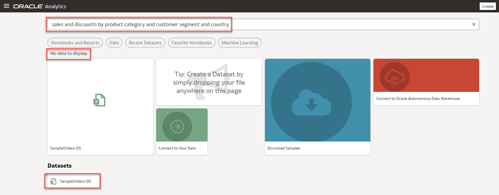
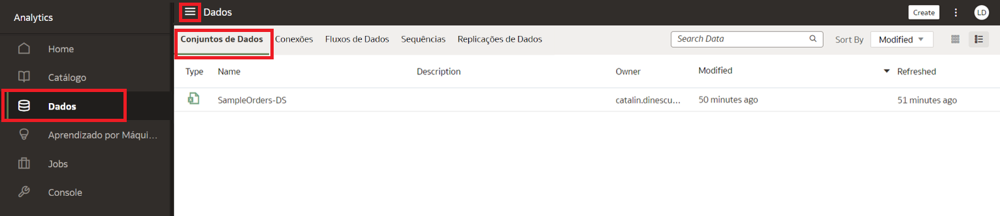
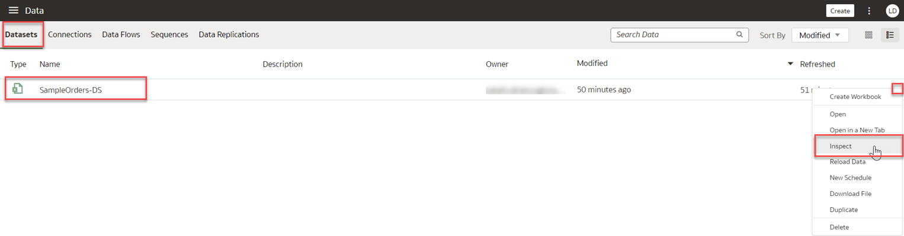
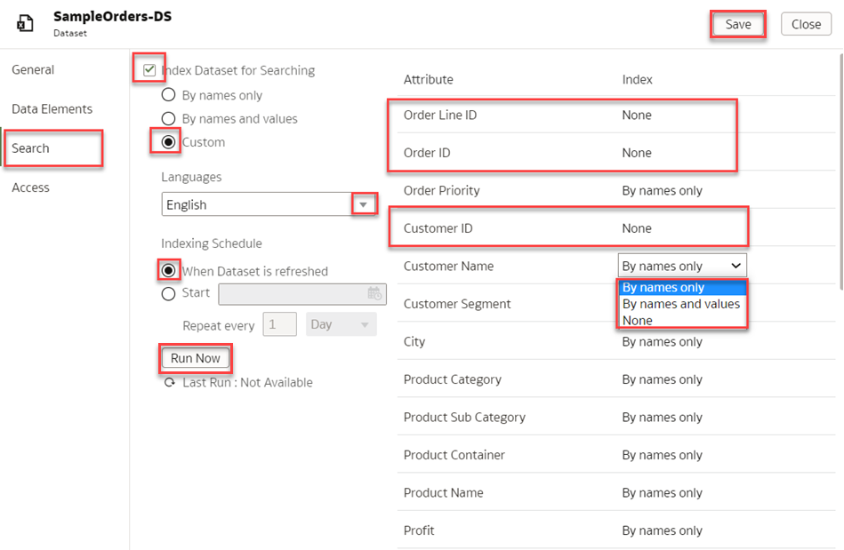
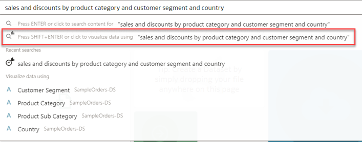
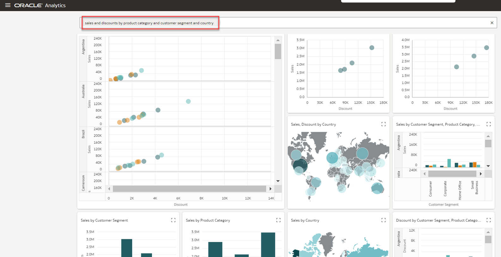

# Como posso pesquisar meu conjunto de dados no Oracle Analytics Cloud (OAC)?

Duração: 3 minutos

Um conjunto de dados (dataset) é uma unidade de armazenamento no Oracle Analytics Cloud (OAC) que armazena dados de várias fontes de dados, tais como arquivos, tabelas, áreas de assunto ou conexões. Um conjunto de dados (dataset) também pode ser um modelo de dados self-service que contém múltiplas tabelas com relações definidas entre as tabelas.

### Situação
Você acabou de carregar seu conjunto de dados "SampleOrders-DS" e a busca não está funcionando nos resultados da busca da homepage.

   

## Habilitar a busca de um conjunto de dados
Se você acabou de carregar um conjunto de dados baseado em arquivo, você tem que **indexá-lo** antes de poder utilizá-lo para construir visualizações a partir da página inicial do OAC. Se você compartilhou seu conjunto de dados com outros usuários, você deve indexar e certificar seu conjunto de dados antes que os usuários com quem você compartilhou o conjunto de dados possam usá-lo para construir visualizações a partir de sua página inicial.
<<<<<<< HEAD
> **Nota:** Você deve ter a função **BI Service Administrator** para executar as seguintes etapas.

1. Na página **Home**, clique no **Menu Navigation**, e depois clique em **Dados** para chegar aos seus conjuntos de dados.  
=======
> **Nota:** Você deve ter o cargo **BI Service Administrator** para executar as seguintes etapas.

1. Na página **Home**, clique no **Menu de Navegação**(menu de hambúrguer), e depois clique em **Dados** para chegar aos seus conjuntos de dados.  
>>>>>>> 90f6bbc29a31d1b40770f30c0bb6187583958c94

   

2. Na aba **Conjunto de Dados**, localize o conjunto de dados que você deseja indexar e clique no menu **Ações**, e depois clique em **Inspecionar**.

      

3. Na aba **Procurar**, clique na caixa de seleção para **Índice Conjunto de dados para pesquisa**. Você verá três opções de indexação pelas quais são apenas por nomes, por nomes e valores, e Pe/personalizado. Para este exemplo, selecione **Personalizado** para selecionar os atributos que você deseja indexar e clique no campo **Linguagem** e selecione o idioma que você deseja pesquisar. Clique em **Salvar** e **Executar agora** para indexar seu conjunto de dados e **Fechar** a janela.

    > **Nota:**  Para conjuntos de dados maiores com muitas colunas, selecione **Personalizado** indexação para que o sistema não tenha que indexar colunas desnecessárias que podem retardar seus resultados de pesquisa.

     

4. Navegue de volta para sua página inicial OAC e faça sua pergunta na área **Procurar**.

   

<<<<<<< HEAD
6. Pressione SHIFT+ENTER para exibir seus resultados. Agora você deve poder ver as visualizações que buscou a partir de seu conjunto de dados.
=======
5. Pressione SHIFT+ENTER para exibir seus resultados. Agora você deve poder ver as visualizações que buscou a partir de seu conjunto de dados.
>>>>>>> 90f6bbc29a31d1b40770f30c0bb6187583958c94

     

Parabéns! Você acabou de aprender como disponibilizar um conjunto de dados para pesquisa no Oracle Analytics Cloud!

## Saiba Mais
* [Make a Dataset's Data Available for Search](https://docs.oracle.com/en/cloud/paas/analytics-cloud/acubi/make-datasets-data-available-search.html#GUID-90C1150A-473D-4460-B0C3-287FC6441128)

## Acknowledgements
* **Author** - Lucian Dinescu, Product Strategy, Analytics
* **Tradução** - Isabelle Dias, GenO, Brazil Data & AI Team
<<<<<<< HEAD
* **Última Atualização** - Isabelle Dias,  Outubro 2022
=======
* **Última Atualização** - Isabel Giannecchini,  Outubro 2022
>>>>>>> 90f6bbc29a31d1b40770f30c0bb6187583958c94
