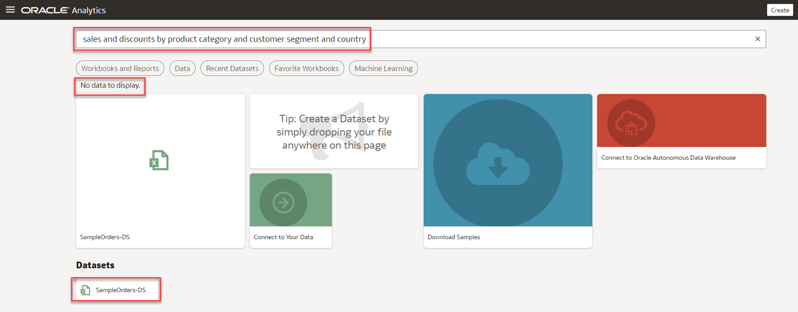
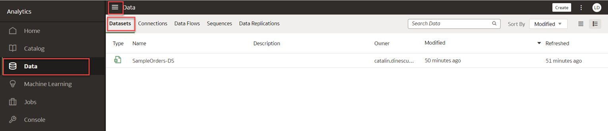
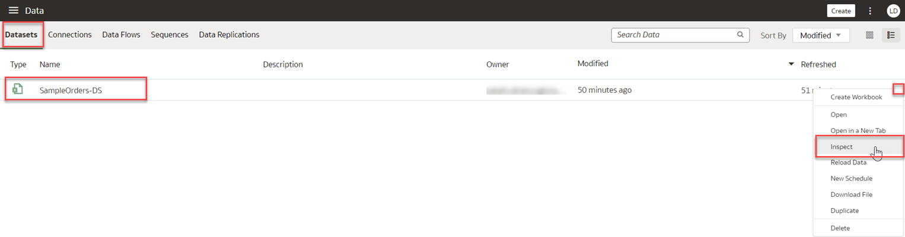
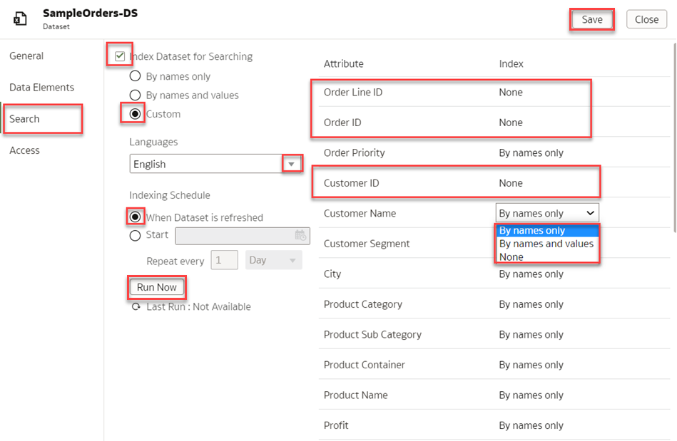
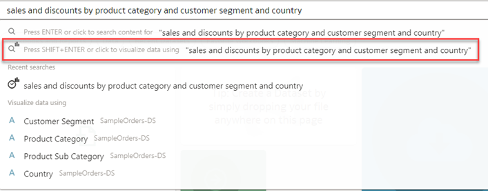
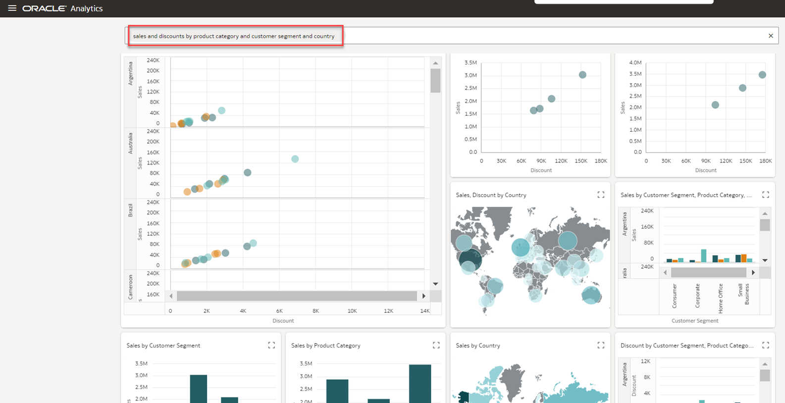

# How do I enable searching for my dataset in Oracle Analytics Cloud (OAC)?

Duration: 3 minutes

A dataset is a basic storage unit in Oracle Analytics Cloud (OAC) which stores data from various data sources such as files, tables, subject areas or connections. A dataset can also be a self-service data model that contains multiple tables with relationships defined between the tables.

### Situation 
You have just uploaded your dataset "SampleOrders-DS" and searching is not working in the hompage's search results.

   

## Enable searching for a dataset
If you have just uploaded a file-based dataset, you have to **index** it before you can use it to build visualizations from the OAC homepage. If you shared your dataset with other users, you must index and certify your dataset before the users you shared the dataset with are able to use it to build visualizations from their homepage.
> **Note:** You must have the **BI Service Administrator** application role to successfully execute this Sprint.

1. On the **Home** page, click the **Navigation menu**, and then click **Data** to get to your datasets.  
   
   

2. On the **Datasets** tab, locate the dataset that you want to index and click the **Actions menu**, and then click **Inspect**.

      

3. On the **Search** tab, click the checkbox for **Index Dataset for Searching**. You will see three options to index by which are By names only, By names and values, and Custom. For this example, select **Custom** to select the attributes that you want to index and click the **Languages** field and select the language you want to search in. Click **Save** and **Run Now** to index your dataset and **Close** the window.

    > **Note:**  For larger datasets with many columns, select **Custom** indexing so that the system does not have to index unnecessary columns which can slow down your search results.
    
     
    

4. Navigate back to your OAC homepage and ask your question in **Search** area.

   

6. Press SHIFT+ENTER to display your results. You should now be able to see the visualizations you searched for from your dataset.

     

Congratulations! You have just learned how to make a dataset available for search in Oracle Analytics Cloud! 

## Learn More
* [Make a Dataset's Data Available for Search](https://docs.oracle.com/en/cloud/paas/analytics-cloud/acubi/make-datasets-data-available-search.html#GUID-90C1150A-473D-4460-B0C3-287FC6441128)
