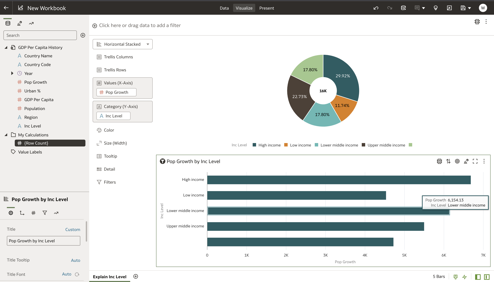

# How do I use the Explain functionality in Oracle Analytics Cloud and Server (OAC & OAS)?
Duration: 2 minutes

The Explain functionality of OAC is a powerful tool that uses machine learning
to uncover insights about data elements of interest in your data. These findings can be added to
your workbook with the click of a button, greatly accelerating the rate at which you can
learn about your data and visualize your findings. Explain is a tool that users
of all skill levels can leverage.

## Using Explain on Your Data.
>**Note:** You must have the **DV Content Author** role in order to complete the following steps.

1. From your Oracle Analytics homepage, create a workbook by clicking on **Create** then **Workbook**. If
you have already created a workbook that you would like to use, you can optionally open it
from the homepage and skip to step 3.

    

2. Choose the dataset that you would like to analyze with the Explain feature, then click **Add to Workbook**.

    

3. Your data is now open in a workbook and ready to have the Explain feature used on it. Simply choose a variable which
you would like to have explained, right click on it and choose **Explain**.

    

4. The Explain feature presents you with information about your variable divided up into four sections.
These sections are **Basic Facts**, **Key Drivers**, **Segments**, and **Anomalies**. Click on each section to view its insights.

    >**Note:** The four sections of the explain feature are dependent on the data type you choose to Explain. The **Key Drivers** and **Segments** section only appears for variables that are attributes, and the **Basic Facts** and **Anomalies** section only appears for variables that are measures or attributes and use the **sum** or **count** aggregation methods. There are also some variables that will show no results for Explain, such as attributes that have 100 or more unique values.

  

5. If you find any of the visualizations created by Explain insightful, you can add them to your canvas by clicking the
check mark in their top right corner, then choosing **Add Selected**.

    

6. The visualizations that you chose can now be interacted with and customized on your canvas.

    

## Learn More

* [A detailed explanation of the Basic Facts, Key Drivers, Segments, and Anomalies sections](https://docs.oracle.com/en/middleware/bi/analytics-desktop/bidvd/analyze-data-explain.html#GUID-1AE7FFB7-9DA5-40EF-A30A-5DC9DEED3D2D)

## Acknowledgements
* **Author** - Miles Novotny, Solution Engineer, North America Specialist Hub
* **Last Updated By/Date** - Nagwang Gyamtso, December 2022
