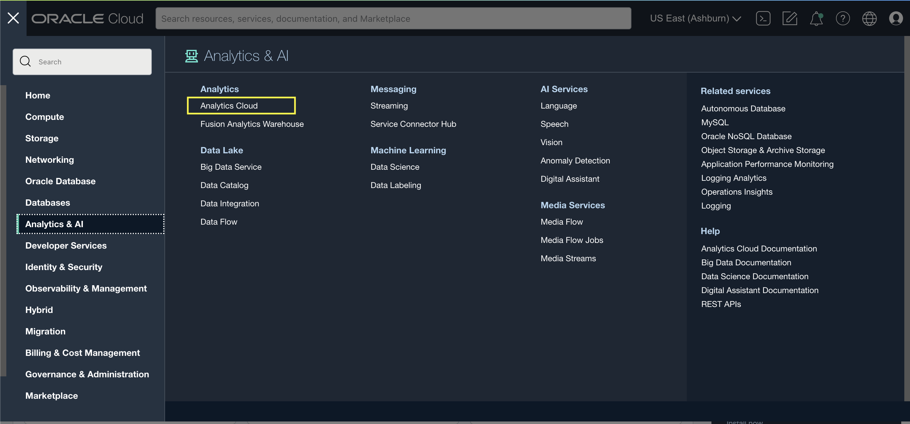
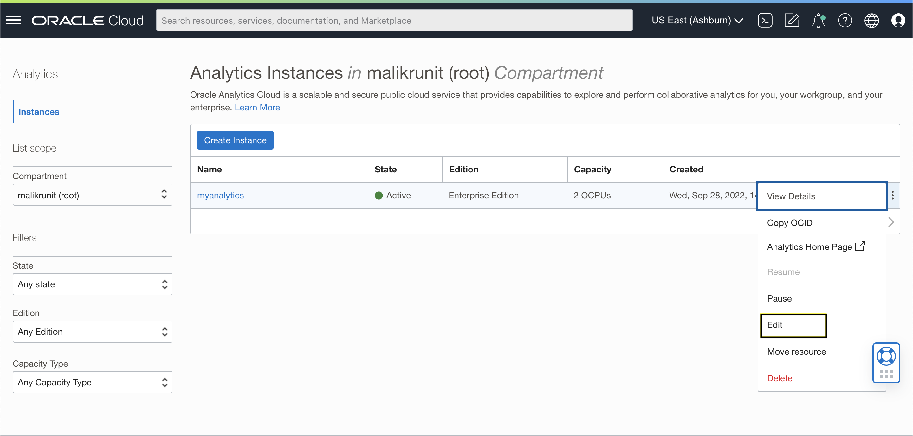

# Como aumentar a capacidade de processamento da minha instância do Oracle Analytics?

**Duração: 5 minutos**

Ao trabalhar com Oracle Analytics Cloud, você pode aproveitar a escalabilidade da plataforma. Para tal, necessitará de acesso à Oracle Cloud Infrastructure Console. 

Na console do OCI é onde poderá realizar a maioria das tarefas administrativas para a OAC. Pode acessar serviços e atualizar detalhes da instância utilizando a Console, API, ou linha de comando. Neste sprint, utilizaremos a Console do OCI.

## Ver ou atualizar a capacidade de processamento OAC utilizando a Console

Você pode utilizar o Oracle Cloud Infrastructure Console para visualizar e fazer alterações às Instâncias do Oracle Analytics Cloud.

1. Entre na sua conta Oracle Cloud.

  

2. Em Oracle Cloud Infrastructure Console, clique no  ícone localizado no canto superior esquerdo.

3. No Menu, clique **Analytics & AI**. Abaixo **Analytics**, clique **Analytics Cloud**.

  

4. Selecione o compartimento que contém as instâncias do Oracle Analytics Cloud que você procura.

  

5. Para alterar a descrição ou o tipo de licença, clique  no ícone para uma instância específica, e selecione **Edit**.

6. A partir daqui, pode ver e alterar o número de OCPUs a serem utilizadas para aumentar a sua instância Oracle Analytics Cloud.

Parabéns! Acabou de aprender como aumentar a capacidade de processamento da sua instância Oracle Analytics Cloud!

## Saiba Mais
* [OAC Administer Documentation](https://docs.oracle.com/en/cloud/paas/analytics-cloud/acoci/administer-services.html#GUID-51F53680-13E0-45B7-AD95-B2091F8AB442)

## Acknowledgements
* **Author:** Runit Malik, Solution Engineer
* **Tradução** - Isabelle Dias, GenO, Brazil Data & AI Team
* **Última Atualização** - Thais Henrique,  Março 2023