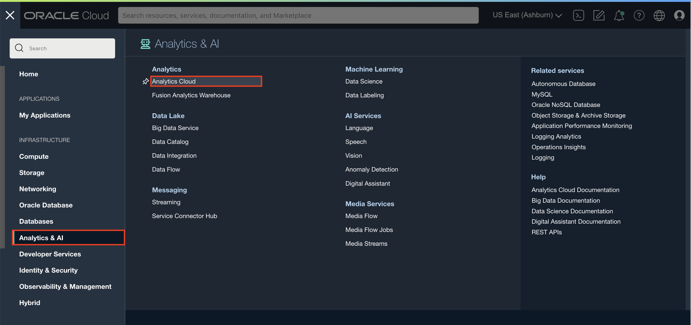
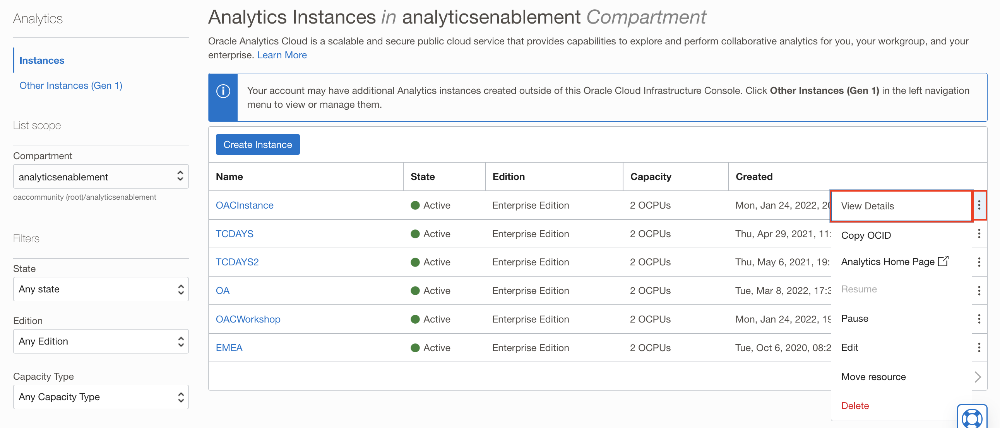
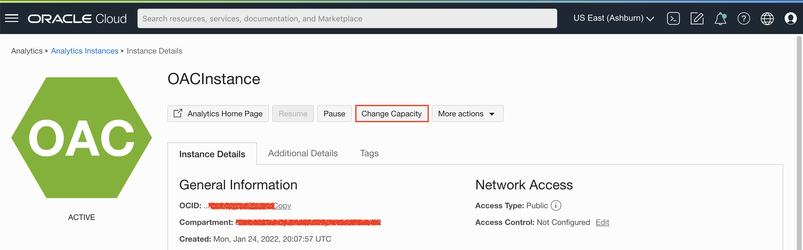
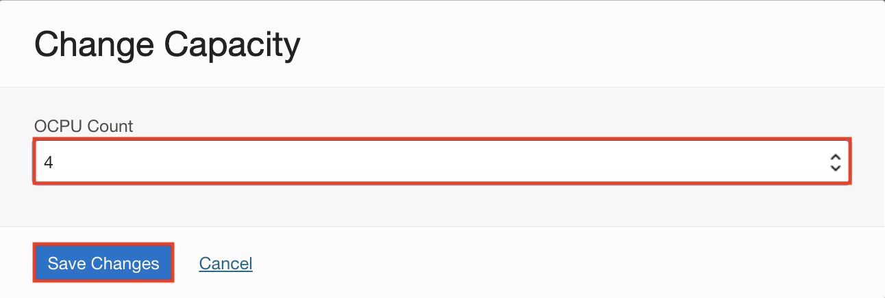

## How do I increase the processing capacity of my Oracle Analytics (OAC) ?

Duration: 1 minute

You can access the Oracle Cloud Infrastructure (OCI) Console to scale your Oracle Analytics Cloud instance.

You can use the OCI Console to perform many of your OAC instance administration tasks. You can access services and update instance details by using the Console, API, or command line. In this sprint you'll learn how to use the OCI Console.

### View or Update OAC processing capacity using the Console
>**Note:** To complete these steps in this sprint, You must either have the **Cloud Account Administrator** role with full administrative privileges in OCI or you must be part of a group with **Manage Analytics-Instances** permission for the compartment where your OAC instance is.

1. Sign in to your Oracle Cloud account.

  

2. In the Oracle Cloud Infrastructure Console, click the  icon in the top left corner.

3. In the menu, click **Analytics & AI**. Under **Analytics**, click **Analytics Cloud**.

  

4. Select the compartment that contains the Oracle Analytics Cloud instance you're looking for. Click the  icon of the instance you want to increase the processing capacity for and select **View Details**.

  

5. Click **Change Capacity**.

  

6. From here, you can view and change the number of OCPUs being used to scale up your Oracle Analytics Cloud instance. Scale up or down by click the drop-down option and select the OCPU Count. Then click **Save**.

  

Congratulations! You have just learned how to increase the processing capacity of your Oracle Analytics Cloud!

## Learn More
* [OAC Administer Documentation](https://docs.oracle.com/en/cloud/paas/analytics-cloud/acoci/administer-services.html#GUID-51F53680-13E0-45B7-AD95-B2091F8AB442)
* [About Scaling](https://docs.oracle.com/en/cloud/paas/analytics-cloud/acoci/administer-services.html#GUID-3483FDF5-A596-4B61-8E8E-A28D9450FF7E)

## Acknowledgements
* **Author:** Runit Malik, Solution Engineer
* **Contributor:** Nagwang Gyamtso, Product Manager, Product Strategy
* **Last Updated By/Date:** Runit Malik, October 2022
