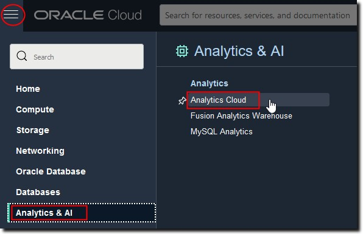

## How do I increase the processing capacity of my Oracle Analytics Instance? #

## Duration: 10 minutes

When working with Oracle Analytics Cloud, you have the option to leverage the platform's scalability. For this, you will need access to the Oracle Cloud Infrastructure Console. 

The OCI Console is where you can accomplish most administrative tasks for OAC. You can access services and update instance details using the Console, API, or command line. You can edit details such as the description, license type, or tags.

  >**Note: Required IAM Policy**
    
  **Verb:** inspect (to view), manage (to update)    
  **Resource Types:** analytics-instance, analytics instances
  
  **Permission:** ANALYTICS_INSTANCE_INSPECT (to view), ANALYTICS_INSTANCE_UPDATE (to update)
  
  See 
  

## View or Update OAC Processing Capacity using the Console

You can use the Oracle Cloud Infrastrcture Console to view and edit Oracle Analytics Cloud Instances.

1. Sign into your Oracle Cloud account.

2. In the Oracle Cloud Infrastructure Console, click  in the top left corner.     

3. Click **Analytics & AI**. Under **Analytics**, click **Analytics Cloud**.

  

4. Select the compartment that contains the Oracle Analytics Cloud instances you're looking for.

5. If required, filter the list by **State** or **Edition**.

6. To change the description or the license type, click  for the instance, and select **Edit**.

  

7. From here, you can view and change the number of OCPUs being used to scale up your Oracle Analytics Cloud instance.

Congratulations! You have just learned how to increase the processing capacity of your Oracle Analytics Cloud instance!

## Learn More
* [OAC Administer Documentation](https://docs.oracle.com/en/cloud/paas/analytics-cloud/acoci/administer-services.html#GUID-51F53680-13E0-45B7-AD95-B2091F8AB442)