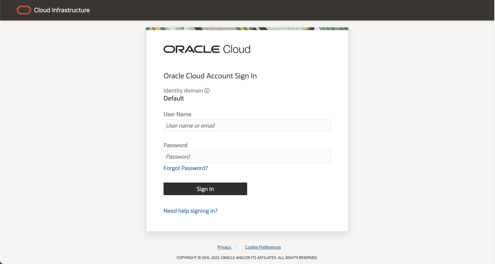
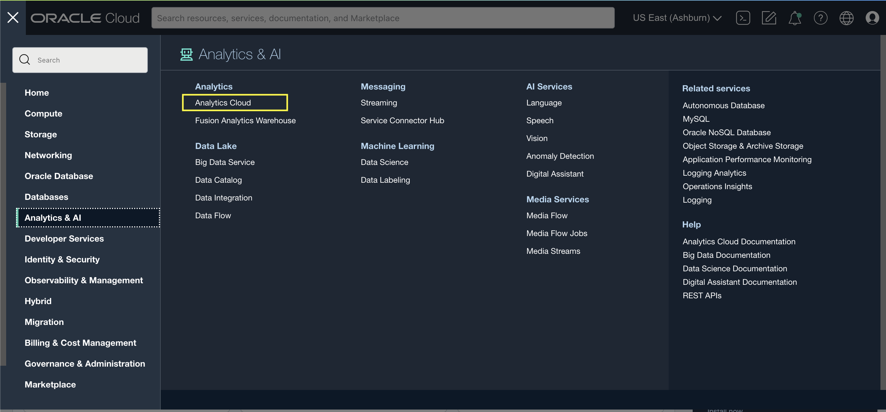
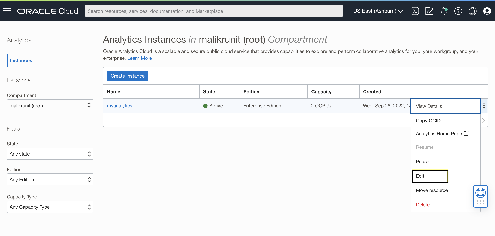

## How do I increase the processing capacity of my Oracle Analytics Instance?

**Duration: 5 minutes**

When working with Oracle Analytics Cloud, you can leverage the platform's scalability. For this, you will need access to the Oracle Cloud Infrastructure Console. 

The OCI Console is where you can accomplish most administrative tasks for OAC. You can access services and update instance details using the Console, API, or command line. In this document, we'll be using the OCI Console.

**View or Update OAC Processing Capacity using the Console**

You can use the Oracle Cloud Infrastrcture Console to view and make changes to Oracle Analytics Cloud Instances.

1. Sign into your Oracle Cloud account.

  

2. In the Oracle Cloud Infrastructure Console, click the  icon in the top left corner.

3. In the menu, click **Analytics & AI**. Under **Analytics**, click **Analytics Cloud**.

  

4. Select the compartment that contains the Oracle Analytics Cloud instances you're looking for.

  

5. To change the description or the license type, click the  icon for a specific instance, and select **Edit**.

6. From here, you can view and change the number of OCPUs being used to scale up your Oracle Analytics Cloud instance.

Congratulations! You have just learned how to increase the processing capacity of your Oracle Analytics Cloud instance!

**Learn More**
* [OAC Administer Documentation](https://docs.oracle.com/en/cloud/paas/analytics-cloud/acoci/administer-services.html#GUID-51F53680-13E0-45B7-AD95-B2091F8AB442)

## Acknowledgements
* **Author:** Runit Malik, Solution Engineer
* **Last Updated By/Date:** Runit Malik, October 2022