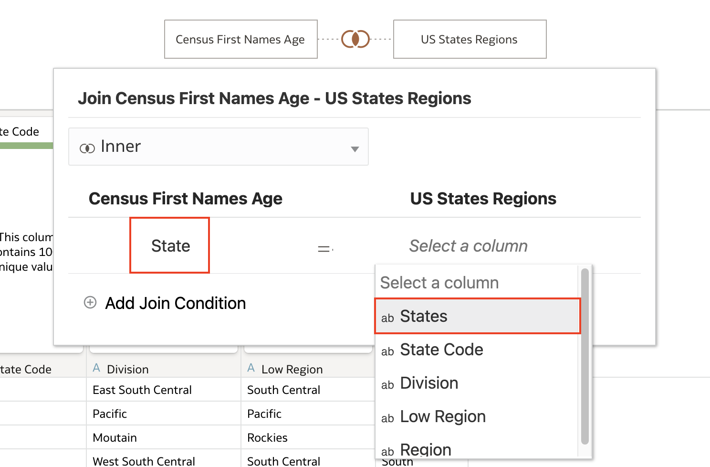

# How do I join two tables in a dataset in Oracle Analytics Cloud (OAC)?
Duration: 1 minute

Oracle Analytics Cloud allows you to join multiple tables into a dataset with its strong data prep capabilities. When you drag and drop a table into a dataset, Oracle Analytics automatically creates a join between tables if there are matching column names. If matching column names are not present, you have the ability to easily create joins, whether its an inner, left, right, or full outer join. This Sprint will guide you on how to create joins between tables in a dataset! 

## Create joins
You must have the **DV Content Author** to be able to successfully execute the following steps. 

1. From your OAC **Home** page, create a dataset by clicking **Create** and selecting **Dataset**.

    

2. Select the data file you want to create a dataset with whether it's in your local machine, from a subject area or connection. If it's from your local machine, select the file and click **Open**.

    

3. This will load the dataset and allow you to change the Name and Description of your file and change the file if you need to. Click **OK**.

    
    
4. Add another file by clicking on the **+** and selecting **Add File**. This will allow you to change the name and description of your file and once changes are made, select **OK** to add the file to your dataset.

    
    
5. Once your dataset is added, you will notice that the two tables are automatically joined. This happens when Oracle Analytics identifies exact column names in both datasets.

    >**Note:** Auto join works on more than 2 tables as well.

    
    
6. If auto join is enabled and Oracle Analytics cannot find matching column names but you know there are columns that you can create joins on, **right-clik** on one of the tables and select **Join To** and select the table you want to create a join to. 
    
    >**Note:** You can also drag and drop the table you want to join onto the table you want to join to to initiate a join.
    
    

7. Select the column names you want to create a join on from the two tables. Notice here that auto join did not work because **State** and **States** do not match. You can strengthen your join if you have multiple column names you can join on by clicking **Add Join Condition** and selecting the extra columns.

    

8. Once you have created your joins, click **Save** and click **OK** after giving your dataset a name.

    

Congratulations! You have learned how to create joins between two tables in a dataset in Oracle Analytics Cloud!

## Learn More

* [Add Joins Between Dataset Tables](https://docs.oracle.com/en/cloud/paas/analytics-cloud/acubi/add-joins-dataset-tables.html)

* [Understand Dataset Table Joins](https://docs.oracle.com/en/cloud/paas/analytics-cloud/acubi/understand-dataset-table-joins.html)
